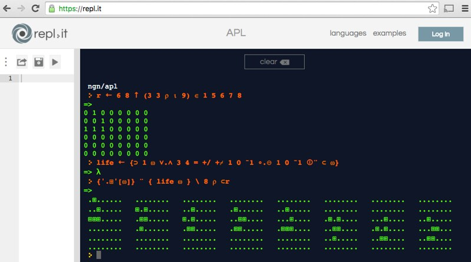
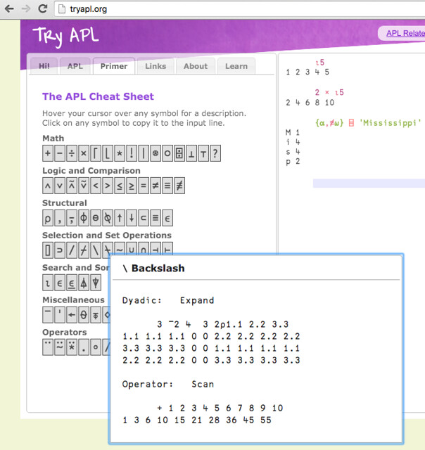
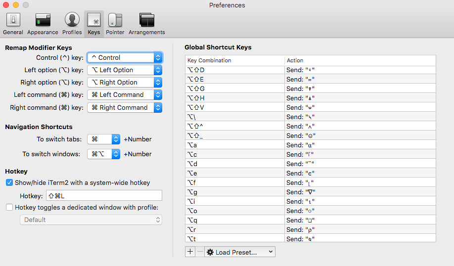

A few years back, I stumbled across [this video](https://www.youtube.com/watch?v=a9xAKttWgP4) while looking for something new to geek out about:

It shows a man live-coding Conway's Game of Life as a way of introducing the viewer to the APL language. He seemlessly types the greek characters iota and omega, set theory symbols, and unicode symbols that are specific to APL, such as a tilde with an umlaut over it. He expresses concepts such as rotation of columns and rows around a matrix's axes, outer products of logic operations, and shows us how flexible the APL language is at doing things like generating a list of boolean matrices that can be combined to get a cell's neighbor count. He ends up with essentially an abstract one-liner that can take any Life board and return its next generation. The end result is similar to, but not exactly, this output from a session of mine on the [replit](https://replit.com/) site:



The overall effect of the video is very impressive, even by the jaded standards of someone like me, who has been in the professional IT world for over 20 years. Equally as impressive is how spotty information on the Internet is regarding the language. There are many duplicate links to a bootleg copy of the current ISO spec for the language (normally $200), each presenting itself as a PDF file, while in actuality being a gzipped file. The comp.lang.apl Usenet group gets around 5 - 10 posts per month, and the APL subreddit is lucky to get 2. A Wiki on the language has only a small handful of user-submitted articles. Tutorials on the language are incomplete or have errors, e.g.:



Assumedly there are supposed to be more backslashes in there somewhere. To make matters worse, there are competing APL interpreters that implement different feature sets. The most popular, Dyalog, took a page from the old Microsoft playbook, by embracing and extending the language, adding features that aren't in the official spec, and then selling their own interpreter.

My point isn't to fault the people who created this content, or disparage Dyalog's business model, because everything starts out this way. Tools to support a language eventually become open and free, but don't always start out that way. Documentation gets tuned up over time by the energy of users, but starts out incomplete. My conjecture is that there is simply not enough interest in this wonderful language to hit an Internet critical mass, which would give APL the same level of respect and coverage that more traditional languages enjoy. Despite this, a determined individual can sort out the basics with modest effort, without opening his or her wallet.

I settled on the GNU implementation, for the dual reasons that it is free, and implements most of ISO 13751. My main sources of information were the above YouTube video, the [GNU info page](https://www.gnu.org/software/apl/apl.html), the Wikipedia page on APL [syntax and symbols](https://en.wikipedia.org/wiki/APL%5Fsyntax%5Fand%5Fsymbols), and Ken Iverson's [original paper](https://www.jsoftware.com/papers/APL.htm) on the concepts that eventually became the language, back when he was searching for a more pragmatic approach to teaching mathematics, and ended up accidentally inventing functional programming.

I currently use a MacBook with iTerm2 as my primary terminal program. Homebrew made the GNU interpreter as easy to build as "brew install gnu-apl". iTerm allows easy keyboard mapping (with the caveat that too many non-ASCII symbols in the buffer makes fontd blow a gasket, bringing performance to a crawl), so I set about copy/pasting symbols from docs as I needed them into iTerm hotkey definitions, and ended up with a fairly complete set:



What follows is a somewhat detailed introduction to the language, learning new functions and their associated symbols as we go. We're going to use APL to find primes numbers a couple different ways, list the Fibonacci sequence, find credit card numbers in a file and validate them with the Luhn algorithm, read some rows from a SQLite database, and do math with the results.

While I introduce a lot of symbols here, a more comprehensive and better organized list is available on the Wikipedia [Syntax and Symbols](https://en.wikipedia.org/wiki/APL%5Fsyntax%5Fand%5Fsymbols) page.

### The basics

```
~: apl

                    ______ _   __ __  __    ___     ____   __
                    / ____// | / // / / /   /   |   / __ \ / /
                  / / __ /  |/ // / / /   / /| |  / /_/ // /
                  / /_/ // /|  // /_/ /   / ___ | / ____// /___
                  \____//_/ |_/ \____/   /_/  |_|/_/    /_____/

                      Welcome to GNU APL version 1.4 / 7887

                Copyright (C) 2008-2014  Dr. Jürgen Sauermann
                        Banner by FIGlet: www.figlet.org

                This program comes with ABSOLUTELY NO WARRANTY;
                  for details run: /usr/local/bin/apl --gpl.

      This program is free software, and you are welcome to redistribute it
          according to the GNU Public License (GPL) version 3 or later.

      1 2 3 + 4 5 6
5 7 9
```

The first interesting feature of the APL REPL environment is that it is very easy to distinguish user input from interpreter output. Input is indented several characters. Output is either flush with the left margin of the terminal, or indented one character if you are dealing with a nested list. On that note, the language handles lists very well, as shown in my first example above: I've added two lists together, which resulted in an item by item sum of their elements.

There are two basic function forms, monadic and dyadic. Dyadic is as the above example: left variable, function, right variable. Right variable, however, means everything to the end of the line, or the end of the parenthetical expression. This means that math functions won't follow traditional order of operations. E.g., :

```apl
      2 × 3 + 4
14
```

The end result of this is that expressions are evaluated right to left. However, parentheses can enclose part of an expression that needs to be evaluated separately, just as in most other languages.

```apl
      (2 × 3) + 4
10
```

APL uses the mathematical symbols × and ÷ for multiplication and division rather than \* and /, which makes it unique among programming languages. Slash is the reduce function (as we'll see in a minute), where asterisk raises to a power:

```apl
      2 * 3
8
```

The monadic form is simply function, variable. If a function symbol occurs at the beginning of an expression, or after another function symbol, it uses its monadic meaning. In this way, the same symbol can have two different functions associated with it. For example, iota. It's monadic form (⍳ B)creates an incremental list of numbers from the index origin (defaults to 1 in GNU APL) up to B, it's dyadic form (A ⍳ B) looks for the index of B in the list A.

```apl
      ⍳ 10
1 2 3 4 5 6 7 8 9 10
      7 8 9 ⍳ 8
2
```

The reduce function (f / B) puts function f between pairs of elements of B, the same way other language's reduce functions work. " + / 1 2 3 4" expands to "1 + 2 + 3 + 4". Combining reduce with iota, we can sum the numbers from 1 to 10 with this brief command:

```apl
      +/ ⍳ 10
55
```

Functions that aren't associative can give unexpected, but correct under APL rules, results. Take subtraction, for example.

```apl
      - / ⍳4
¯2
```

First, note the high minus sign next to the result. Negative numbers are always prefaced with high minus, to distinguish it from the subtraction operation; this let's you include negative numbers in inline lists. As for returning -2 instead of -8, APL is evaluating the expression as "1 - (2 - (3 - 4))", so this happens:

```apl
      3 - 4
¯1
      2 - ¯1
3
      1 - 3
¯2
```

What if you really want the sequence evaluated the same way a traditional programming language would? You could do something like this, subtracting in reverse order over the reversed list (I'll explain the details of what's happening further on):

```apl
      { ⍵ - ⍺ } / ⌽ ⍳4
¯8
```

In a function's monadic form, by default everything on the right side of the function is evaluated as its variable. That makes this statement, which makes logical sense, invalid by APL rules:

```apl
      ⍳ 10 × ⍳ 10
LENGTH ERROR
      ⍳10×⍳10
      ^
```

The statement doesn't say to multiply the list of 1-10 by itself, it is instead passing this list to the iota function:

```apl
      10 × ⍳ 10
10 20 30 40 50 60 70 80 90 100
```

...and since iota takes a scalar value and not a list, APL throws an error. The correct way to do what we meant is to wrap the logical left side of the multiplication in parentheses:

```apl
      (⍳ 10) × ⍳ 10
1 4 9 16 25 36 49 64 81 100
```

Another correct way to produce the same list is to use an inline function with formal parameter omega:

```apl
      { ⍵ × ⍵ } ⍳ 10
1 4 9 16 25 36 49 64 81 100
```

Wrapping a statement in curly braces produces an inline function ("unnamed lambda" in APL-speak - it would be "named" if the function was assigned to a variable). The expression to the left of the function, if any, is passed in as the formal parameter alpha (⍺), and the expression on the right is passed in as omega (⍵), both of which can be treated as normal variables, and used as many times as necessary. In this case, omega is iota-10, which is multiplied against itself.

A third way to perform this is to use the monadic function duplicate (⍨), which takes the expression on the right, passing it to the preceding function as both alpha and omega:

```apl
      ×⍨ ⍳ 10
1 4 9 16 25 36 49 64 81 100
```

One of the more powerful features of APL is the outer product function (∘.f), which creates a cartesian product of every element on the left against every element on the right, outputting a matrix. For example, the outer product of muliplying a list by itself produces a standard multiplication table:

```apl
      { ⍵ ∘.× ⍵ } ⍳ 10
 1  2  3  4  5  6  7  8  9  10
 2  4  6  8 10 12 14 16 18  20
 3  6  9 12 15 18 21 24 27  30
 4  8 12 16 20 24 28 32 36  40
 5 10 15 20 25 30 35 40 45  50
 6 12 18 24 30 36 42 48 54  60
 7 14 21 28 35 42 49 56 63  70
 8 16 24 32 40 48 56 64 72  80
 9 18 27 36 45 54 63 72 81  90
10 20 30 40 50 60 70 80 90 100
```

OK, two quick final basic operations, and we're ready to start doing something more useful. The pipe operator in dyadic form is the "residue" function, the converse of modulus. "4 residue 5" means "5 mod 4"

```apl
      4 | 5
1
```

Lastly, the duplicate function used in dyadic form becomes "commute", swapping the left and right expressions. "4 residue-commute 5" is exactly "4 mod 5":

```apl
      4 |⍨ 5
4
```

### Let's make some primes!

Now we're ready to do something more interesting. Instead of a multiplication table, let's replace × with | and create a residue table:

```apl
      { ⍵ ∘.| ⍵ } ⍳ 10
0 0 0 0 0 0 0 0 0 0
1 0 1 0 1 0 1 0 1 0
1 2 0 1 2 0 1 2 0 1
1 2 3 0 1 2 3 0 1 2
1 2 3 4 0 1 2 3 4 0
1 2 3 4 5 0 1 2 3 4
1 2 3 4 5 6 0 1 2 3
1 2 3 4 5 6 7 0 1 2
1 2 3 4 5 6 7 8 0 1
1 2 3 4 5 6 7 8 9 0
```

This shows us the remainders of division operations. The top row of zeroes shows that each number divides evenly by 1. The diagonal line of zeroes shows that each number divides evenly by itself. Any other zeroes imply a number that isn't prime, because it divided evenly by something other than 1 or itself.

The 1 row and column doesn't add any useful information, so we can drop it. The down-arrow in dyadic form means "drop". A ↓ B means return the list B without its first A elements. Creating a residue table with the integers from 2-10 is more meaningful:

```apl
      1 ↓ ⍳ 10
2 3 4 5 6 7 8 9 10
      { ⍵ ∘.| ⍵ } 1 ↓ ⍳ 10
0 1 0 1 0 1 0 1 0
2 0 1 2 0 1 2 0 1
2 3 0 1 2 3 0 1 2
2 3 4 0 1 2 3 4 0
2 3 4 5 0 1 2 3 4
2 3 4 5 6 0 1 2 3
2 3 4 5 6 7 0 1 2
2 3 4 5 6 7 8 0 1
2 3 4 5 6 7 8 9 0
```

Here any column with more than one 0 isn't prime. Creating a boolean matrix of where all the zeroes were is as easy as preceding the inline function with "0 = ".

```apl
      { 0 = ⍵ ∘.| ⍵ } 1 ↓ ⍳ 10
1 0 1 0 1 0 1 0 1
0 1 0 0 1 0 0 1 0
0 0 1 0 0 0 1 0 0
0 0 0 1 0 0 0 0 1
0 0 0 0 1 0 0 0 0
0 0 0 0 0 1 0 0 0
0 0 0 0 0 0 1 0 0
0 0 0 0 0 0 0 1 0
0 0 0 0 0 0 0 0 1
```

The integers 1 and 0 are used in place of boolean values, allowing us to sum each column easily. Here we are using the character ⌿, which does the same thing as reduce, but over a minor axis - the columns of a matrix, rather than its rows.

```apl
      { +⌿ 0 = ⍵ ∘.| ⍵ } 1 ↓ ⍳ 10
1 1 2 1 3 1 3 2 3
```

Now we're getting closer to programmatically finding primes. Each 1 in this list is in the position of a prime number in our original 2-10 list. Passing a boolean list to the reduce function returns just those values that correspond to 1s; this is a "select" function. We can identify just our 1s by preceding our sum reduction with "1 = ", then select from our original list by appending slash-omega after the boolean list:

```apl
      { 1 = +⌿ 0 = ⍵ ∘.| ⍵ } 1 ↓ ⍳ 10
1 1 0 1 0 1 0 0 0
      { (1 = +⌿ 0 = ⍵ ∘.| ⍵) / ⍵ } 1 ↓ ⍳ 10
2 3 5 7
```

And now we have everything we need to extract prime numbers from a list of integers. To find all the primes up to 100, I just need an extra 0 at the end of the previous statement:

```apl
      { (1 = +⌿ 0 = ⍵ ∘.| ⍵) / ⍵ } 1 ↓ ⍳ 100
2 3 5 7 11 13 17 19 23 29 31 37 41 43 47 53 59 61 67 71 73 79 83 89 97
```

Since this is all contingent on a cartesian product, our solution, though expressed in very few characters, is suboptimal, since its performance is O(n^2). Further down we'll build a faster method.

### Fibonacci numbers, and debugging inline functions

If you've made it this far, you probably have a good Unicode font installed. If you see boxes in this section, they're on purpose. In APL the box is called the "quad" symbol, and prefaces a few system variables, for instance the "index origin" I nebulously referred to above is ⎕IO, and can be set to either 0 or 1, depending on how you want indices to behave. Assigning a variable is done with the left arrow symbol. "n ← 5" would set variable "n" to 5 (which means the equals sign is only used for comparing things).

Assigning to just a naked quad character is akin to printing to STDOUT, or a JavaScript console.log(). If I take this simple inline function that multiplies alpha by omega's successor...

```apl
      4 { ⍺ × 1 + ⍵ } 5
24
```

...and add in some quad assignments, then we can infer that expressions really are evaluated right to left, by the order of the output.

```apl
      4 { (⎕ ← ⍺) × 1 + ⎕ ← ⍵ } 5
5
4
24
```

That's not extremely useful by itself, but that concept is useful for debugging the inner workings of a reduce statement. In the function below, I'm doing simple addition over the numbers 1 through 4, displaying each iteration's omega, alpha, and sum:

```apl
      { ⎕ ← (⎕ ← ⍺ ) + ⎕ ← ⍵ } / ⍳ 4
4
3
7
7
2
9
9
1
10
10
```

In the first iteration, omega is 4, alpha is 3, and their sum, naturally, is 7. That total becomes the next iteration's omega, and alpha becomes 2, the next element of the list read right to left. That cycle repeats once more, and the final sum, 10, is displayed again as the normal output of the function as it exits.

Why is that useful to know? I can leverage that into a clumsy method of building a Fibonacci sequence. The first item read from the input list is the first omega, but the remaining elements are all alphas. If I reduce over a reversed iota list (see how we're talking in APL-speak now?), I can ignore all the alphas, and still get an initial 1 as the first element of my output list.

The phi function, in modaic form, reverses a list:

```apl
      ⌽ ⍳ 10
10 9 8 7 6 5 4 3 2 1
```

In dyadic form, the phi function rotates a list, or rotates a matrix around the vertical axis, which we'll get into later. The up-arrow function in dyadic form is "take", drop's counterpoint. "A ↑ B" returns the first A elements of list B. If A is negative, take gets its elements from the end of the list. If you take more than the size of the input list, the remaining elements are filled with zeroes.

```apl
      2 ↑ ⌽ ⍳ 10
10 9
      ¯2 ↑ ⌽ ⍳ 10
2 1
      ¯2 ↑ 1
0 1
      ¯2 ↑ 1 1
1 1
```

The comma function, in dyadic form, concatenates lists. Combining all that, I can build up a Fibonacci sequence by concatenating omega with the sum of it's last two digits... taking only the initial 1 from the reversed input list, the end result of which looks like this:

```apl
      { ⍵, +/ ¯2 ↑ ⍵ } / ⌽ ⍳ 10
 1 1 2 3 5 8 13 21 34 55
```

Succinct, but clumsy. The business with reversing the natural number list turns out to be unnecessary. Instead I can just generate a list of all 1s by using the Rho function (⍴). Rho is monadic form tells you the shape of something (a list's length, or a matrix's dimensions), but in dyadic form it is \_re_shape, where reshaping to a larger size causes an scalar or list to repeat. Making 10 ones is as easy as...

```apl
      10 ⍴ 1
1 1 1 1 1 1 1 1 1 1
```

...which can be easily subbed into our Fibonacci function:

```apl
      { ⍵, +/ ¯2 ↑ ⍵ } / 10 ⍴ 1
 1 1 2 3 5 8 13 21 34 55
```

This is better, but it still rubs me the wrong way to use a list for the sole purpose of flow control in a loop. APL provides a more traditional style of function that can be created using the "del editor". The del character is a downward-pointing triangle (∇), and is used to declare a function signature, inlcuding the name of a variable to return (z in this case), optional variable names to handle inputs, the function name itself, and an an optional final list of local variables, delimited by semicolons. This puts you in a line-editor mode, and avails you of the use of APL's goto function, the right-arrow.

Goto can reference a numbered line, or a named label (labels are defined by typing a word followed by a colon on a line by itself). If 0, nil, or something that isn't a valid line number or label is passed to goto, the function exits. In the function below, I'm initializing z to 1, then concatenating it as above, and exiting the loop using a boolean select that returns 2 (the line number to go back to) until z is the same size as the input variable "len" (using Rho to get z's shape):

```apl
      ∇z ← fib len
[1] z ← 1
[2] z ← z, +/ ¯2 ↑ z
[3] → (len > ⍴ z) / 2
[4] ∇
      fib 10
1 1 2 3 5 8 13 21 34 55
```

Seeing the del-formatted functions is a little awkward at first, and in non-Gnu APL interpreters, this style of inline function definition is deprecated in favor of using built-in function editors that can be invoked with ")edit" or similar commands.

### Primes redux, and function metrics

Let's build a new method of calculating prime numbers that is more performant than O(n^2). I'll start by manually building up a list, and checking the residue of all the primes so far against the new candidate number.

```apl
      primes ← 2
      primes | 3
1
      primes ← 2 3
```

Since 3 mod 2 is 1, 3 doesn't divide evenly by any previous prime number, and so is itself prime.

```apl
      primes | 4
0 1
      ^ / primes | 4
0
```

Here, "primes residue 4" returns 0 for 2, and 1 for 3, meaning 4 divides evenly by 2, but not by 3. The carat (^) symbol is a bitwise AND function, and in this case the AND-reduction of 0 and 1 is 0, or false. 4, then, is not a prime, but we have a starter method to quickly check for new primes. If we try it with 5...

```apl
      ^ / primes | 5
2
```

...we see that 5 is prime, since the AND-reduction didn't return 0. If we make that a generic function, use comma to concatenate new items that pass the AND-reduction test...

```apl
      { ⍵, (^/⍵|⍺)/⍺ } / ⌽ 1 ↓ ⍳ 10
 2 3 5 5 7 7
```

...oops, we see that doing a select of numbers greater than 1 pull that element out multiple times. Almost there. All we have left to do is turn that into a boolean list, which can be accomplished by asking if our residue is greater than 0:

```apl
      { ⍵, (^ / 0 < ⍵ | ⍺ ) / ⍺ } / ⌽ 1 ↓ ⍳ 10
 2 3 5 7
      { ⍵, (^ / 0 < ⍵ | ⍺ ) / ⍺ } / ⌽ 1 ↓ ⍳ 100
 2 3 5 7 11 13 17 19 23 29 31 37 41 43 47 53 59 61 67 71 73 79 83 89 97
```

Success!! - Sort of. This isn't as efficient as we can make it, since we are comparing each new number to ALL previous primes, when we only need to check up to the square root. Before we tackle that, let's change our output so that it only returns a count of how many primes we found:

```apl
      ⍴ { ⍵, (^ / 0 < ⍵ | ⍺ ) / ⍺ } / ⌽ 1 ↓ ⍳ 100

      ⍴ ⊃ { ⍵, (^ / 0 < ⍵ | ⍺ ) / ⍺ } / ⌽ 1 ↓ ⍳ 100
25
```

In the first statement, Rho didn't return anything, since reduce always returns a scalar, not a list. Even though the body of the function reduce is running over builds a list, reduce "encloses" it, leaving a scalar of rank 0, and no shape. The superset symbol (⊃) "discloses" enclosed scalars, making their contents visible to functions that expect a plain list - or at least, that's my current understanding. Rank and shape are odd concepts, and getting an intuitive understanding of them helps make one's APL code less... um... janky.

Now let's get some heuristics on our prime function, and see if we can tweak it further. APL provides a timestamp function, but I find the "account information" (⎕AI) list very useful. It returns an array containing your "user ID", which I think GNU-APL hardcodes, or used to hardcode, the CPU time that the interpreter process has used, how long in real time the process has been running, and, in theory, how long your keyboard has been unlocked.

Here's the quad-AI array, and assigning its second element to a variable we can subtract with:

```apl
      ⎕ai
1001 38 901514 901476
      ⎕ai[2]
38
      start ← ⎕ai[2]
```

Now, let's see how many primes are less than two thousand, and how many milliseconds it took to figure out:

```apl
      ⍴ ⊃ { ⍵, (^ / 0 < ⍵ | ⍺ ) / ⍺ } / ⌽ 1 ↓ ⍳ 10000
1229
      ⎕ai[2] - start
2703
```

The [How many primes are there?](https://t5k.org/howmany.html) page assures me that, indeed, 1,229 is the correct answer. It took our process close to 3 seconds to figure that out, though. What happens, then, if I select from only the current primes that are less than or equal to the square root of our candidate number? A quick modification to the function sorts out the omegas less than alpha to the 1/2 power:

```apl
      start ← ⎕ai[2]
      ⍴ ⊃ { ⍵, (^ / 0 < ((⍵ ≤ ⍺ * .5)/⍵) | ⍺ ) / ⍺ } / ⌽ 1 ↓ ⍳ 10000
1229
      ⎕ai[2] - start
984
```

...and voila, we have a three-fold speed improvement. If you're wondering just how bad the O(n^2) solution from earlier is, it's a doozy:

```apl
      start ← ⎕ai[2]
      ⍴ { (1 = +⌿ 0 = ⍵ ∘.| ⍵) / ⍵ } 1 ↓ ⍳ 10000
1229
      ⎕ai[2] - start
57865
```

Close to a minute. A little detail to finding a good algorithm netted a 60-fold improvement in a list this size.

### Text files, finding credit card numbers, and Luhn's algorithm

APL does have some pragmatic utility above creating mathematical lists. A standard GNU-APL install comes with modules for file processing, and for connecting to a SQLite database. In this example, I'm going to pull some credit card numbers off of the [Paypal test CC number page](https://www.paypalobjects.com/en_GB/vhelp/paypalmanager_help/credit_card_numbers.htm).

To start with, here's the syntax for loading the FILE_IO module:

```apl
      )copy 5 file_io
loading )DUMP file /usr/local/Cellar/gnu-apl/1.4/lib/apl/wslib5/file_io.apl...
```

The "5" references the 5th in a set of library directories, and file_io is simply the name of an APL script file in that directory. A convention the library files use is NAMESPACE∆function_name to declare functions. The delta character between the namespace and function name doesn't have a special meaning; it's just treated as a character in the name.

Here is the file_io command to slurp in a file as a character vector, and showing a small section of the file to STDOUT to prove that we're looking at HTML with card numbers in it:

```apl
      f ← FIO∆read_file 'cards.html'
      120 ↑ ¯300 ↑ f
Paymentech)</td>
<td rowspan="1" colspan="1" width="363px" class="whs5">
<p clas
      s=CellBody>6331101999990016</td></tr>
</
```

If I assign that same snippet to a variable, I can easily see which characters are members of the set of numeric digits:

```apl
      tst ← 120 ↑ ¯300 ↑ f
      tst ∈ '1234567890'
0 0 0 0 0 0 0 0 0 0 0 0 0 0 0 0 0 0 0 0 0 0 0 0 0 0 0 0 0 0 1 0 0 0 0 0 0 0 0 0
      0 0 1 0 0 0 0 0 0 0 0 0 1 1 1 0 0 0 0 0 0 0 0 0 0 0 0 0 0 1 0 0 0 0 0 0 0
      0 0 0 0 0 0 0 0 0 0 0 0 0 0 1 1 1 1 1 1 1 1 1 1 1 1 1 1 1 1 0 0 0 0 0 0 0
      0 0 0 0 0 0
```

Running that boolean list through an enclose (the subset, or "⊂" character) over the original variable works similarly to the reduce function. The main difference is that consecutive true elements are combined to make unique list items:

```apl
      tst ⊂⍨ tst ∈ '1234567890'
 1 1 363 5 6331101999990016
```

If you compare this with the original snippet, you'll see that these exactly match the 5 blocks of numbers in the HTML. Now that we have the theory right, let's apply it to the entire file:

```apl
      nums ← f ⊂⍨ f ∈ '1234567890'
      ⍴ nums
227
      nums
 3 4 0 8 1 1 1 1 1 2 248 3 363 4 248 5 363 6 611 4 0 0 4 1 2 1 2 1 2 1 2 1 2 1 2
       0 0 1 1 0 4 1 1 2 2 1 1 2 3 1 1 248 4 1 1 363 5 1 1 248 4 1 1 363 5 37828
      2246310005 1 1 248 4 1 1 363 5 371449635398431 1 1 248 4 1 1 363 5 3787344
      93671000 1 1 248 4 1 1 363 5 5610591081018250 1 1 248 4 1 1 363 5 30569309
      025904 1 1 248 4 1 1 363 5 38520000023237 1 1 248 4 1 1 363 5 601111111111
      1117 1 1 248 4 1 1 363 5 6011000990139424 1 1 248 4 1 1 363 5 353011133330
      0000 1 1 248 4 1 1 363 5 3566002020360505 1 1 248 4 1 1 363 5 555555555555
      4444 1 1 248 4 1 1 363 5 5105105105105100 1 1 248 4 1 1 363 5 411111111111
      1111 1 1 248 4 1 1 363 5 4012888888881881 1 1 248 4 1 1 363 5 422222222222
      2 1 2 611 6 1 1 248 4 1 1 363 5 76009244561 1 1 248 4 1 1 363 5 5019717010
      103742 1 1 248 4 1 1 363 5 6331101999990016 1 2 0 0
```

Now, I want to filter out all the number blocks that are between 12 an 19 digits long, the current range of lengths of valid credit card numbers. First I check an iterator to make sure I'm getting the right range, then I get boolean lists of which numbers have any of those shapes, and or the results together giving me a true/false for each number block:

```apl
      11 + ⍳8
12 13 14 15 16 17 18 19
      { ∨ / (11 + ⍳8) = ⍴ ⍵ } ¨ nums
0 0 0 0 0 0 0 0 0 0 0 0 0 0 0 0 0 0 0 0 0 0 0 0 0 0 0 0 0 0 0 0 0 0 0 0 0 0 0 0
      0 0 0 0 0 0 0 0 0 0 0 0 0 0 0 0 0 0 0 0 0 0 0 0 0 1 0 0 0 0 0 0 0 0 1 0 0
      0 0 0 0 0 0 1 0 0 0 0 0 0 0 0 1 0 0 0 0 0 0 0 0 1 0 0 0 0 0 0 0 0 1 0 0 0
      0 0 0 0 0 1 0 0 0 0 0 0 0 0 1 0 0 0 0 0 0 0 0 1 0 0 0 0 0 0 0 0 1 0 0 0 0
      0 0 0 0 1 0 0 0 0 0 0 0 0 1 0 0 0 0 0 0 0 0 1 0 0 0 0 0 0 0 0 1 0 0 0 0 0
      0 0 0 1 0 0 0 0 0 0 0 0 0 0 0 0 0 0 0 0 0 0 0 0 0 1 0 0 0 0 0 0 0 0 1 0 0
      0 0
```

The diaeresis character (¨) is the "each" operator. It iterates over each element of a list and passes it into a function as consecutive omegas. It is similar to a reduce function, except it doesn't do any first-pair funny business, and doesn't explicitly return a scalar.

Enclosing our list above over nums pulls out all the candidates of the right length... but then we discover the weird nested list output, as "enclose" and "reduce" make drastically different list shapes:

```apl
      ({ ∨ / (11 + ⍳8) = ⍴ ⍵ } ¨ nums) ⊂ nums
  378282246310005    371449635398431    378734493671000    5610591081018250
        30569309025904    38520000023237    6011111111111117
        6011000990139424    3530111333300000    3566002020360505
        5555555555554444    5105105105105100    4111111111111111
        4012888888881881    4222222222222    5019717010103742
        6331101999990016
```

Fortunately, this is mainly resolved by disclosing the output, and then the comma operator in monadic form "ravels" the unraveled list, creating a simple list of one dimension. (If you don't count the fact that these strings are each vectors as well.)

```apl
      ⊃ ({ ∨ / (11 + ⍳8) = ⍴ ⍵ } ¨ nums) ⊂ nums
 378282246310005
 371449635398431
 378734493671000
 5610591081018250
 30569309025904
 38520000023237
 6011111111111117
 6011000990139424
 3530111333300000
 3566002020360505
 5555555555554444
 5105105105105100
 4111111111111111
 4012888888881881
 4222222222222
 5019717010103742
 6331101999990016
      ,⊃ ({ ∨ / (11 + ⍳8) = ⍴ ⍵ } ¨ nums) ⊂ nums
 378282246310005 371449635398431 378734493671000 5610591081018250 30569309025904
       38520000023237 6011111111111117 6011000990139424 3530111333300000 3566002
      020360505 5555555555554444 5105105105105100 4111111111111111 4012888888881
      881 4222222222222 5019717010103742 6331101999990016
      cards ← ,⊃ ({ ∨ / (11 + ⍳8) = ⍴ ⍵ } ¨ nums) ⊂ nums
```

Now I can easily take my cards list and use the "identical" operator (the triple-equals, or congruent symbol) to pull out all the cards that look like a Discover card:

```apl
      ( {'6011' ≡ 4 ↑ ⍵} ¨ cards) ⊂ cards
  6011111111111117 6011000990139424
```

I mentioned above that the index origin could be set to 1 or 0. In GNU-APL, it defaults to 1, and has this behavior:

```apl
      ⎕IO
1
      'abcd'[2]
b
      ⍳10
1 2 3 4 5 6 7 8 9 10
```

I can assign 0 to quad-IO, then indexing works like every other programming language you might be familiar with:

```apl
      ⎕IO ← 0
      'abcd'[2]
c
      ⍳10
0 1 2 3 4 5 6 7 8 9
```

It's necessary to do this prior to using the function below for performing a Luhn check, due to a pair of list index operations expecting a 0 base.

If you're unfamiliar with the Luhn algorithm, it's a simple checksum-like operation to see whether a given number _can_ be a credit card number. Essentially, the last digit of your credit card is a check digit. If your card has 16 numbers, no one else's card will have the same first 15 numbers as you; the last number simply makes a total divide evenly by 10.

The total is calculated by summing the digits in reverse order. The first digit is added directly, the second digit is doubled, then repeat until the end. If doubled digits exceed 9, the sum is also summed. 7 doubled is 14, 1 plus 4 is 5. This can be simplified programatically into selecting your digit's index from the list '0246813579'. Finally, the grand total must be evenly divisible by 10.

The function below makes use of the ⍎ symbol, which is APL's "eval" or "execute" operator. It is idiomatic to use execute to turn strings into numbers. My function here returns true for sums with a 10 residue of 0. It creates the sum by iterating over the reversed input string, expecting each character to be a digit, and alternating between evaluating the digit itself, or evaluating the nth index of '0246813579', depending on whether the index of the shape of the input string is even or not.

Simple! Actually it may take you some time to parse out what's going on, particularly if this is your first venture into APL. I've read accounts of APL being referred to as a write-only language due to trouble people have with parsing the very densely packed ideas in APL expressions. At any rate, here's my Luhn function, followed by a couple tests, and finally iterating over all our previously identified card numbers:

```apl
      luhn ← { 0 = 10 | +/ {⍵ {⍎ (⍺ '0246813579'[⍎⍺])[2|⍵] } ¨ ⍳ ⍴ ⍵} ⌽ ⍵ }
      luhn '378282246310005'
1
      luhn '378282246310006'
0
      luhn ¨ cards
1 1 1 1 1 1 1 1 1 1 1 1 1 1 1 1 1
```

As expected, all the card numbers in PayPal's test card list pass the Luhn test.

### Working with databases, no-fear decimal operations

In theory, GNU-APL has support for both SQLite and PostgreSQL, but my build seems to only support SQLite, so I threw together a quick demo database in that format, further anonymizing and obscuring some already anonymous test data I had laying around.

Similar to FILE_IO, the SQL apl script is in the same directory, and can be loaded the same way:

```apl
      )copy 5 sql
loading )DUMP file /usr/local/Cellar/gnu-apl/1.4/lib/apl/wslib5/sql.apl...
SQL lib loaded
```

The Connect command takes an alpha of the DB format, an omega of the file name, and returns a numeric database handle that you need for further commands on that database. For instance, the Tables command is just a monadic function that takes in the same handle:

```apl
      d ← 'sqlite' SQL∆Connect 'test.db'
      SQL∆Tables d
 payments
```

Colums takes an alpha of the DB handle, an omega of a table name:

```apl
      d SQL∆Columns 'payments'
 id                int(11)
 tms               datetime
 amount            decimal(14,2)
 cardholder        varchar(256)
 address1          varchar(128)
 address2          varchar(128)
 city              varchar(128)
 state             varchar(128)
 zip               varchar(10)
 country           varchar(2)
 token             varchar(64)
 card_type         varchar(16)
 expiration_date   datetime
 last_4            varchar(4)
 successful        tinyint(1)
 transaction_id    varchar(64)
```

Selecting is a little more interesting. The alpha variable is the main select command, the omega is a _scalar_ of any variables the select needs, the Select function itself takes an axis variable to refer to the DB handle. If you are doing a direct query with no variables, 0 or an empty string ('') will suffice for omega:

```apl
      'select amount, last_4 from payments' SQL∆Select[d] 0
  96.45  2222
  37.45  1111
  35     2222
   5     2222
   1     2222
   5.99  1111
  28.96  1111
   5.99  1111
   5.99  1111
   5.99  1111
  14     1111
   5     1111
   5     1111
   6     1111
   7     1111
  15     1111
 400     1111
```

An axis variable is an index after a function to refer to which axis of a matrix to operate on. For example, instead of using the special ⌿ character to reduce over a column, you can also use the normal reduce and specify the first index. E.g.:

```apl
  { +/[0] 0 = ⍵ ∘.| ⍵ } 2 ↓ ⍳ 11

1 1 2 1 3 1 3 2 3
```

(Remember, our index origin is 0 now, so I tweaked the iota list generator to make the same 2-10 list.)

Let's grab just the amounts, where the card number ends with 1111:

```apl
      'select amount from payments where last_4 = ?' SQL∆Select[d] ⊂'1111'
 37.45
  5.99
 28.96
  5.99
  5.99
  5.99
 14
  5
  5
  6
  7
 15
400
```

The result is unraveled, but not enclosed, so I can sum over the numbers if I ravel it first:

```apl
      +/ , 'select amount from payments where last_4 = ?' SQL∆Select[d] ⊂'1111'
542.37
```

...which is perfectly safe to do in APL, with no worry of floating point rounding errors due to rounding the binary value of a tenth:

```apl
      +\ 100 ⍴ .1
0.1 0.2 0.3 0.4 0.5 0.6 0.7 0.8 0.9 1 1.1 1.2 1.3 1.4 1.5 1.6 1.7 1.8 1.9 2 2.1
      2.2 2.3 2.4 2.5 2.6 2.7 2.8 2.9 3 3.1 3.2 3.3 3.4 3.5 3.6 3.7 3.8 3.9 4
      4.1 4.2 4.3 4.4 4.5 4.6 4.7 4.8 4.9 5 5.1 5.2 5.3 5.4 5.5 5.6 5.7 5.8 5.9
      6 6.1 6.2 6.3 6.4 6.5 6.6 6.7 6.8 6.9 7 7.1 7.2 7.3 7.4 7.5 7.6 7.7 7.8
      7.9 8 8.1 8.2 8.3 8.4 8.5 8.6 8.7 8.8 8.9 9 9.1 9.2 9.3 9.4 9.5 9.6 9.7
      9.8 9.9 10
```

Why this is, I have no idea. Dyalog's CTO, Morten Kromberg, gave a [Google talk](https://www.youtube.com/watch?v=PlM9BXfu7UY) where he called this feature out.

### Closing

The libraries available for GNU-APL are pretty nonexistent, unless I just haven't stumbled onto the treasure trove yet. Despite that, I'm still finding more reasons at my day job to use APL, particularly for some quick one-liners that in days of yore I'd have used Perl for, and more recently Chrome's dev console for a quick JavaScript function. Now, for instance, I recently used APL to write a quick contrast calculator prior to giving a talk at work:

```apl
lum ← .2126 .7152 .0722
contrast ← { (lum +.× ⍺) ÷ lum +.× ⍵ }
```

As long as the scale of the bright/dark values is the same, this will give correct output, and it works on greyscale luminance as well as RGB values:

```apl
      { lum +.× ⍵ } ¨ (200 120 80) (80 40 20)
134.12 47.06
      134.12 47.06 ÷ 256
0.52390625 0.183828125
      200 120 80 contrast 80 40 20
2.849978751
      134.12 contrast 47.06
2.849978751
      .52390625 contrast .183828125
2.849978751
```

My contrast function output the same result for all three input styles... which by the way shows a contrast that doesn't meet the 4.5:1 ratio that WCAG recommends, meaning I'd need to adjust those colors to get a government website certified for accessibility.

The barrier to entry for APL may be pretty daunting, but the payoff is pretty dramatic. If you're interested in the language, but want something more portable, you may want to check out the [J language](https://www.jsoftware.com/), an ASCII-only extension of APL. Ken Iverson was also involved in the J language prior to his death.

I think that wraps it up for now. I hope you enjoyed this brief glimpse at a language I'm growing very fond of.
