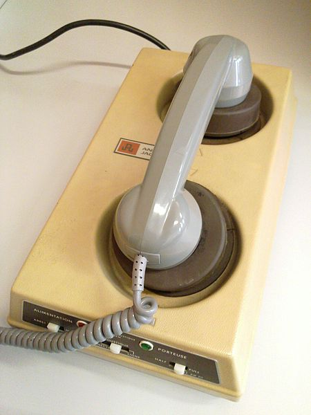
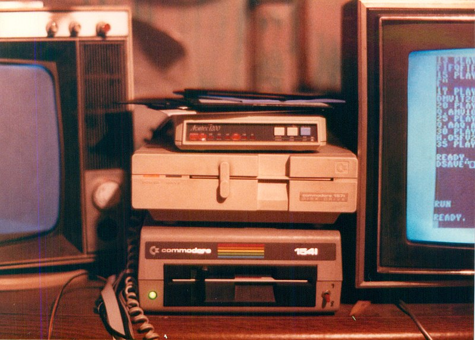
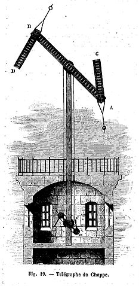
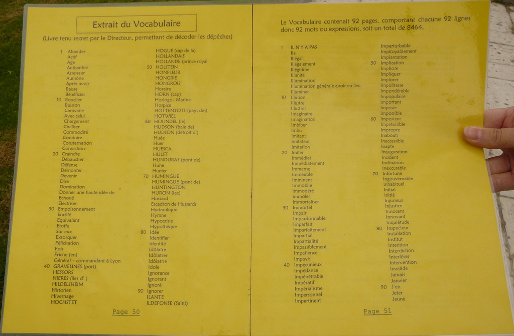
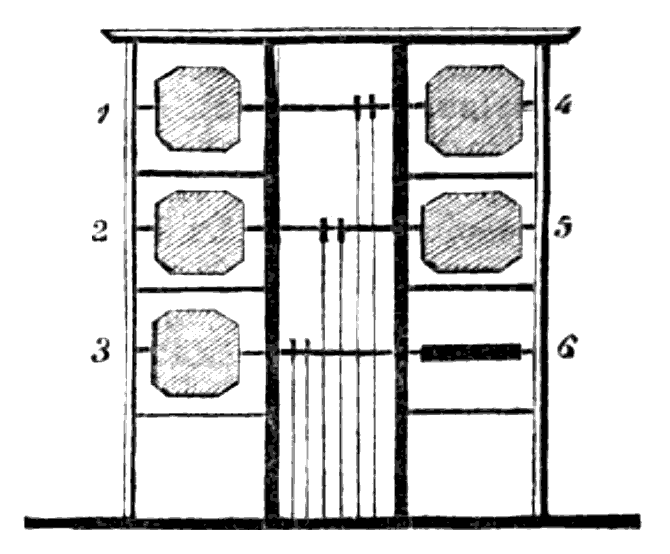
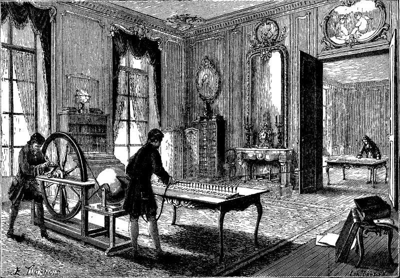

# From Baudot to Graphemes

## Part 1. The age of dial-up modems

> It [transmitting data with a modem] is a simple principle, and telecommunicating would be easy if all computers spoke precisely the same digital language. They don't, however, and that's where telecommunicating can become frustrating. - ASCII Express instruction manual

In 1985, I attended a small magnet high school called the Linworth Alternative Program. In one of the rooms used primarily for math classes, there was a dumb terminal, a rotary phone, and a 300 baud [accoustic coupler modem](https://en.wikipedia.org/wiki/Acoustic_coupler). On a piece of paper taped nearby was a list of phone numbers of local Columbus BBS servers - COMPUTE, The Tesseract, The Village (after the 1960s British TV show "The Prisoner"), others I've forgotten in the intervening decades.

:::tip


[Acoustic modem and phone plugged](https://upload.wikimedia.org/wikipedia/commons/a/a8/Acoustic_modem_and_phone_plugged.jpg)
by [Olivier Berger](https://commons.wikimedia.org/wiki/User:OlivierBerger)
is licensed under [CC BY-SA 3.0](https://creativecommons.org/licenses/by-sa/3.0/deed.en)
:::

You could dial one of these numbers, a modem would answer with a carrier signal, and you then placed the phone handset on top of the modem. After a second, the modems understood what was what, and their attached terminals could start exchanging data. In this case, the BBS would send you an info screen and login prompt, sometimes including ASCII art like so:

```
NetBSD 7.0.2 (PANIX-VC) #5: Fri May 12 12:13:35 EDT 2017

Welcome to NetBSD!

(1.101y 01-Jun-11 wtf 11pm pub) + MonoLib(1.23i 27-Aug-07). NetBSD-x86_64-7.0.

Current Users on Monochrome : 1.

[][]      [][]
[][][]  [][][]
[][][][][][][]
[][]  []  [][]  [][]   [][]   [][]   [][] []  []  [][]   [][]   [][][]  [][][]
[][]      [][] []  [] []  [] []  [] []    []  [] []  [] []  [] [] [] [] []
[][]      [][] []  [] []  [] []  [] []    [][][] [][][] []  [] []    [] [][]
[][]      [][] []  [] []  [] []  [] []    []  [] [] []  []  [] []    [] []
[][]      [][]  [][]  []  []  [][]   [][] []  [] []  []  [][]  []    [] [][][]

|We explicitly disclaim everything we may under English law. Specifically, but|
| not limited to the fact that any statement made by a user on this system is |
| not necessarily the view of, nor supported by the operators of this system. |


If you do not have a Monochrome account, enter 'guest'
Account :
```

(Source: mono.org telnet server)

Except it wouldn't quite have looked like that. Most of us had terminals that were only 40 characters wide, and most home computer keyboards back then only supported upper-case characters, thanks to [Woz not already being rich](https://www.vintagecomputing.com/index.php/archives/2833/why-the-apple-ii-didnt-support-lowercase-letters), and the lack of mass-market ASCII peripherals in 1974.

These "boards" were an awakening for me. They were social networks of nearby young computer enthusiasts who could suddenly communicate with people like them. This was back in a time when being a nerd was much less mainstream, and bullying wasn't exactly frowned on. For many of us who were some degree of an outlier in our normal lives, after our first public BBS post gets replies from our contemporaries, we realize we're normal and part of a larger community. It was beautiful. And years before any of us would discover the internet.

I liked connecting to boards so much that I needled my parents to buy a modem for my Apple //c. I'm pretty sure I still rode my bike places, climbed trees, played soccer, what have you, but if I was home I was on the computer typing furiously on one BBS or other.

My modem, an Avatex 1200, was more complicated than an accoustic coupler modem. You changed it's settings by typing to it from a terminal program on your computer, which would transmit command signals to it over a serial cable. The modem would start listening for commands when you typed "AT" (attention).

:::tip


[Commodore insitu loz](https://commons.wikimedia.org/wiki/File:Commodore_insitu_loz.jpg)
by [Alex Lozupone](https://commons.wikimedia.org/wiki/User:Tduk)
is licensed under [CC BY-SA 4.0](https://creativecommons.org/licenses/by-sa/4.0/deed.en)
:::

After that you could use "init string" commands to set properties for the connection like timeouts and how flow control (notifying a device to stop sending so you can catch up) will work on the next connection. Dialing the phone was the D command, and back then some phone lines didn't have touchtone service yet, so you said whether to dial in pulse or tone mode with P or T. A typical command sequence would be:

```
ATS30=12&K4
ATDT5551212
```

The first line is the init string. This particular one sets the inactivity timeout to 120 seconds and [Xon/Xoff flow control](https://en.wikipedia.org/wiki/Software_flow_control), where the control-S and control-Q characters are transmitted from modem to modem if either side needs time to process buffered data. The second line tells the modem to dial using touchtone to 555-1212 (we didn't need to include an area code on local numbers back then).

As modems got faster, there were more chances for errors in transmission (the phone network could have static, signal bleed, impedence problems, etc.), and for buffering problems as the speeds of UARTS, CPUs, and modem connections were all getting faster at different rates. Naturally, modem protocols needed to evolve to keep up. Between my discovery of the BBS scene in the 80s and getting hired into a tech support job at CompuServe in 1995, several protocols like LAPB, LAPM, MNP, and BTLZ were developed, and newer modems implemented them in hardware.

This meant that for backwards compatibility, modems got progressively more expensive to manufacture. The idea of passing some of the work off to the computer a modem was attached to became more attractive in the late 90s, when modem speeds were 33,600 baud and CPU speeds crossed the 300MHZ threshold. A few different [softmodems](https://en.wikipedia.org/wiki/Softmodem) hit the PC consumer market then, and it was nothing short of a train wreck for us tech support folks. The average computer user wasn't very sophisticated back then, so talking them through installing a software driver for their modem was a chore, and often the computer wasn't up to the task and swapping error correction mode for something like "buffered async" mode was needed to keep a healthy connection.

Another common problem I ran into back then was with a modem's default flow control mode. CompuServe's client software had a list of modems for users to select, which would pre-populate an init string. All of these enabled [RTS/CTS flow control](https://stackoverflow.com/questions/957337/what-is-the-difference-between-dtr-dsr-and-rts-cts-flow-control), where most users would have had a better experience with Xon/Xoff. RTS/CTS only works between a modem and the computer it's connected to, and inevitably users with underpowered computers would run out of buffer on their modems because the computer couldn't process incoming data fast enough, and then either the user would lose data if they weren't in error control mode, or get disconnected after too many error-controlled packets have to be sent again. In Xon/Xoff, a struggling computer could send an Xoff character over the modem to the CompuServe side, and this helped prevent buffer overruns and disconnects.

I left the tech support world around the time that 56k modems started hitting the market, which was a pretty chaotic time. In 1998 the ITU published the [V.90 recommendation](https://www.itu.int/rec/T-REC-V.90-199809-I/en), which was an official call to action for both USRobotics and Rockwell, who created [incompatible 56k standards](https://www.inetdaemon.com/tutorials/computers/hardware/modems/v90.shtml), X2 and K56Flex, forcing consumers and online services/ISPs to pick a side or suffer slower connection speeds. Fortunately both companies were quick to adopt the common standard, since modems had also started using EPROMs that could be flashed to support more features.

I won't talk much here about V.90 modems, but it's an interesting topic. Digital lines had been added to the public phone network going back as far as the 1960s, not all the way to customer phones on the "local loop", but between "trunks" of the phone network. In 1988, The ITU rolled out recommendation [G.711](https://www.itu.int/rec/T-REC-G.711/), a codec for encoding voice data, turning speech into a .wav file, essentially. Some ISPs had digital lines all the way to their modem banks, and could use digital modems. V.90 allows a connection where receiving (from the customer's point of view) data can happen in G.711, and transmission happens in V.34.

In 2000 the standard was enhanced with V.92, the basic change being an attempt to negotiate G.711 on both transmit and receive happened, with both falling back to V.34. I don't know enough about the technology to speak intelligently about where the conversion to audio happens, or whether V.92 required digital local loop lines as well.

Either way, this turned out to not be very relevant, as consumers started getting true digital piped to their homes with DSL and cable internet, where 56k would seem slow in comparison. Internet users in big cities where this was first rolled out were quick to migrate, and dial-up modems started showing up in thrift stores and garage sales.

This type of technical progression, improvements causing new problems, regulators getting involved when adoption gets wider, has repeated itself throughout the history of telecommunications. The two basic problems of how to send signals faster, and what those signals mean, are constants that we've been contending with for a very long time.

These days most of us receive data over high speed internet connections, in the unicode character set, transmitted using UTF-8 encoding. But all of those things are very new. Going back to as recent a time as 1985 when "getting online" was brand new to me, there was no unicode. Data was transmitted very slowly, in 7 or 8 bit ASCII, with [disagreement](https://en.wikipedia.org/wiki/Windows-1251) [over](https://en.wikipedia.org/wiki/ISO/IEC_8859-1) what characters were represented by symbols 128-255.

## Part 2. In the aftermath of revolution

> Paris is quiet and the good citizens are content - Napoleon

The tech used in dial-up modem communications is built on ancient concepts.

Transmitting simple information over distance has been done with simple tools throughout recorded history. Natives of the Americas and Australian aboriginals used smoke signals. Ming dynasty China used [a relay system of beacon towers](https://link.springer.com/article/10.1007/s12520-021-01283-7) along the Great Wall to warn of invaders. The ancient Greeks got creative with their [Polybius square](https://en.wikipedia.org/wiki/Polybius_square) fire-signaling to describe coordinates on a grid of letters (or on a cipher grid).

A big leap forward from Polybius happened in France during the French Revolution. Claude Chappe conceived of a semaphore telegraph which would sit above a tower. The telegraph had two indicator arms that could each be rotated to 7 distict positions, connected to a base that could be rotated into a horizontal or vertical position, giving `$7 \times 7 \times 2 =  98$` distinct numeric codes. Each tower also had a telescope, to view other telegraphs in a chain between cities.

:::tip


[Télégraphe Chappe](https://commons.wikimedia.org/wiki/File:T%C3%A9l%C3%A9graphe_Chappe_1.jpg)
by [Louis Figuier](https://en.wikipedia.org/wiki/Louis_Figuier)
is licensed under public domain
:::

Six of the codes were meant to convey status information, or "control codes" - start of message, no one at the station right now, etc. The remaining 92 positions were used in a two-symbol code, where each code represented a French word, giving `$92 \times 92 = 8,464$` possible words. Each station would have a codebook of 92 pages, with 92 words on each page.

:::tip


[ExtraitDuVocabulaire](https://commons.wikimedia.org/wiki/File:ExtraitDuVocabulaire.JPG)
by [Anne Goldenberg](https://commons.wikimedia.org/wiki/User:AnneGoldenberg)
is licensed under [GFDL-1.2-or-later](https://en.wikipedia.org/wiki/GNU_Free_Documentation_License)
:::

When Napoleon came to power, he made use of these towers to communicate with his army an order of magnitude faster than the next quickest option, delivery of physical letters via horseback. This method of communication was very timely, since France's neighbors had taken a hostile stance towards them, worried about revolution spreading into their countries and their own monarchs getting their heads lopped off.

Napoleon found the Chappe telegraph network so useful that he recruited Claude's brother Abraham to design a telegraph that could [communicate across the English channel](https://shannonselin.com/2020/05/chappe-semaphore-telegraph/), and a mobile telegraph that could be used in a Russia compaign, which was unworkable with the tools Abraham had to work with.

Why Abraham and not Claude? Sadly, Claude suffered from depression, not helped by the strain of his contemporaries competing for attention, declaring that they had invented the telegraph first, or made a better one. Ultimately Claude committed suicide. His gravesite has a replica of a Chappe telegraph, with its indicator arms set to the "at rest" position.

:::tip


[Cimetière du Père Lachaise tombe de Claude Chappe](https://commons.wikimedia.org/wiki/File:Cimeti%C3%A8re_du_P%C3%A8re_Lachaise_tombe_de_Claude_Chappe.jpg)
by Mimmo109
is licensed under [CC BY-SA 3.0](https://creativecommons.org/licenses/by-sa/3.0/deed.en)
:::

After witnessing Napoleon's use of the Chappe network, the utility of being able to communicate over distance reliably and at speed wasn't lost on the rest of Europe. Within a few years optical telegraphs were being designed and built in Sweden, Denmark, England, and Spain, and they were in use by the early 19th century. Each country ended up with unique designs and encoding systems, all incompatible and in local language character sets. A grid of shudders was a popular idea.

:::tip


[Murray Shutter Telegraph 1795](https://commons.wikimedia.org/wiki/File:Murray_Shutter_Telegraph_1795.png)
is licensed under public domain
:::

## Part 3. The age of electricity

> What hath God wrought? - Samuel Morse

The thing about using towers, semaphore, and telescopes for communication is... a whole lot can go wrong. Your messages are plainly visible to anyone nearby, needing only a codebook to decipher them. You rely on intermediaries to be available, to accurately transcribe and transmit, and you rely on light and good weather for visibility.

A more reliable, secure, and fast method of sending messages was sending electric signals over wire. This technology was in its infancy during the French Revolution, but an early prototype electric telegraph was created in 1774 by physicist [Georges-Louis Le Sage](https://en.wikipedia.org/wiki/Georges-Louis_Le_Sage), while Claude Chappe was still a child.

:::tip


[Lesage's Telegraph](https://www.gutenberg.org/files/8862/8862-h/8862-h.htm#7)
is licensed under the [Project Gutenberg License](https://www.gutenberg.org/policy/license.html)
:::

The spinning wheel in the above image generates static electricity. There are 24 or 26, depending on [which](https://en.wikipedia.org/wiki/Electrical_telegraph) [source](https://www.gutenberg.org/files/8862/8862-h/8862-h.htm#7) you believe, wires hooked to contraptions in two rooms. Here's a description from George Prescott's [History, Theory, and Practice of the Electric Telegraph](https://commons.princeton.edu/motorcycledesign/wp-content/uploads/sites/70/2018/07/History_theory_and_practice_of_the_elect1.pdf):

> Lesage ... constructed an apparatus composed of twenty-four wires, corresponding to the twenty-four letters of the alphabet, and separated from each other by insulators. To the extremity of each one of these wires a [pith-ball](https://www.youtube.com/watch?v=Zfg_ryinAME) was suspended by a silk thread. By touching the wires with an electrical machine, the other extremity of the conductors —the pith-ball — would be repulsed, and thus make known the letter indicated.

The Le Sage telegraph is interesting, and a good proof of concept for communicating without line of sight, but it was impractical to use that many wires over any real distance, where each wire required insulation against other wires' static charges.

In 1816, English scientist Francis Ronalds built a telegraph that needed only one "wire", although his prototype used a hard to imagine amount of wire strung in a grid between two insulators - eight miles of wire!

From the 2016 Physics Today article [The bicentennial of Francis Ronalds’s electric telegraph](https://pubs.aip.org/physicstoday/article/69/2/26/415427/The-bicentennial-of-Francis-Ronalds-s-electric)

> Cooke, Wheatstone, and Morse took advantage of important new discoveries in electrical science, beginning with Hans Ørsted’s 1820 observation that electricity and magnetism were interrelated. The electromagnet, developed a few years later, enabled mechanical work to be done at a distance by applying a current. Electromagnets could be deployed as a relay switch to operate the telegraph receiver or in repeaters at intermediate wire locations to increase the transmission distance. In 1827 Georg Ohm published his famous law, which related electromotive force, current, and resistance and allowed circuits to be designed mathematically. Finally, John Daniell in 1836 created a battery much longer lasting and more reliable than Volta’s pile. All the elements were available to put together a new generation of electric telegraphs powered by current rather than static electricity.
