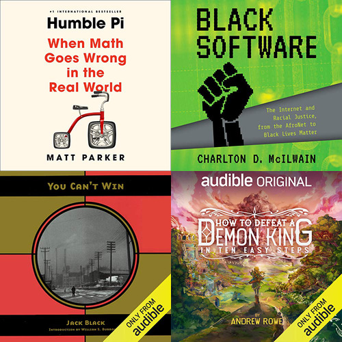

# Books of the year, 2020

:::hero

:::

Some things happened this year that took a bite out of my love for fiction. I spent most of my media consumption in 2020 on current events, listening to late night talk show hosts shake their collective fists at Trump and his posse of criminal buffoons, and as a result I ended up finishing more non-fiction books than I usually consume in a year.

In fact, my list of good reads for the year contains only two works of fiction.

## Stasiland - Anna Funder

The Stasi were the post-WWII secret police in East Berlin. Similar to the KGB, they set up a network of citizen spies, reprogrammed or disappeared any dissidents, real or accused, and were generally a bunch of monsters demanding blind devotion to State and Party that would shame a Trump fan.

Stasiland is a prose retelling of interviews Anna conducted with former Stasi officers and citizens who lived under their thumb. Fascinating, and terrifying. This was recommended to me by a fellow engineer at Beam.

## Black Software - Charlton D. McIlwain

If you dig into the origins of the Black Lives Matter movement, you uncover a time machine that stretches back in time to the 1960s, to IBM's early efforts at affirmative action, to MIT's first black engineering student, and, believe it or not, CompuServe, my former employer and now-defunct online service.

You've probably heard of the digital divide, where working class, ethnically diverse areas have less access to the Internet. But did you know that there were 5.2 million African Americans online in 1995? Back then, if you knew where to look, there was a wealth of services devoted to black culture and struggles - AfroNet, NetNoir, GO AFRO. As a completely un-woke 20-something white boy in 1995, I had no idea any of this was a thing, despite having been glued to changes in the tech and online world. I just simply never knew to ask the question, and the Powers That Be were never overt in advertising activism... You had to ask; you would never be told otherwise.

The book is very winding, heralding heroes I had never heard of before - Derrick Brown, Mattie Arnold, William Murrell, who I would never have known about, but for professor McIlwain's investigations. It reads like some of my blog entries - a lot of research, clumsily hammered into a story, with seemingly bizarre revelations, such as IBM's relation to the Watts riots. A little clumsy, but astounding, especially to a man who lived in that world, without knowing any of this was going on.

## You Can't Win - Jack Black

No, not _that_ Jack Black. This Jack Black was a hobo and burglar in the early 1900s. The story takes you from his teenage years, where he started train-hopping, got mixed up with ne'er-do-wells, learned to blow up post office lockboxes for the cash inside, got caught again and again, spending time in many prisons in Canada and the US, and ultimately redeemed himself and finished life on the right side of the law.

In the story, we meet some of the most casually corrupt and abusive officers of the law and officers of the court you will ever hear about, prostitutes by misfortune, struggling to get out of the game, a hobo queen not afraid to stage a jailbreak, and the attrition of partner's in crime by accident, murder by rivals, or killed while breaking into homes.

This was William Burroughs's favorite book, and many of the themes show up in the otherwise unreadable book Naked Lunch. I agree with Burroughs that this book is amazing, less so that Naked Lunch should ever have been penned.

## How to Defeat a Demon King in Ten Easy Steps - Andrew Rowe

A lighthearted dive into a fantasy RPG world. The big nasty is resurrected, and had been destroying towns for years, while the world waits for a Link-like hero to be reborn. Our protagonist doesn't want to wait for that, and instead levels up her skills as a "bag mage" (meant to be supporting characters that manage inventory), and assumes the role of hero-proper, upsetting the balance of people's expectations.

Very cute, meant for a younger audience, but as a former RPG enthusiast now watching his daughters play a lot of Zelda, I can state with confidence that this holds up rather well for an adult audience, too.

## Humble Pi - Matt Parker

I've been following Matt on YouTube for a while, after enjoying him as a guest on Numberphile. He is a former math teacher who became, of all things, a comedian who talks about math things and why they're funny.

"Humble Pi" is a collection of stories about disasters, near disasters, and marketing or legal disasters, caused by math mistakes. [This video](https://www.youtube.com/watch?v=ig-2xlXfex4) shows Matt talking about the book with Adam Savage, which doesn't give away too much of the content. A couple that come up in the video are the Millenium Bridge, which you've no doubt seen video of swaying in the wind, and a McDonalds marketing campaign that overestimated by an order of magnitude just how many possible meal combinations they offer.

Great read, I won't spoil it for you, and you should [follow Matt on YouTube](https://www.youtube.com/user/standupmaths) if you are not already.

## Replay - Ken Grimwood

Oddly, I've been meaning to read this book since I was a teenager. My highschool girlfriend's mother gave it to me as a present.

The conceit of the book is that there is a couple who, upon death, wake up again as themselves in college, and get to live life over again. The story is philosophical, with many discussions about what should be done with the power of foresight. Should they just make bank by playing the stock market and live comfortable lives over and over? Should they help catch bad guys, or maybe help the government avoid political disasters? Also, what's up with each life starting a little bit later than the one before?

It's an imperfect book, and I'm tempted to fault the author for not being an Asimov, or a Bradbury, but the truth is it's a good story filled with great ideas. Grimwood isn't a grandmaster, but his writing and storytelling are accessible. The ideas here were built on by Catherine Webb in her book "The First Fifteen Lives of Harry August", and also by Audrey Niffenegger's "The Time Traveler's Wife", with some uncomfortable scenes where the protagonist's age gap and the fact that they regain their past-life memories at different times.

Imperfect, yes, but well done, and I recommend it as an addition to your collection of wacky natural sci-fi stories.

## The Minuteman - Greg Donahue

In the years leading up to WWII, the United States was more pro-nazi than you might imagine, including German immigrants in Newark, New Jersey showing anti-semitic films, having parades, and recruiting fascists.

The Jewish gangster Abner Zwillman, known as the "Al Capone of New Jersey", was a bootlegger and racketeer, and had the Newark police in his pocket. He organized a group of enforcers called The Minutemen, to violently and enthusiastically break up pro-nazi meetings. "The Minuteman" is Sidney Abramowitz, an ex-boxer, who took over the group in 1934, and fought nazis on the streets for six years.

This book is very gritty, and gives you the same grey feeling you get when you think about Al Capone running a Thanksgiving soup kitchen.
