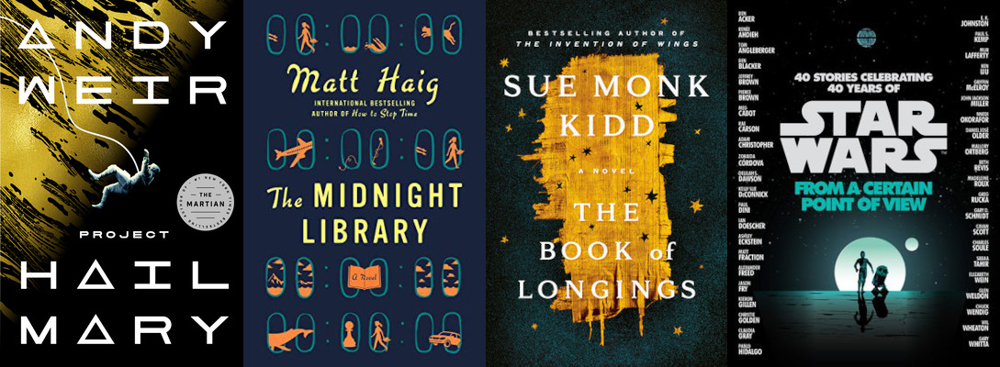

# Audiobooks of the year, 2021

:::hero

:::

There's no point in pretending I read physical books any more. I read code and web pages, an occasional e-book, maybe a pilfered PDF file from Sci-Hub, but most of my "book" consumption is from Audible, which I listen to as I commute or do chores. The links below are to Audible, but most of these you can find from your local library, [WorldCat](https://search.worldcat.org/), [OverDrive](https://www.overdrive.com/), [Hoopla](https://www.hoopladigital.com/), etc., as physical or e-books, books on CD, or downloadable audio.

2020 was a banger of a year, and I lost my taste for fiction. This year things turned around quite nicely, at least for my immediate family. I landed a better paying job where I am more respected, my children survived and I was able to finally get them vaccinated against covid. As a result, I was in better spirits and found being entertained to be more enjoyable, so I returned to my normal sci-fi/fantasy consuming ways, with only one non-fiction book in the mix.

## [Shadow of the Torturer](https://www.audible.com/pd/The-Shadow-of-the-Torturer-Audiobook/B00309TZRM?ref=a_library_t_c5_libItem_&pf_rd_p=80765e81-b10a-4f33-b1d3-ffb87793d047&pf_rd_r=4KNRQF743CY0363ZTZ6Z)/[Claw of the Conciliator](https://www.audible.com/pd/The-Claw-of-the-Conciliator-Audiobook/B0030EJON2?ref=a_library_t_c5_libItem_&pf_rd_p=80765e81-b10a-4f33-b1d3-ffb87793d047&pf_rd_r=4KNRQF743CY0363ZTZ6Z), Gene Wolfe

These are the first two of Gene's Book of the New Sun series, and I can't recommend them highly enough. His style of both world-building and slowly showing you different facets of the world is amazing. We learn that there is a feared monastic order, that there are contraptions with weird properties that are maybe magic, maybe super-science or alien. The "torturers", we find out, are not cruel Jigsaw analogues, but rather agents of the state who carry out sentences, and treat their "guests" well while they are in captivity.

Then we learn about either an aboriginal reclusive tribe hostile to outsiders, or maybe they're not quite human. An earlier species? Uplifted animals? The series has several instances of that, where the truth of the world is unclear, and good explanations for the world's mysteries are slow in coming.

## [Manufacturing Consent](https://www.audible.com/pd/Manufacturing-Consent-Audiobook/B06Y2J6MQZ?ref=a_library_t_c5_libItem_&pf_rd_p=80765e81-b10a-4f33-b1d3-ffb87793d047&pf_rd_r=4KNRQF743CY0363ZTZ6Z), Noam Chomsky

I wanted to revisit Chomsky, after struggling to get through "Hegemony or Survival" during the Bush years. I didn't realize when I picked this up that it was written during the 80s. It points out something pretty shocking, namely that American news organizations have always cherry-picked which atrocities in the world they report on. The book develops the "propaganda model" of communication, relating mass-media's attempts to acquire news cheaply, with support from advertisers and others who subsidize news, and avoiding blowback from lawsuits and other "enforcer" methods.

According to Chomsky, because of the propaganda model, there are modern genocides and other atrocities that the average American has never heard of.

## [Project Hail Mary](https://www.audible.com/pd/Project-Hail-Mary-Audiobook/B08G9PRS1K?ref=a_library_t_c5_libItem_&pf_rd_p=80765e81-b10a-4f33-b1d3-ffb87793d047&pf_rd_r=4KNRQF743CY0363ZTZ6Z), Andy Weir

It's hard to describe this story without unforgivable spoilers. There is something eating our sun, and some of the other stars in our local cluster. There is one star system nearby where this started to happen, but now that star is no longer dimming, and no one knows why. Clearly Earth's best chance of survival is flying out a middle school science teacher to investigate!

I'll skip trying to explain why this ends up making perfect sense, and just say that this book is profoundly better than The Martian, one of Weir's earlier works. And one of the best examples you'll ever see of waking up with amnesia and trying to sort out what situation you're in.

## [The Midnight Library](https://www.audible.com/pd/The-Midnight-Library-Audiobook/059334023X?ref=a_library_t_c5_libItem_&pf_rd_p=80765e81-b10a-4f33-b1d3-ffb87793d047&pf_rd_r=QV0Y4SWVV6SX1JA2S3PJ), Matt Haig

When you are on the brink of death, you visit a library, which contains row upon row of the possible variations on your life. You can ask the librarian to find you a book with specific properties. Give me a book where my cat didn't get hit by that car. Give me one where my mother's life turned out differently. What if I didn't do that one thing I regret really badly? You open the book and start reading, and are transported into that world.

If the world suits you, you can stay and continue that life instead, but you must make a choice before your body in the original world finishes dying. Beautifully done.

## [The Andromeda Strain](https://www.audible.com/pd/The-Andromeda-Strain-Audiobook/B00VGSQTHS?ref=a_library_t_c5_libItem_&pf_rd_p=80765e81-b10a-4f33-b1d3-ffb87793d047&pf_rd_r=QV0Y4SWVV6SX1JA2S3PJ)/[Sphere](https://www.audible.com/pd/Sphere-Audiobook/B00ZJQ8D8Q?ref=a_library_t_c5_libItem_&pf_rd_p=80765e81-b10a-4f33-b1d3-ffb87793d047&pf_rd_r=QV0Y4SWVV6SX1JA2S3PJ), Michael Crichton

The Jurassic Park book is imperfect, but in some ways it was an improvement on the movie. Each chapter heading was a dragon curve fractal, with each subsequent chapter being the next generation of the one prior. Hammond was clearly the bad guy, and Malcolm told him as much, proclaiming loudly that the system he was building was chaotic and would ultimately collapse, prior to coming to the island. The kids' ages were reversed, and no one was a hacker, or knew that "it's a unix system!". That scene is in the book, though, and it's much better (and much more is at stake) than watching Lex poke around in some 3D-represented file system. Sadly, Lex's character in the book is awful. Just a tomboy brooding about her father, and screaming at her brother a lot.

After seeing the stark differences in the book and movie version of Jurassic Park, I decided to explore some more Chrichton. Andromeda Strain I liked a lot, and was quite an improvement on its very 1970s movie. The story is simply that an alien organism hitched a ride to earth on a deorbited military satellite, and shortly thereafter everyone in a nearby town died. The town got cordoned off, a crack team of scientists were sent to a secret lab to study it, particularly why two people in town lived.

What I loved most about the story was how poorly Chrichton understood tech, but how what he described would have been believable in 1969. It has the same lovable feel as seeing Star Trek TOS bridge equipment with analog dials.

Sphere was... okay. There's a huge alien craft at the bottom of the ocean that has been there for a very long time, which has a sphere in it that can't be opened... unless you go there alone and really believe it will open, or something like that. People coming back from such interactions are sneaky and weird, and maybe going mad. I'm sure there's a good story in there, but reading back-to-back Chrichton books is oddly difficult for me. His stories are grounded in the real world. There may be something otherworldly going on, but the world still has politics, and bureaucracies, and Chrichton confronts us with things like racism in a clumsy, dated way. For lack of a better way to describe his style of pop sci-fi, I kept waiting for Jack Ryan to show up.

I suspect I'll give Sphere a second read to try to get more out of it. I think there's a good story in there, and I let the writing tone distract me too much.

## [The Invisible Life of Addie LaRue](https://www.audible.com/pd/The-Invisible-Life-of-Addie-LaRue-Audiobook/125077795X?ref=a_library_t_c5_libItem_&pf_rd_p=80765e81-b10a-4f33-b1d3-ffb87793d047&pf_rd_r=QV0Y4SWVV6SX1JA2S3PJ), Julia Whelan

Claire North, who did not write this book, is a recent discovery of mine, and wrote a few books that had a premise like this. There is a society of people who are reborn after they die. There are people who can body jump by touch, all of whom were murder victims in their first bodies and jumped at the last second. There are people who cannot be remembered shortly after you stop looking at them. I love the thought-exercise aspect to stories like that.

Addie LaRue is a woman who, like Claire North's Hope, can't be remembered. Except unlike Claire's characters who have their magical ability as an intrinsic part of them, Addie can't be remembered because of the curse of a dark god. Oh, and she's also immortal. And her writing disappears, and her name disappears from contracts.

On top of this premise, Whelan gives us an amazing love story, and explores loopholes in curses (can someone else write about Addie and have it stick?) and what happens when two curses collide. It's a very fun read.

## [The Book of Longings](https://www.audible.com/pd/The-Book-of-Longings-Audiobook/0593212835?ref=a_library_t_c5_libItem_&pf_rd_p=80765e81-b10a-4f33-b1d3-ffb87793d047&pf_rd_r=QV0Y4SWVV6SX1JA2S3PJ), Sue Monk Kidd

Kidd's writing is a constant song. It flows smoothly, with a passion for her characters, and it shines with knowledge of the world of the story - Galilee in the days of Jesus. Whether Jesus was divine or not is deliberately skirted in this story, but the man Kidd describes is easy to love, and she took his work and journey as seriously as Nikos Kazantzakis did. And like Kazantzakis's Jesus, Kidd's Jesus takes a wife, Ana, the story's real protagonist.

Through Ana we learn about the women of the Therapeutae, who study and meditate on Sophia, the feminine aspect of God. And of [incantation bowls](https://www.facebook.com/suemonkkidd/posts/1490103971172829/), of [The Thunder, Perfect Mind](https://www.pbs.org/wgbh/pages/frontline/shows/religion/maps/primary/thunder.html), and how much the ancient world hated educated women.

I've been struggling to find the words to describe this book for a long while now. It's wonderful. You should stop everything and go read it right now. Don't even finish this post!!

## [The Years of Rice and Salt](https://www.audible.com/pd/The-Years-of-Rice-and-Salt-Audiobook/B00X6ILNYU?ref=a_library_t_c5_libItem_&pf_rd_p=80765e81-b10a-4f33-b1d3-ffb87793d047&pf_rd_r=QV0Y4SWVV6SX1JA2S3PJ), Kim Stanley Robinson

This is a book I picked up years ago when it first came out, and made it about a third of the way through before putting it down, and for some reason never got back to it until this year. The premise is fun: What if the Black Plague killed all of Europe? The dominant world powers would be China and India, and first introductions to the indigenous peoples of the Americas would be very different.

The story is told from the point of view of three people whose lives are intertwined. In each period of history, the trio are reincarnated, with differing relationships in their new lives. In one early chapter, the karma of one of the group causes them to be reincarnated as a tiger. Between lives, the trio spend time in the Bardo, trying to figure out their goals, sometimes being less obedient before a rebirth, trying to avoid the water of forgetting (some analogue to Meng Po's soup or the river Lethe).

Robinson boldly rewrites the history of technology, from measuring longitude at sea, to flying machines, to science and mathematics. Eventually Europe is repopulated, and historians stumble across records of science and math that was going on in the 14th century prior to the plague. This is the best alternate history book I've come across.

## [Dracul](https://www.audible.com/pd/Dracul-Audiobook/0525640479?ref=a_library_t_c5_libItem_&pf_rd_p=80765e81-b10a-4f33-b1d3-ffb87793d047&pf_rd_r=QV0Y4SWVV6SX1JA2S3PJ), Dacre Stoker

What if.... Dracula was REAL?!

This is my new favorite vampire story, displacing Dan Simmons's "Children of the Night". The protagonist is Bram Stoker, a sickly boy who somehow becomes healthy later in his childhood, thanks maybe in part to a nanny the Stoker family employed, who disappears mysteriously. The conceit is that the book "Dracula" is a fictionalized telling of his own search to discover the truth about his caregiver, a vampire she associated with, and the hunt is aided by a Van Helsing analogue who becomes Stoker's benefactor.

Tremendous fun, and not lacking on the spooky front, either. I was surprised to learn that this was actually Dacre's third novel, and I'm eager to check out his earlier "Dracula the Un-dead" sequel to his great-great uncle's seminal work.

## [Star Wars - From a Certain Point of View](https://www.audible.com/pd/From-a-Certain-Point-of-View-Star-Wars-Audiobook/B074CNCXCF?ref=a_library_t_c5_libItem_&pf_rd_p=80765e81-b10a-4f33-b1d3-ffb87793d047&pf_rd_r=QV0Y4SWVV6SX1JA2S3PJ), multiple authors

That red R2 unit that Uncle Owen wanted to buy, do you think it just randomly blew a fuse, allowing R2D2 to join Luke and 3PO? Ah no. Was that trash compactor snake actually trying to kill Luke? Huh-uh. Welcome to Star Wars as told by other characters, where we learn the backstory of the Mos Eisley cantina band, drama between X-wing pilots, bean counters on the Death Star, and why exactly Ben was hanging out on Tatooine in the first place.

This was 40 short stories from different authors that made me feel 10 years old again. I loved every minute of it.

## [The Giver](https://www.audible.com/pd/The-Giver-Audiobook/B002UUQUB6?ref=a_library_t_c5_libItem_&pf_rd_p=80765e81-b10a-4f33-b1d3-ffb87793d047&pf_rd_r=QV0Y4SWVV6SX1JA2S3PJ)/[Gathering Blue](https://www.audible.com/pd/Gathering-Blue-Audiobook/B002V9ZBK2?ref=a_library_t_c5_libItem_&pf_rd_p=80765e81-b10a-4f33-b1d3-ffb87793d047&pf_rd_r=QV0Y4SWVV6SX1JA2S3PJ), Lois Lowry

My son has, in three separate grades, been assigned The Giver as a reading assignment. He's not a fan, but I suspect that has less to do with the book itself, and more with how it is taught, and the inevitable after discussion: "What do you think happens next?" as if the book wasn't part of a series.

In The Giver, we learn that something weird happened to the world, but not what it was. People can't see colors, and take libido-eliminating meds. There are no seasons, and no animals. Society is rigidly organized. Children are given a bicycle at a fixed age. Girls wear a hair ribbon until a certain age. When graduating school, kids are assigned jobs based on their aptitude. Families have two children, birthed by women who are assigned the ill-regarded job of birth mother. Every evening families meet and discuss what feelings they had that day, and what the feelings meant.

The elderly, in a life-celebrating ritual, are "released" from society to go "elsewhere". And not many people know what this actually means.

One role that does understand is the Receiver of Memories. There is a mysterious means of passing memories from one person to another, that apparently only Receiver's know how to do. They have memories of multiple people in the time before "The Sameness" happened. They remember animals and seasons, lust, hunger, pain, war. When passing a memory to a new person, they experience the memory as an event that just happened. If the memory is of being hurt, then you feel that same hurt, and need time to recover afterwards. If the memory is of being outside on a warm sunny day, your skin becomes warmer. The original receiver becomes the titular Giver, and gives the memories away completely, and the giver forgets. As painful memories are transferred, the weight of them is taken away from the giver.

Unfortunately, the receiver learns the truth of the world, and it is a lot to bear. The protagonist, Jonas, eventually comes to the Soylent Green moment, where he understands what it means to be released. There are a fixed number of people in the society. If a birth mother delivers twins, the lighter of the two...

In "Gathering Blue", we learn that the black & white sameness society isn't the only way the world went weird. There is another society that isn't subject to those rules, and they live more primitively. Some in the village are pretty brutal, fighting for resources, stealing food from each other, some with children who are essentially feral. The sick and disabled are taken to a field to either die of exposure, or be killed by "beasts".

Separate from the main villagers is the Council of the Guardians, who live more refined lives. There is an annual gathering that includes a singer dressed in a robe that details the world's history, who sings a ritual song that tells all that is known about how the world was in the past.

The story is from the perspective of a young girl with a deformed leg who the council takes in because of her skill at making and repairing clothing. She learns how to grow plants used in dyeing fabric from an old lady who lives away from the council, who puts it in her head that maybe not everything is as cool with the council as it seems. What's up with beasts, exactly? And is the singer really there by choice, or is he maybe more of a prisoner?

That sounds like a pretty bad spoiler, but both of these books are great about telling the reader things about the world that the characters don't understand yet.

Fun reads both, but YA fiction isn't something I normally seek out. Being halfway through the series, though, I'll probably soldier on and see whatever happened to that Jonas kid.

## [The Dispatcher](https://www.audible.com/pd/The-Dispatcher-Audiobook/B01KKPH1VA?ref=a_library_t_c5_libItem_&pf_rd_p=80765e81-b10a-4f33-b1d3-ffb87793d047&pf_rd_r=QV0Y4SWVV6SX1JA2S3PJ), John Scalzi

Whoever is controlling the universe decides that murder ain't a thing anymore. People still die of disease, accidents, and age, but if you deliberately kill someone, most of the time the body disappears. and they appear alive again at their home. And nobody knows why.

These facts create an incentive for a new profession: Dispatcher. A dispatcher kills someone in extreme circumstances, in order to preserve their life. Usually this happens in operating rooms for patients undergoing risky procedures. If the dispatcher believes a patient is close to death, they perform a mercy killing (they have special non-bloody foolproof gadgets for this), and (most times) the person appears back at home with a body in the condition it was yay-many hours ago.

That's a normal use for a dispatcher. There are some other, more shady off-book uses. At its heart, this book is a detective drama, where we are searching for a missing dispatcher with a shady past.

Very well done. I had never heard of Scalzi before Audible recommended him to me. He has a deep bibliography, and a few Hugo nominations, so there are a lot of good stories I'm anxious to explore.

## [Termination Shock](https://www.audible.com/pd/Termination-Shock-Audiobook/0063028085?ref=a_library_t_c5_libItem_&pf_rd_p=80765e81-b10a-4f33-b1d3-ffb87793d047&pf_rd_r=QV0Y4SWVV6SX1JA2S3PJ), Neal Stephenson

Stephenson usually makes my list every year, and this year's atypical offering of his is no exception. Termination Shock is set in the near future, as we continue to upset the world's climate. It opens with the queen of the Netherlands landing a plane on a murderous outsized wild boar in Waco Texas. Part of me thinks Stephenson pulled those items randomly out of a hat and tried to write a story around it.

Part of the story concerns a real political issue I wasn't aware of, the LAC (Line of Actual Control) in the disputed India/China border. There was a [1996 agreement](https://peacemaker.un.org/sites/default/files/document/files/2024/05/cn20in961129agreement20between20china20and20india.pdf) between the nations not to deploy firearms or explosives in the area, since, ya know, the nations both have nuclear weapons, and humanity is at risk if nuclear powers ever go to war with each other. Despite that, patrols try to claim territory and move the LAC by other means, such as going at each other with rocks and melee weapons, such as last year's [Galwan Valley clash](https://thebulletin.org/2020/07/sticks-stones-and-words-ugly-stability-between-india-and-china/) that caused the deaths of at least 20 soldiers.

In Stephenson's story, this conflict is more ritualized and performative, with videos of fights used as propaganda, individual fighters become YouTube stars, and the fights aren't to the death any more. It's Fight Club rules, where a fight goes on as long as it has to, and your side can tap out at any time and yield territory to the opposing force. One of the fighters specializes in the Sikh fighting style [Gatka](https://www.youtube.com/watch?v=uFS9t7svEiM), which employs a lot of jumping around and spinning with a sword or stick, as if you're being attacked by multiple opponents, which ends up being quite the game-changer in the LAC.

Most of the story is a meditation on the politics of geoengineering to address climate change. In theory we can blow a lot of sulfur in the atmosphere and cool the planet some, which scientists have noted happens naturally with some [volcanic erruptions](https://volcano.oregonstate.edu/climate-cooling).

Some of the book goes in the strange direction of considering the dating strategies of a widowed-but-still-young constitutional monarch while still being perceived as [doe normaal](https://accidentallydutch.com/guides-to-holland/doe-normaal-like-the-dutch), what happens if wild boars crossbreed with larger domesticated pigs from abandoned farms, and how people would manage to stay alive in a world where outdoor temps in excess of 120°F are common.

It has pretty mixed reviews. Stephenson's fanbase loves his cyberpunk, far-future, alternate universe stories, and when he branches out too far from that, there is much fist-shaking. I, for one, enjoyed the hell out of Termination Shock, if for no other reason that it brought me to some interesting nooks and crannies of the world I live in now that I'd never crossed paths with before.

## [The Player of Games](https://www.audible.com/pd/The-Player-of-Games-Audiobook/B004ZLBFZ4?ref=a_library_t_c5_libItem_&pf_rd_p=80765e81-b10a-4f33-b1d3-ffb87793d047&pf_rd_r=QV0Y4SWVV6SX1JA2S3PJ), Iain M. Banks

The Culture, what a bunch of socialist layabouts! The universe is the far future, with post-singularity AIs, and a post-scarcity society with no money or assigned work, where people are free to pursue interests of their choosing. A popular interest, we find out in this book, is the academic study of game theory.

My return to Banks's Culture series was prompted by an academic paper on a board game AI named "Player of Games". It was posted to Hacker News, and there were several mentions of this book in the comments, which the AI was named after, giving it high praise. So I threw it on my wish list, and just finished it last night.

In the Small Magellanic Cloud dwarf galaxy, there exists the war-hungry empire of Azad. It's no threat to The Culture, and for decades only a handful of AIs and first contact specialists even knew of its existence. Azad is also the name of a very complicated board game that is integral to life in the empire. Your strength of play can affect your social status in the empire, up to and including who is emperor. The game is played on multiple large boards that players walk around on, and games can take several days to complete.

This was much less the space opera of Consider Phlebas, the first book in the series. Similar to Hesse's Glass Bead game, we learn to fall in love with games whose rules we don't know, and as with Frank Herbert's saboteur extraordinary Jorj X. McKie on Dosadi, we see a gifted protagonist in a stressful environment thrive, and grow almost godlike analytical abilities.

The crux of the story is two peoples who detest each other. The Azad empire, which bears a strong resemblance to us, sees The Culture as soft, not needing to fight for anything. The Culture sees the empire as barbaric, classist, and depraved.

I loved it. Consider Phlebas was fun, but at its core was a ray gun shoot-em-up, so I didn't seek out more in the series. This more contemplative political drama I found much more appealing, so Banks goes back on the wish list for 2022!
