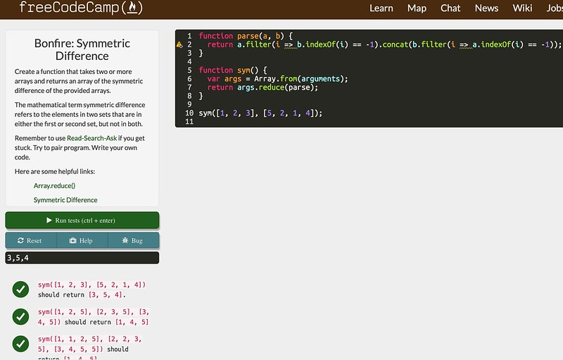
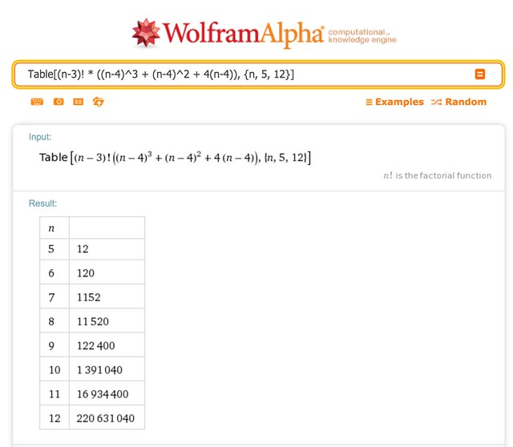
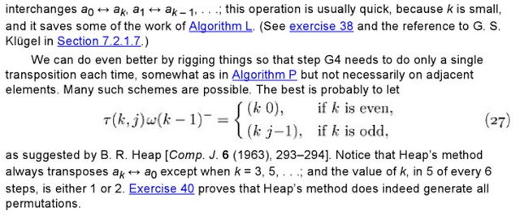
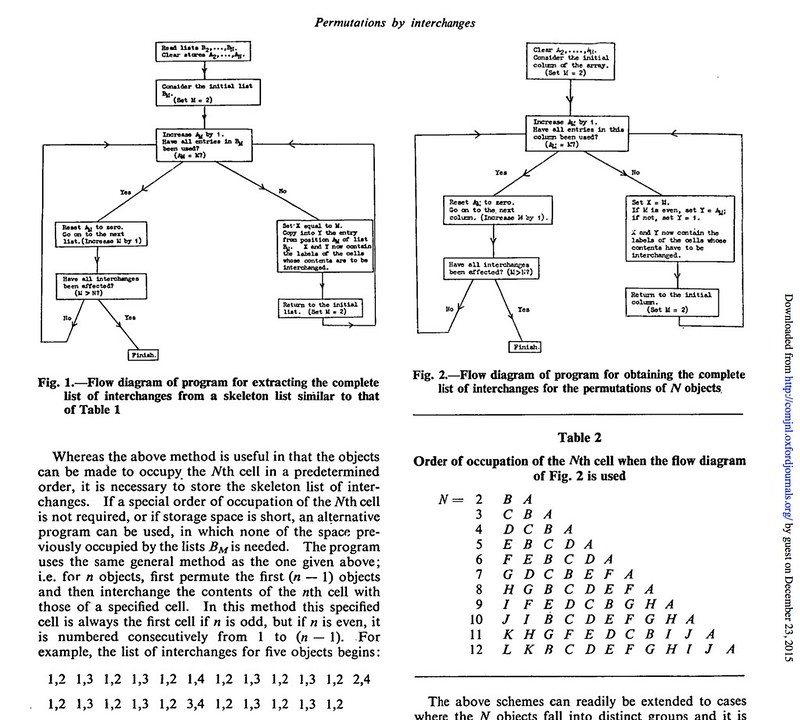
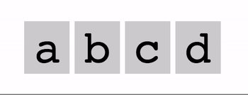

Recently I've been checking out coding tutorial sites, including Hour of Code, Khan Exercises, Codecademy, freeCodeCamp (fCC). This last site interested me because of its promise to hook budding coders up with nonprofits, and also because their codebase is on GitHub, under active development, and references modern libraries and tools (D3/CodePen, for instance).

The fCC tutorial includes incremental instructions on how to write basic HTML and JavaScript, challenges to solve, and links to Wikipedia pages or other sources on topics that will be needed for the exercise. When presented with a problem, you type JavaScript code to solve it right into the page and submit it, where a number of test assertions are run against your code. For example, the [Symmetric Difference](https://www.freecodecamp.org/learn/coding-interview-prep/algorithms/find-the-symmetric-difference) algorithm problem looks like this:

:::hero

:::

(The warning triangle is there because the library fCC uses for its syntax checks doesn't like arrow functions, but whatever your browser can execute runs fine against the test assertions.)

fCC appears to be successful at what it attempts. It has an active community, many users, and sparks local meetups in different cities, one of which I'm a member of. Whether or not it will be successful in the long run is anyone's guess, but it was at least successful in getting me out of my comfort zone of blogging on tech topics I'm interested in, and into coffee shops and libraries talking to other people.

### Algorithm challenge: permutations

One of the advanced algorithm challenges on fCC is called [No repeats please](https://www.freecodecamp.org/learn/coding-interview-prep/algorithms/no-repeats-please). It appears to be a simple combinatorics problem, but is a little more in-depth than it appears. Here is the text of the problem, and the test cases:

> Return the number of total permutations of the provided string that don't have repeated consecutive letters.
>
> For example, 'aab' should return 2 because it has 6 total permutations, but only 2 of them don't have the same letter (in this case 'a') repeating.
>
> permAlone("aab") should return a number.  
> permAlone("aab") should return 2.  
> permAlone("aaa") should return 0.  
> permAlone("aabb") should return 8.  
> permAlone("abcdefa") should return 3600.  
> permAlone("abfdefa") should return 2640.  
> permAlone("zzzzzzzz") should return 0.

Like many academic exercises, this is pretty far from a real-world problem, but that doesn't detract from its value as a learning tool. Let's look at the 'aab' case first. Why does it have 6 permutations? There are only 3 distinct "words" from those letters, namely 'aab', 'aba', and 'baa'. Whence 6? Assumedly this is because each of the two a's should be considered unique for generating permutations, but not unique when counting repeated letters. If we distinguish that visually, we can see all 6 combinations. Let's take our first a and capitalize it:

```
Aab
aAb
Aba
abA
bAa
baA
```

The permutations 'Aba' and 'abA' are the only two without 'A' and 'a' touching, so the algorithm we write should return 2 for that input.

### Rough draft solution

Here is a recursive, brute force attack of this problem:

```javascript
var out;
function permAlone(prefix, arr) {
  // Initialize if only called with one variable
  if (arr === undefined) {
    arr = prefix.split("");
    prefix = [];
    out = 0;
  }
  if (arr.length == 1) {
    var tst = prefix.concat(arr).join("");
    if (!/(.)\1/.test(tst)) out++;
  } else {
    arr.forEach((elem, ndx, a) => {
      var tmp = a.slice();
      tmp.splice(ndx, 1);
      permAlone(prefix.concat(elem), tmp);
    });
  }
  return out;
}

permAlone("aab");
```

This splits the string passed to it into prefix and remainder arrays. The remainder array is iterated over, and each element is appended to the prefix array, and the function is called again. When the last digit of the remainder is reached, a string is built, and compared against a test regular expression to see if any duplicate letters are touching.

The regex I used is `/(.)\1/`, which is an idiomatic way to check for duplicate characters in a string. Everything in parentheses becomes a numbered match, starting with $1, then $2, $3, etc. A dot matches any character, and a number preceded by a backslash is a backreference, matching a prior numbered match. In regex-speak, this says "match any character immediately followed by itself." Predictably, others who solved this problem used the same regex I did.

Ideally, I'd like to have found a generic mathematical formula for calculating this, so I set about generating some other tests using my working brute-force solution, to try to untangle the underlying math.

### Searching for an algorithm

First, I tested strings where there were no duplicated letters.

```
permAlone('a')    =  1
permAlone('ab')   =  2
permAlone('abc')  =  6
permAlone('abcd') = 24
```

As expected, the results were the factorial of the string's length. Since there are no duplicated letters, each permutation, of which there are `n!`, passes the regex test. Next, strings with a single duplicated pair of letters:

```
permAlone('aa')     =   0
permAlone('aab')    =   2
permAlone('aabc')   =  12
permAlone('aabcd')  =  72
permAlone('aabcde') = 480
```

This matches `n! - 2(n-1)!`. Next, strings with two pairs of duplicate letters:

```
permAlone('aabb')    =    8
permAlone('aabbc')   =   48
permAlone('aabbcd')  =  336
permAlone('aabbcde') = 2640
```

After a bit of fiddling, I found a matching equation for these values, `n! - 4((n-1)! - (n-2)!)`, which gave me a lot of what turned out to be false hope for an easy generic solution. Here's the dealbreaker, three pairs of duplicate letters:

```
permAlone('aabbcc')    =    240
permAlone('aabbccd')   =   1968
permAlone('aabbccde')  =  17760
permAlone('aabbccdef') = 175680
```

After playing with various forumlas until my eyes crossed, the best I came up with was a sequence to match the same numbers:

```
6! - (3! *  80) =    240
7! - (4! * 128) =   1968
8! - (5! * 188) =  17760
9! - (6! * 260) = 175680
```

...but finding the significance of 80, 128, 188, and 260 eluded me, so I gave up trying to blindly churn through numbers, and turned to the [OEIS](https://oeis.org/), the On-line Encyclopedia of Integer Sequences, which existed prior to the late-90's consumer Internet boom, hence 'on-line' is hyphenated unironically.

After some searching, I found 240 and 1968 in entry [A173841](https://oeis.org/A173841), the number of permutations of 1 through N where no adjacent pair sums to N+1. A couple entries down, 17760 and 175680 were found in a similar sequence, [A173843](https://oeis.org/A173843), where no pairs summed to N+3. The formulas were simple, and I was able to combine them to create a generic rule that applied to all of the test sequences I had generated so far:

```javascript
var fac = [
  1, 1, 2, 6, 24, 120, 720, 5040, 40320, 362880, 3628800, 39916800, 479001600,
  6227020800, 87178291200, 1307674368000, 20922789888000, 355687428096000,
  6402373705728000,
];
function binomial(n, k) {
  return fac[n] / (fac[n - k] * fac[k]);
}

function a(n, m) {
  var sum = 0;
  for (var j = 0; j <= m; j++) {
    sum += Math.pow(-2, j) * binomial(m, j) * fac[n - j];
  }
  return sum;
}
```

Rather than calculate factorials by rote, I used a fixed array up to the JavaScript maximum safe integer, to make calculating binomial coefficients a little easier. The inputs to the function are `n`, the length of the string, and `m`, the number of pairs of duplicated letters.

For strings from length 1 - 4 with no duplicates:

```
a(1, 0) =  1 = permAlone('a')
a(2, 0) =  2 = permAlone('ab')
a(3, 0) =  6 = permAlone('abc')
a(4, 0) = 24 = permAlone('abcd')
```

For strings from length 2 - 6 with one pair of duplicates:

```
a(2, 1) =   0 = permAlone('aa')
a(3, 1) =   2 = permAlone('aab')
a(4, 1) =  12 = permAlone('aabc')
a(5, 1) =  72 = permAlone('aabcd')
a(6, 1) = 480 = permAlone('aabcde')
```

Length 4 - 7 with two pairs of duplicates:

```
a(4, 2) =    8 = permAlone('aabb')
a(5, 2) =   48 = permAlone('aabbc')
a(6, 2) =  336 = permAlone('aabbcd')
a(7, 2) = 2640 = permAlone('aabbcde')
```

And finally, the tricky one that sent me on this quest in the first place, length 6 - 9 with three duplicated pairs of letters:

```
a(6, 3) =    240 = permAlone('aabbcc')
a(7, 3) =   1968 = permAlone('aabbccd')
a(8, 3) =  17760 = permAlone('aabbccde')
a(9, 3) = 175680 = permAlone('aabbccdef')
```

This alone is enough to satisfy the fCC exercise. The test cases included either strings that were all the same character, which can easily be tested for first, and then either one or two pairs of letters, with strings of small length. My new algorithm could pass the tests, however it wasn't a generic solution for the actual exercise, and would not work for all possible inputs. If the problem statement was that only pairs of duplicate letters were possible, then this would be the optimal stopping point.

The possible inputs aren't specified, so we must assume they are free-form, meaning we can get three of the same letter. What happens then?

```
permAlone('aaa')        =       0
permAlone('aaab')       =       0
permAlone('aaabc')      =      12
permAlone('aaabcd')     =     144
permAlone('aaabcde')    =    1440
permAlone('aaabcdef')   =   14400
permAlone('aaabcdefg')  =  151200
permAlone('aaabcdefgh') = 1693440
```

This sequence appears in OEIS in [entry A182062](https://oeis.org/A182062/table) on the fourth line of the "square array" section, in a count of permutations of how to queue men and women in line so that no two men are adjacent... an odd thing to be concerned about, for certain. The formula isn't iterative, as the pairs formula is, but just uses straight factorials and binomial coefficients.

### Submitting to the OEIS

One of my test sequences was combining three of a kind with a pair:

```
permAlone('aaabb')        =        12
permAlone('aaabbc')       =       120
permAlone('aaabbcd')      =      1152
permAlone('aaabbcde')     =     11520
permAlone('aaabbcdef')    =    122400
permAlone('aaabbcdefg')   =   1391040
permAlone('aaabbcdefgh')  =  16934400
permAlone('aaabbcdefghi') = 220631040
```

These numbers appeared nowhere on the Internet that I could find, which inidicated to me that there was not a known general formula for this type of problem. Given that the sequence directly relates to a combinatorics problem, it was a good candidate for a new OEIS entry, so I took a sidebar to register an account with them, and set about searching for a formula for this specific sequence.

After some experimentation, I found that the numbers all divided evenly by the factorial of the string's length (n) minus 3, giving this sequence:

```javascript
[6, 20, 48, 96, 170, 276, 420, 608, 846, 1140, 1496, 1920, 2418];
```

Searching for that sequence on OEIS didn't return an existing entry, but did run some math on the sequence and displayed the message `Your sequence appears to be: +1x3 + 1x2 + 4x`. Since the first value is from `n=5`, `x` is `n-4`. Using that, we can ask Wolfram Alpha to verify our results [with a table](https://www.wolframalpha.com/input?i=Table%5B%28n-3%29%21+*+%28%28n-4%29%5E3+%2B+%28n-4%29%5E2+%2B+4%28n-4%29%29%2C+%7Bn%2C+5%2C+12%7D%5D):



After verifying the equation, I generated the sequence up to 17 values (n from 5 to 21), and submitted it to OEIS [as a draft](https://oeis.org/draft/A266393), describing the sequence as "Permutations of n letters where there are exactly 3 A's and 2 B's, where no A's are adjacent and no B's are adjacent". Hopefully it will be accepted as a permanent entry, pushing someone more stubborn than me in the future closer to finding a general equation to handle all input types for this problem.

### Better brute-forcing

Since I could find no single formula for all possible inputs, my original solution of brute force iterating was the best option. My method of generating all the permutations was correct, but bloated. A better method is mentioned on the (now deprecated) [fCC wiki page](https://github.com/freeCodeCamp/wiki/blob/master/deprecated%20wiki/Algorithm-No-Repeats-Please.md) for this problem: Heap's Algorithm.

B. R. Heap, who has thusfar resisted my attempts to identify him or her, published [several papers](https://scholar.google.com/scholar?q=b.r.+heap) on ferromagnetism, group theory, and the fortran language in the 1960s. In a 1963 article in The Computer Journal titled [Permutations by interchanges](https://academic.oup.com/comjnl/article-abstract/6/3/293/360213), Heap introduced a permutation generator that uses single item swaps in a particular order.

The algorithm is very efficient, is cited in [45 other papers](https://scholar.google.com/scholar?cites=13253158272816423306), and made it's way into Knuth's section of combinatorial algorithms:



Knuth's notation is describing a nested loop, swapping a list's first item and current outer position if the outer position is even (0 indexed), or the outer position and inner position if the outer position is odd. Heap's own paper describes using a pre-generated list of swaps, and then pitches the odd/even algorithm at the end almost as an afterthought:



Here is an animation of Heap's algorithm running on a 4 character string:



All the implementations I found wrote this out as a recursive function, some using a global array of position indices to increment and set back to 0. My implementation is a single, non-recursive loop, using modular arithmetic to determine what items get swapped. It uses a callback function reference to be run after every swap, which in the case of the fCC exercise is comparing adjacent characters, and incrementing a counter if no duplicates are found:

```javascript
function iterate(arr, callback) {
  var fac = [
    1, 1, 2, 6, 24, 120, 720, 5040, 40320, 362880, 3628800, 39916800, 479001600,
    6227020800, 87178291200, 1307674368000, 20922789888000, 355687428096000,
    6402373705728000,
  ];
  function swap(a, b) {
    var tmp = arr[a];
    arr[a] = arr[b];
    arr[b] = tmp;
  }

  callback(arr);
  for (var iter = 1, last = fac[arr.length]; iter < last; iter++) {
    if (iter % 2) swap(0, 1);
    else if (iter % 6) swap(0, 2);
    else {
      var cycle = arr.length - 1;
      while (iter % fac[cycle] > 0) cycle--;
      var left = cycle % 2 == 0 ? 0 : (iter / fac[cycle] - 1) % (cycle + 1);
      swap(left, cycle);
    }
    callback(arr);
  }
}

function permAlone(str) {
  var arr = str.split(""),
    out = 0;
  function test() {
    if (arr.every((elem, ndx) => elem != arr[ndx + 1])) out++;
  }
  iterate(arr, test);
  return out;
}
```

Predictably, this runs faster on longer strings due to not using recursion (preventing a large call stack), or a new array for each iteration, both of which my rough draft solution used.

So, there you have it, a seemingly simple algorithm coding challenge, that has some subtlety, and hopefully will have a purely formulaic solution in the future.
