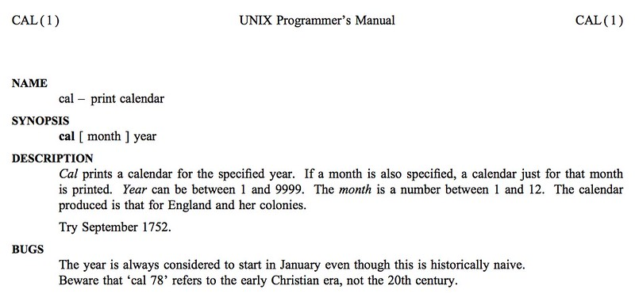
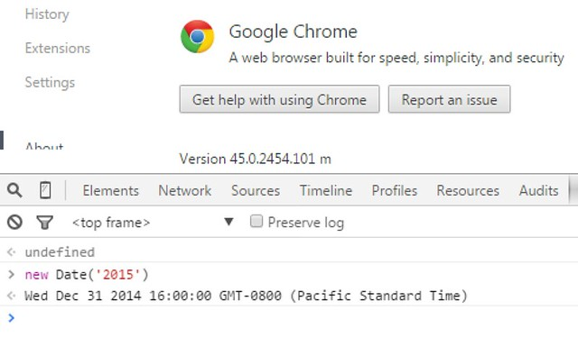
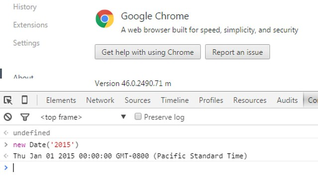
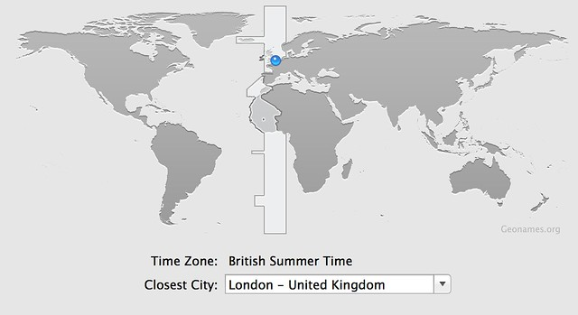
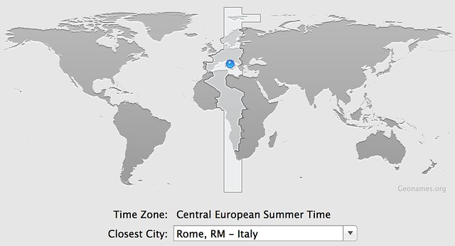
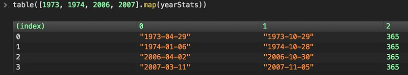
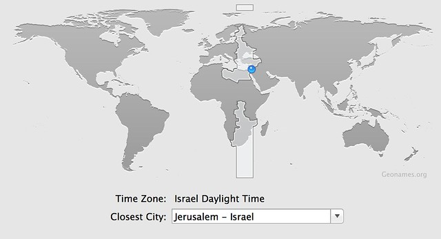
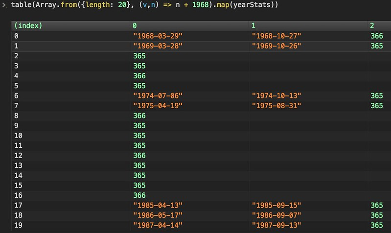

# JavaScript dates, trains, Passover, and Henry VIII

Measuring time is more nebulous than you might imagine. The length of a year isn't constant, neither is the length of a day, owing to planetary physics, e.g. the pull of gravity from other planets, and the gyroscopic effect of the rotation of Earth's axis (think of a spinning top wobbling as it slows) approximately every 26,000 years. Neither a year nor a lunar month complete in a whole number of days, and to complicate matters, their lengths are very close to a quarter day and a half day, respectively. This caused the mathematically literate of ancient times to attempt calendars using these fractions, which would slowly stray. Efforts to standardize calendars caused as many problems as they tried to solve, mostly surrounding religious observances, which I'll get into below. Nature, indifferent to man's planning, doesn't cooperate by giving us easy time tables, but rather gave us teasingly close to usable fractions to work with, leading to much strife among the devout where numbers are concerned.

Let's start with what we mean by "year". An anomalistic year is the time between the Earth twice reaching perihelion, the closest point to the sun on its elliptical orbit. A sidereal year is the time between the Earth twice reaching the same position with respect to fixed background stars. A tropical year, on the other hand, measures the time between the Earth twice reaching the same season, measured at the start of an equinox, where from our perspective the sun crosses the equator, our axial tilt is perpendicular to the sun's rays, and day and night are the same length. All three of these measurements vary slightly from each other, spanning a range of about 25 minutes, which you can see see in the various definitions for "year" at [His Majesty's Nautical Almanac Office](https://web.archive.org/web/20221121170014/https://asa.hmnao.com/SecM/Glossary.html) (Wayback Machine cache - the site has been down for "essential mantenance" since 2023).

The creation of calendars to satisfy religious observances concerns itself with astronomical events, such as the phase of the moon (lunar months repeat a frustrating 44 minutes more than 29.5 days on average) and seasons, which would necessitate defining a tropical year. For example, the beginning of Spring is very important to Judaism and Christianity, as this is the "coming of the light", where Passover and the Fast of the Firstborn, and the resurrection of Jesus are celebrated (I won't cover the strictly lunar Islamic calendar here, whose months don't stay aligned with seasons), and other observances and feast days are based on distance from the Spring rituals, such as the movable feasts of the Catholic Paschal cycle, and, as far as I can tell, Jewish holidays are fixed at set distances from the start of Passover. A fixed yearly calendar that identifies the start of Spring isn't possible, as the number of days in a year isn't a whole number; it has a remainder of slightly more, or slightly less, than a quarter of a day, depending on what you're measuring.

Jean Meeus and Denis Savoie's publication [The history of the tropical year](https://articles.adsabs.harvard.edu/cgi-bin/nph-iarticle_query?db_key=AST&bibcode=1992JBAA..102...40M&letter=.&classic=YES&defaultprint=YES&whole_paper=YES&page=40&epage=40&send=Send+PDF&filetype=.pdf) is a great introduction to the topic of measuring years, showing among other things that a small sample range of years varies by an incredible range of 4 minutes 28 seconds. The work also shows estimations going back to antiquity of exactly 365 and a quarter days for a "year" (when subdivisions of "sidereal" or "tropical" weren't yet realized... nor elliptical orbits, or who was orbiting who, for that matter), to Hipparchus' estimation in the 2nd century BCE of 365.25 - 1/300 of a day, to the 13th century Alfonsine tables, to the measurements of Copernicus, and Tycho Brahe, to a conclusion that the length of a tropical year decreases at roughly a half second per century. Fascinating read.

Without getting too mired in astronomy, let's go back to 46 BC, when Julius Caesar reformed the Numan calendar. The calendar of Numa Pompilius consisted of 12 months totaling 355 days, inserting an intercalary month (leap month) every few years to help line the seasons up. Unfortunately, this month was added irregularly, sometimes with political motivations like keeping a senator in office longer, with a confusing consequence of Romans living in other territories often not knowing what the current date was.

Caeser's reformed calendar, the Julian calendar, lined up the year much better into months whose names you are mostly familiar with, with the same lengths we use today. Normal years totaled 365 days, and the intercalary month was replaced with a leap day once every 4 years, lining up almost perfectly with a tropical year, being off by just 3 days in 400 years. The Julian calendar continued to be used through Europe more than a millenium after Rome lost power, despite it becoming increasingly clear that the Spring equinox kept moving earlier in the calendar.

### Enter the Christians

From "The Jewish Time Line Encyclopedia: A Year-by-Year History From Creation to the Present" entry for Hebrew year 4085, Julian year 325:

> The Christian Council of Nicaea (northwest Turkey) called by Constantine I passed measures to distance Christianity from Judaism and to limit the rights of Jews in the Roman Empire. They discussed the disengagement of the dates of Easter and Pesach (Passover) (which was dependent on the monthly decision of the Jewish Beit Din, as to when the new moon would inaugurate the month). The council also discussed changing the Sabbath from Saturday to Sunday. Some twenty years earlier, a Council in Elvira (Spain) had forbidden Christians from keeping the Jewish Shabbat, eating with Jews, or marrying them.

So, what's going on here? Essentially, the early Christian church had strongly Jewish roots. They celebrated the death and resurrection of Jesus at the start of Passover according to the lunisolar Hebrew calendar on the 14th day of Nisan. Let's talk a little about the Hebrew calendar, as it is genuinely a work of art.

There are 12 months in a common Hebrew year, alternating between 29 and 30 days, to match the 29.5 day lunar cycle. This gives 354 days to a common year. Since Pesach should begin in Spring, as the calendar drifts, a 30 day intercalary month "Adar Aleph" (or Adar I) is added between Shevat and Adar, changing the latter's name to "Adar Bet" (or Adar II). This happens 7 out of every 19 years, giving us an average of 354 + (30 \* 7 / 19) = 365.05 and change days per year. Not an exact tropical year, but hold that thought...

Months start on the new moon. Since a lunar month is not precisely 29.5 days, and seasons do not begin at the same point in a lunar cycle each year, there are two months that can be used to make fine adjustments as needed, namely Cheshvan, which can have a 30th day added to it (helping with our 365.05 problem), and Kislev, which can be reduced from 30 to 29 days, depending on what the situation calls for. There is a set formula for doing this based on events happening on certain days of the week, which I won't get into. Because of the flexibility of Cheshvan and Kislev, and fixed rules that are ritually followed for adjusting those months, the Hebrew calendar is self-correcting, and will stay in sync between groups not in contact with each other... in theory. In practice, groups ended up with holy days out of sync with each other occasionally, possibly owing to the changes in sky observation caused by local weather, or longitude when an event was on the cusp of two days.

When Christians started celebrating Easter in the 2nd century, they kept the Julian calendar, and relied on their Jewish neighbors to find out when that year's Passover would be. This caused problems for those Christians who wanted a clean break from Jewish traditions. The quote above really downplays the amount of Christian antisemitism of the time, but a passage from Constantine I's report on the Council of Nicaea, circa 325 called "On The Keeping of Easter" makes it much clearer how much hate there was for Jews in the early Christian church:

> When the question relative to the sacred festival of Easter arose, it was universally thought that it would be convenient that all should keep the feast on one day; for what could be more beautiful and more desirable, than to see this festival, through which we receive the hope of immortality, celebrated by all with one accord, and in the same manner? It was declared to be particularly unworthy for this, the holiest of all festivals, to follow the custom of the Jews, who had soiled their hands with the most fearful of crimes, ... in unanimously adopting this mode, we desire, dearest brethren, to separate ourselves from the detestable company of the Jews, for it is truly shameful for us to hear them boast that without their direction we could not keep this feast.

Um, wow. That's right out of the inaugural ecumenical council that tried to reach a concensus on what Christianity was, and hate language is front and center in it. I'll leave you to dwell on that at your leisure, but let's return to the numbers. The council came up with three declarations regarding Easter: It should be on a Sunday instead of a particular lunar phase, all of Christendom should celebrate it on the same day, and it should not be based on the Hebrew calendar. This was arguably the world's first ambiguous API, which unfortunately left too many classes as simple interfaces, relying on implementation-specific details, and having incomplete requirements, and any modern software developer reading this now is groaning at what was likely to follow.

Predictably, different groups picked different methods and did not, in fact, all celebrate on the same day. A general concensus that it should be a Sunday after the start of Spring was pretty popular, and two sets of tables were created, one with a 19 year cycle, another with an 84 year cycle (Der 84-jahrige Ostercyclus). It was kind of a mess. The Catholic Encyclopedia's [page on Easter](https://www.catholic.com/encyclopedia/easter#IV._Easter_Controversy) discusses some of this in greater detail. The point being, there was still controversy and confusion about this up to the 16th century, which was slowly being complicated by the Julian calendar's March 21 coming increasingly later than the actual Spring equinox as the centuries ticked by.

### Enter Pope Gregory XIII

In February of 1582, the pope published the Papal bull [Inter Gravissimas](https://www.bluewaterarts.com/calendar/NewInterGravissimas.htm) (named after it's opening sentence), which roughly translates from the Latin as "Among the gravest" or "Among the most serious", describing the new calendar system the church was adopting in October of that same year. From the publication:

> "While, therefore, this has been entrusted to us, an undeserved dispensation from God has been allowed. Our dear son Antonio Lilio, professor of science and medicine, brought to us a book, written at one time by his brother Aloysius [Luigi], in which this one showed that, by means of a new cycle of epacts which he had devised, and who directed his own particular Golden Number pattern and accomodated the entirety of any solar year, every [defect of] the calendar collapsed, and the constant calculations would endure for every generation."

The calendar introduced fine-tuning of leap years to prevent seasonal drift, and also included a [new method of calculating Easter](https://en.wikipedia.org/wiki/Computus#Tabular_methods). Aloysius Lilius is described as a divine hero, but he wasn't actually the first to submit to the church the basic algorithm for chopping off 3 leap years out of every 400. From page 163 of Duncan Steel’s "Marking Time: The Epic Quest to Invent the Perfect Calendar":

> "The intricate details of the calendar revision are somewhat confusing, so we must cover them in their proper place, but at this juncture I should make clear that the alteration in the mean year length (using 97 leap years in a cycle of 400 to produce an average of 365.2425, close to the length needed to keep the vernal equinox on the same date) is a relatively simple part of the overall problem which was tackled. That cycle had been suggested prior to Lilius’s proposal - for example, in 1560 the astronomer Petrus Pitatus of Verona had advocated this solution - and the essential novel feature of the scheme described by Aloysius Lilius which won over the pope and his advisers was a new system for calculating the date of Easter."

What were the details of the leap year adjustment? From Inter Gravissimas:

> "Then, lest the equinox recede from XII calends April in the future, we establish every fourth year to be bissextile (as the custom is), except in centennial years; which always were bissextile until now; we wish that year 1600 is still bissextile; after that, however, those centennial years that follow are not all bissextile, but in each four hundred years, the first three centennial years are not bissextile, and the fourth centennial year, however, is bissextile, so the years 1700, 1800 and 1900 will not be bissextile. Assuredly, the year 2000, as with our custom, will have a bissextile intercalation, February will contain 29 days, and the same rule of intermittent bissextile intercalations in each four hundred year period will be preserved in perpetuity ... Moreover, so that the fourteenth day of the Paschal moon is given with precision ... and which make it possible to find more surely and more easily the sacred date of the Easter."

The intended date of Easter had been settled hundreds of years prior to this, namely the first Sunday after the first full moon on or after the Spring equinox. What was meant by "Spring equinox" gave everyone fits, though, because there were three competing definitions: the astronomical event itself, March 21, and March 25. March 25 was in some locales (England, notably) the first day of the year, so, for instance, March 24 1500 is followed the next day by March 25, 1501. When the council of Nicaea met in 325, the equinox had slipped back to around March 21, which became popular to set as the calendar day of the equinox, even though by 1582 March 21 happened many days after the equinox.

To help mend all that was broken with Easter calculations, the Gregorian calendar fixed January 1 as the start of the year, and moved March 21, 1583 back to the Spring equinox by removing 10 days from the 1582 calendar - October 5 through 14.

The Inter Gravissimas quote above contains some archaic terminology referencing how ancient Rome calculated dates. The calends are the first day of the month, where the nones are the 5th or 7th of the month, depending on the month length, and the ides are the 13th or 15th (perhaps you've heard of the Ides of March?), and these referenced the new moon, half moon, and full moon respectively. "XII calends April" would be 12 days from April 1... inclusive. I calends April, by that math, is April 1, where II calends April is March 31, the day before April 1. So XII calends April is April 1 minus 11 days, or March 21.

The term "Bissextile" refers to adding a leap day that February to make "twice sixth" calends March. In other words, the extra day would cause two occurrences of VI calends March, or March 1 minus 5 days, which is February 24. Why that date was used has some history. Even numbers were considered unlucky in ancient Rome, so all the Numan calendar had months of odd numbers of days (29 or 31), except for February, which had 28, suitable because that month included the Februa festival of ritual purification. February also had two festival days back to back late in the month: Terminalia on the 23rd (a celebration of the god Terminus, not to be confused with the train station from The Walking Dead), and Regifugium (king's flight) on the 24th, which if I understand correctly is celebrating Rome becoming a republic after king Tarquin the Proud fled the city, and on leap years the bissextile day was stuck between them.

### Enter the Redcoats

This would have been a nice place to end calendar issues of Europe and their religious festivals, but that would have required the Catholic church in 1582 to still hold power over all of Europe. Unfortunately, Henry VIII wanted a divorce from Catherine of Aragon half a century earlier, in 1533, and so formed the Church of England as a mechanism to let that happen, and so England fell behind the curve, keeping the Julian calendar, causing, among other things, legal issues when contract dates in neighboring lands didn't match local dates. The only areas to adopt the 1582 date adjustment were the newly formed Polish-Lithuanian commonwealth, Portugal, Spain, and what is now Italy. France and the Netherlands (including Luxembourg and what is now Belgium) joined that December, and within a few years Holland, Austria, and Hungary had all converted to the Gregorian calendar as well. But not England or her territories; they held out for another 170 years.

In 1750, the British Parliament addressed the growing date problems with the <a href="https://www.legislation.gov.uk/apgb/Geo2/24/23">Calendar (New Style) Act</a>. From its text:

> "The Julian Calendar, hath been discovered to be erroneous, by means whereof the vernal or spring equinox, which at the time of the general council of Nice in the year of our Lord three hundred and twenty-five happened on or about the twenty-first day of March, now happens on the ninth or tenth day of the same month; and the said error is still increasing, ... The old supputation of the year not to be made use of after Dec. 1751. Year to commence for the future on 1 Jan. The days to be numbered as now until 2d Sept. 1752; and the day following to be accounted 14 Sept. omitting 11 days. ... any other hundredth years of our Lord which shall happen in time to come, except only every fourth hundredth year of our Lord, whereof the year of our Lord two thousand shall be the first, shall not be esteemed or taken to be bissextile or leap years, but shall be taken to be common years consisting of three hundred and sixty-five days, and no more;"

This follows the same rules as the calendar introduced by Pope Gregory, but any mention of the Catholic church, the pope, or even that this is commonly referred to as the Gregorian calendar are noticeably absent from the act. Beween the introduction of the Gregorian calendar and the Calendar (New Style) Act, 170 years had passed, and with a calendar drift of 3 days every 400 years, the Julian calendar was another 1 and a quarter days behind, so 11 days, instead of 10, had to be deleted to move March 21 back to the equinox.

Fortunately for the United States, in 1752 we were still nearly a quarter century away from secession from England, otherwise we may have held onto the Julian calendar longer, further complicating the issue.

### ...And Russia

Many other countries were holdouts, and an interesting list of conversion dates is available in the source code to the FreeBSD program [ncal](https://github.com/st3fan/osx-10.9/blob/master/misc_cmds-32/ncal/ncal.c), but Russia's conversion to Gregorian time is interesting enough for a quick sidebar.

Russia stuck to the Julian calendar until the middle of World War I. After the 1917 Bolshevik revolution (Red October, which was only in October locally, as the Gregorian world was by then 13 days ahead), the new Sovnarkom government (Совнарком = Совет народных коммиссаров = SOViet NARodnykh KOMmissarov = Council of People's Commissars... that's right, Soviet just means "council") implemented a swift set of decrees including withdrawing from the war, rules for peasants dividing up rural land, labor laws for wages and hours, abolishing classes, voiding debts... and changing to the Gregorian calendar. Russia made the switch at the end of January, 1918, having the following day jump right to February 14, in sync with the rest of the Western world. Interestingly, the Sovnarkom decree on changing calendars put a lot of thought into handling contract dates and wages, which the Pope's original decree and the British Calendar Act glossed over.

The Russian Wikipedia page on the [Декрет о введении в Российской республике западноевропейского календаря](https://ru.wikipedia.org/wiki/%D0%94%D0%B5%D0%BA%D1%80%D0%B5%D1%82_%D0%BE%D1%82_26_%D1%8F%D0%BD%D0%B2%D0%B0%D1%80%D1%8F_1918_%D0%B3%D0%BE%D0%B4%D0%B0) (which loosely translates as "The decree to introduce the Russian Republic to the Western calendar") shows a print of the act itself, where only points 1 and 10 refer to non-legal issues. Point 10, in fact, specified that until half a year had passed under the new calendar, the old Julian style date should still be included parenthetically after the new style dates on contracts. As far as official acts published immediately following a violent revolution, this wasn't half bad.

Another post-revolution Sovnarkom decree that grabbed my interest was for [reforming spelling](https://en.wikipedia.org/wiki/Reforms_of_Russian_orthography#The_post-revolution_reform) to remove unwieldy Slavic language rules, but the calendar decree is still printed with the old spelling rules, e.g. including the "hard sign" (ъ) after Декрет, the yat (ѣ) after в, etc.

### Unix picks England

Now that we have some background on just a small handful of history's calendars, let's take a look at some of the ways computers have incorporated date handling. Unix is a good place to start. This is some commentary by Dennis Ritchie on the First Edition of the <a href="https://www.bell-labs.com/usr/dmr/www/1stEdman.html">Unix Programmer's Manual</a> regarding timekeeping:

> We even anticipated the millenium bug: time was measured in sixtieths of a second since 1 Jan. 1971 as a 32 bit quantity. The BUGS section for time(II) remarks, "The cronological-minded reader will note that 2\*\*32 sixtieths of a second is only about 2.5 years." Later, this was patched more than once by declaring a new epoch, then again in 1973 by making the units full seconds dating from the 1970 New Year--this is the "classical" Unix epoch. Of course, it only pushed the issue off to 2038. Yet, the cal program even in 1971 knew about the hanky-panky in 1752!
>
> In 1971, when this manual was written, we had moved off the original PDP-7 to the PDP-11/20; it had 24KB of core memory, and no memory management hardware at all. The operating system and most of the software was still in assembly language, (rewritten or new, not "ported"). By this time we knew about the upcoming PDP-11/45, and had visited Digital in Maynard to talk about it; in particular, we had the specs for the floating-point instructions it supported. So the system described here included a simulator for the instructions (fptrap(III)).

In short, Dennis and Ken (Thompson) had their hands full writing the base Unix programs we hackers take for granted now. The text above implies they wrote memory management from scratch in assembly, and had to know low level chip operations like how to correctly handle floats on a specific piece of hardware. The complexity of this can't easily be overstated, so they can be forgiven for ending up with timekeeping that would break in three years, especially since they didn't leave it that way, and were able to adjust in future Unix versions, ending up with the defacto standard epoch, the one that all small systems programmers assume you mean when you just say "epoch": Midnight GMT, Jan 1, 1970.

In actuality, there are <a href="https://en.wikipedia.org/wiki/Epoch_(reference_date)#Notable_epoch_dates_in_computing">over a dozen common epochs</a> in use on different operating systems or individual programs, but for this article we are only going to focus on the one from Unix.

Dennis refers to the "cal" calendar program understanding the Gregorian cutover of England, and by extension the United States. The manual page for the cal program mentions this as well:



True to form, if you call up the calendar for September 1752, you see a month with some missing days:

```
~: cal sep 1752
    September 1752
Su Mo Tu We Th Fr Sa
        1  2 14 15 16
17 18 19 20 21 22 23
24 25 26 27 28 29 30
```

The FreeBSD-born calendar program, ncal, on the other hand, attempts to identify the Gregorian cutover date based on your locale, but falls back to British rules if a locale can't be found, or isn't associated with a Gregorian cutover. It also accepts a commandline switch to specify a two-letter country code rather than look up where you are. So if I wanted to see the calendar of Rome when the calendar Papal bull was published, I'd specify IT (Italy) as my location:

```
  ~: ncal -s IT oct 1582
    October 1582
Mo  1 18 25
Tu  2 19 26
We  3 20 27
Th  4 21 28
Fr 15 22 29
Sa 16 23 30
Su 17 24 31
```

Note the bizarre row/column reversal in ncal's output. The ncal manpage states this was deliberate to fit on a 25x80 terminal. If I want to see the calendar of Russia in the February after Red October...

```
~: ncal -s RU feb 1918
    February 1918
Mo    18 25
Tu    19 26
We    20 27
Th 14 21 28
Fr 15 22
Sa 16 23
Su 17 24
```

...we see that month starting on the 14th, as expected.

These three examples, and the above primer in calendar evolution, show that doing calculations with past dates is tricky. You need to know _where_ an event took place to understand what its recorded date means.

Unix systems use a variable time_t, originally a 32-bit signed integer, to record seconds since epoch, giving a range of 2,147,483,648 seconds (2 ^ 31) in both directions from the epoch, from December 1901 to January 2038. The switch to 64 bit hardware and Unix versions that take advantage of that with a 64 bit time_t variable effectively eliminate problems recording dates going back to the birth of the universe, and extending to long after our sun will go nova. This doesn't mean 2038 is going to be painless, as there will be enumerable code compatibility problems with switching the time variable type, embedded systems will need firmware upgrades or chip replacements, and there will be pleas for retired geezers (like I will be in 2038) to dust off their gladiator clothes, and head back to the arena to retrofit legacy systems, just like the call in 1999 to hire back all those COBOL programmers that were laid off in the 80s. Unlike the Y2K problem, which was caused by using two digits for a year instead of 4, there won't always be an obvious strategy to tackle 2038 issues; some are going to take creativity.

### Enter JavaScript

While Unix uses integers to record seconds, JavaScript has only one number type, a 64-bit float with 52 bits of mantissa. Additionally, the internal representation of dates is in milliseconds since epoch. With 52 bits of mantissa, we can use integer-safe floats of up to 2 ^ 53 - 1 milliseconds in both directions, or about 285,000 years, or 104,249,991 days. That's what the Number type is capable of representing, however the specification for [Date objects](https://262.ecma-international.org/6.0/#sec-date-objects) uses a more round number: plus or minus 100,000,000 days.

Along with storing the number of milliseconds since epoch, the JavaScript Date object provides functions to create a formatted date string, and extract or set date elements (month, day, year, etc.). It has by far the most unusual constructor in all of the official ECMA spec. Let's go through a few examples.

If called with no arguments, the constructor returns the current moment:

```javascript
» d = new Date()
« Sun Oct 25 2015 21:44:53 GMT-0400 (EDT)
```

It's important to note that JavaScript dates have no timezone internally; they are simply a count of milliseconds since epoch. Casting dates to strings shows the timezone of the user's locale at that moment in time. We'll talk more about timezones shortly.

If coerced to a Number, a JavaScript Date shows the internal milliseconds number. This is the same as calling its getDate() method.

```javascript
» Number(d)
« 1445823893067
```

If coerced to a String, a Date shows a friendly, but implementation-specific date:

```javascript
» String(d)
« "Sun Oct 25 2015 21:44:53 GMT-0400 (EDT)"
```

Calling a Date's toISOString method, however, creates the same output across all modern browsers, in a legal [ISO 8601](https://en.wikipedia.org/wiki/ISO_8601) string in YYYY-MM-DDTHH:mm:ss.sssZ format. Specifying a date constructor in the same format works, although JavaScript doesn't support all variations of the 8601 format, such as ordinal date (Julian day), or week number.

```javascript
» d.toISOString()
« "2015-10-26T01:44:53.067Z"
```

The single variable date constructor can take a date, number, or string. Using another date object is useful for quickly creating a clone of a date if you want to call setters without affecting the original. Using a number will build a date that references that number of milliseconds since epoch.

```javascript
» new Date(d)
« Sun Oct 25 2015 21:44:53 GMT-0400 (EDT)
» new Date(1445823893067)
« Sun Oct 25 2015 21:44:53 GMT-0400 (EDT)
```

Both the date and number constructors are unambiguous and don't rely on browser implementation vagaries. Not so for the string constructor, which attempts to guess what your input string means, and can go wrong in a number of different ways, including transposing date and month, adding 1900 or 2000 to two digit years, or constructing the date with reference to a local timezone instead of UTC (or vice-versa). For an example of the latter, here are two date constructors referencing the same date, one in a standard format for my locale, one in an ISO 8601-friendly format.

```javascript
» new Date('10/25/2015')
« Sun Oct 25 2015 00:00:00 GMT-0400 (EDT)
» new Date('2015-10-25')
« Sat Oct 24 2015 20:00:00 GMT-0400 (EDT)
```

The MM/DD/YYYY format created a Date object referencing midnight at my local time on that day, however the ISO string created a Date referencing midnight UTC on that day, and the string representation shows what time is locally when UTC is that time. This is the source for the majority of off-by-one problems that websites have. My database has a date string in it, I build a JavaScript Date out of it and do some math on it, extract the date again, and end up with a day earlier in my output.

Date element getters, such as getMonth, getFullYear, etc., have UTC variants (getUTCMonth, getUTCFullYear) to help address this, but even so some unexpected things can crop up. For example, compare the text of the ES5 and ES6 JavaScript standards regarding using the ISO-format date constructors.

ES5:

> This format includes date-only forms:
>
> <pre>YYYY
> YYYY-MM
> YYYY-MM-DD</pre>
>
> It also includes “date-time” forms that consist of one of the above date-only forms immediately followed by one of the following time forms with an optional time zone offset appended:
>
> <pre>THH:mm
> THH:mm:ss
> THH:mm:ss.sss</pre>
>
> All numbers must be base 10. If the MM or DD fields are absent “01” is used as the value. If the HH, mm, or ss fields are absent “00” is used as the value and the value of an absent sss field is “000”. **The value of an absent time zone offset is “Z”.**

ES6:

> This format includes date-only forms:
>
> <pre>YYYY
> YYYY-MM
> YYYY-MM-DD</pre>
>
> It also includes “date-time” forms that consist of one of the above date-only forms immediately followed by one of the following time forms with an optional time zone offset appended:
>
> <pre>THH:mm
> THH:mm:ss
> THH:mm:ss.sss</pre>
>
> All numbers must be base 10. If the MM or DD fields are absent "01" is used as the value. If the HH, mm, or ss fields are absent "00" is used as the value and the value of an absent sss field is "000". If the time zone offset is absent, **the date-time is interpreted as a local time.**

Google Chrome was the first browser to attempt to implement the ES6 rule, which changed the value a Date returned with a simple year-only constructor:




As of version 46.0.2490.80, Chrome went back to the prior constructor rules, which I assume is due to either the ambiguity of the ES6 rule (the timezone offset is only mentioned in regard to the time part of the constructor, and isn't mentioned at all in the date-only constructor), or because it broke previously working websites that relied on the (undefined) behavior of casting Dates to UTC if the YYYY-MM-DD constructor was used without explicitly appending a Z on the end.

Make no mistake, developing on top of a living standard with browsers implementing only subsets of it, or implementing ambiguous definitions differently from each other, has its aggravations. To guard against this as browsers implement the new rules, a string constructor should specify the full ISO 8601 string with an explicit Z on the end, e.g.:

```javascript
new Date('2015-10-26T01:44:53Z')
Sun Oct 25 2015 21:44:53 GMT-0400 (EDT)
```

The multiple-variable Date constructor takes numbers only, in the order year, month (0-indexed), day, hour, minute, second, millisecond. If called with less than 7 variables, the missing ones are assumed to be 0. The Date object is built assuming the variables refer to local time.

```javascript
» z = new Date(2015, 1, 2, 3, 4, 5, 6)
« Mon Feb 02 2015 03:04:05 GMT-0500 (EST)
» z.getMilliseconds()
« 6
```

A caveat to using this constructor signature is for years less than 100:

```javascript
» new Date(15, 0)
« Fri Jan 01 1915 00:00:00 GMT-0500 (EST)
» new Date(99, 0)
« Fri Jan 01 1999 00:00:00 GMT-0500 (EST)
» new Date(100, 0)
« Fri Jan 01 100 00:00:00 GMT-0500 (EST)
```

Compare those results with string constructors using those same years:

```javascript
» new Date('1/1/15')
« Thu Jan 01 2015 00:00:00 GMT-0500 (EST)
» new Date('1/1/99')
« Fri Jan 01 1999 00:00:00 GMT-0500 (EST)
» new Date('1/1/100')
« Fri Jan 01 100 00:00:00 GMT-0500 (EST)
```

This craziness is the Y2K problem all over again (note the cases where year 15 is supposed 1915 vs. 2015). If you want to actually work with years in the first century AD, you need to either use four digit years in the ISO 8601 string constructors, e.g., '0015-01-01T00:00:00Z', or call the setFullYear method after a Date is built:

```javascript
» y15 = new Date('1/1/15')
« Thu Jan 01 2015 00:00:00 GMT-0500 (EST)
» y15.setFullYear(15); y15
« Thu Jan 01 15 00:00:00 GMT-0500 (EST)
```

### Locales

For almost all uses, JavaScript understands only the Gregorian calendar. From the spec:

> 20.3.1.3 Year Number
>
> ECMAScript uses an extrapolated Gregorian system to map a day number to a year number and to determine the month and date within that year. In this system, leap years are precisely those which are (divisible by 4) and ((not divisible by 100) or (divisible by 400)). The number of days in year number y is therefore defined by

```
DaysInYear(y)
  = 365 if (y modulo 4) ≠ 0
  = 366 if (y modulo 4) = 0 and (y modulo 100) ≠ 0
  = 365 if (y modulo 100) = 0 and (y modulo 400) ≠ 0
  = 366 if (y modulo 400) = 0
```

That's it. There has always been a Gregorian calendar, and we've always been at war with Eastasia. For business purposes or calculating future dates, this is generally fine. But if we want JavaScript to understand that there were Julian to Gregorian cutovers, or that other calendar systems exist, we need to depend on third party libraries, or wait for wider adoption of the [Internationalization API](https://402.ecma-international.org/1.0/) (currently unsupported in Safari, and IE < 11), and use locales. Prior to the Intl API, the toLocaleString method was left as an implementation-dependent specification [defined as follows](https://262.ecma-international.org/6.0/#sec-date.prototype.tolocalestring):

> **20.3.4.39 Date.prototype.toLocaleString** ( [ reserved1 [ , reserved2 ] ] )
>
> An ECMAScript implementation that includes the ECMA-402 Internationalization API must implement the Date.prototype.toLocaleString method as specified in the ECMA-402 specification. If an ECMAScript implementation does not include the ECMA-402 API the following specification of the toLocaleString method is used.
>
> This function returns a String value. The contents of the String are implementation-dependent, but are intended to represent the Date in the current time zone in a convenient, human-readable form that corresponds to the conventions of the host environment’s current locale.
>
> The meaning of the optional parameters to this method are defined in the ECMA-402 specification; implementations that do not include ECMA-402 support must not use those parameter positions for anything else.
>
> The length property of the toLocaleString method is 0.

This boils down to "make a friendly string using whatever local rules you can descern". The Intl API clearly defines what this process should be, and outlines toLocaleString constructor signatures to control output format, and language definitions including region, characters set, and calendar (see [RFC 5646](https://datatracker.ietf.org/doc/html/rfc5646)).

So we can take our Oct 25 date from above and show it with my locale rules (en-US), British rules, rendered as a Hebrew calendar date, and rendered with long weekday and month names, so no one has to explicitly declare `var month = ['January', 'February'...]`:

```javascript
» d.toLocaleString()
« "10/25/2015, 9:44:53 PM"
» d.toLocaleString('en-GB')
« "25/10/2015, 21:44:53"
» d.toLocaleString('en-US-u-ca-hebrew')
« "12 Heshvan 5776, 9:44:53 PM"
» d.toLocaleString('en-US', {weekday: 'long', month: 'long', day: 'numeric'})
« "Sunday, October 25"
```

But like I mentioned, not all of these features are available across all browsers. For now, this use should be restricted to Node.js, browser extensions, or should be used with feature detection and polyfills. So if we're using a modern Chrome or Firefox, we can check to see if the year 1000 was actually a leap year or not...

```javascript
» k = new Date('2/29/1000')
« Sat Mar 01 1000 00:00:00 GMT-0500 (EST)
» k.toLocaleString()
« "2/24/1000, 12:03:58 AM"
```

So, in normal string coercion, year 1000 is not a leap year under Gregorian rules, since it is a multiple of 100, but not 400. However, using local rules, we can see that the year 1000 was actua... wait... what? February 24? 12:03:58?!

The February 24 in our previous locale string is explainable as the calendar drift that occurred between the council of Nicaea and year 1000, but whence the 3 minutes and 58 seconds? Okay, let's go back to school.

### Enter timezones

[Nevil Maskelyne](https://en.wikipedia.org/wiki/Nevil_Maskelyne) was involved with the British Board of Longitude in the mid-18th century, as the quest for better ways to determine a ship's longitude at sea was reaching its peak. The basic problem with finding one's longitude, or east-west position, while at sea was that you were trying to measure against the axis on which you were spinning. Angles between stars and the moon, or stars and a planet, were effective at telling a ship's lattitude, or it's north-south position, but not so of longitude.

There were a dozen ways to measure local time by similar geometrical analysis, when combined with accurate sea-worthy clocks (e.g., clocks that didn't lose accuracy due to a ship's constant motion against the sea), could tell you your current longitude by simply subtracting the local time from the time your clock was synchronized with, and each minute difference is a quarter of a degree. (360 degrees _ 4 = 1440, 24 hours _ 60 minutes = 1440).

After judging a competition of longitude measuring techniques, Maskelyne wrote a report suggesting that tables of moon positions for the coming year be published for mariners to use in conjunction with good timepieces on a ship, to back each other up. This led to the publication of The Nautical Almanac, and Maskelyne's appointment as Astronomer Royal when the previous holder of that chair died.

The Almanac was published with tables of the moon's position at various times throughout the year as viewed from a fixed location. The tables were a mathematical breakthrough of solving the three-body problem of positions of the sun, Earth, and moon, one of many contributions to history by mathematician Leonhard Euler. The fixed location of the tables was the Greenwich observatory, which led to Greenwich becoming the de facto reference point for marine navigation, and later to the meridian passing through it being accepted worldwide as the Prime Meridian.

Fast forward to the 19th century. By 1869, the Pacific Railroad in the United States became the last link in a transcontinental line of railroads, connecting California to the eastern rail lines. The various railroad companies of that time (Western Pacific, Union Pacific, Canadian Pacific, Wabash, Illinois Central, Burlington-Rock Island, etc.) had a scheduling nightmare on their hands, due mainly to the differing local times used in American cities.

From Henry Haines' 1919 book [Efficient Railway Operation](https://books.google.com/books?id=FkEuAAAAYAAJ&pg=PA387#v=onepage&q&f=false):

> The discordance of railway standards of time occasioned so great inconvenience to the traveling public that it had attracted the attention of horologists. Greenwich Observatory time had been established as a standard for the British Islands on January 13, 1848, by Act of Parliament. In 1869, Professor Charles F. Dowd of Saratoga, N.Y., proposed that railway-time in the United States should be standardized by plus or minus signs from meridians one hour apart, based originally upon the meridian of Washington, but afterward on that of Greenwich. Between 1876 and 1882 ... (descriptions of proposals from other sources, including the president of the Canadian Pacific Railway, another professor, and the president of Harvard) ... None of these proposals were approved by railroad-officials, as the establishment of standards arbitrarily based upon meridians cut across so many lines as to render such a system impracticable.
>
> In 1881, … presented the subject to the General Time Convention … At that time, there were over fifty standards of time in use on our railway system.
>
> In April, 1883, Mr. Allen presented a report including certain propositions as follows:
>
> 1. The division of time over the earth’s surface is to be based upon the meridian of the Greenwich Observatory and upon each successive fifteenth meridian around the globe. The whole 360 degrees of its circumference would thereby be divided by meridians one hour apart; and in sections 7 1/2 degrees on each side of these meridians, the time on that meridian would be the standard.
> 2. The boundaries between each section are to be so modified as to avoid curing arbitrarily across the operation of east-and-west lines, thus meeting the most important practical objections to the establishment of the change of time by even hours at such boundaries.

To avoid train stations needing 50 clocks, and crashes and deaths being more likely due to the sheer mathematical overhead of dealing with all the different city local times, railroads wanted a simpler method of timekeeping. At the same time, they didn't want to split any one line into two timezones. Eventually, William F. Allen (not to be confused with the ancient languages professor who published books of slave songs) proposed meridian-based timezones, coupled with having them zig-zag as necessary to not break an east-west rail line into multiple zones.

On November 18, 1883, the rail companies adopted this new timekeeping. There was ample resistance to it in the general community, particularly from devoutly religious balking at man's time vs. God's time, but some cities adopted it earlier than the 1918 official adoption by the United States with the Standard Time Act. New York was one such early adopter.

From the proceedings of the [New York Board of Alderman](https://babel.hathitrust.org/cgi/pt?id=njp.32101058411487;view=1up;seq=70), November 7, 1883:

> Whereas, A standard of time has been proposed for the belts respectively of geographical area, consisting of fifteen degrees each of longitude west from Greenwich, to be regulated by and to conform to the meridian of the central degree of the belts; and
>
> Whereas, The City of New York is near the centre of the fifth belt numbered west from Greenwich, or, in other words, near the seventy-fifth degree of longitute west from Greenwich, which belt extends its eastern limits to the eastern boundary of Maine, and its western limit to Detroit, a thousand miles, with New York City near its centre; and
>
> Whereas, This standard of time varies but four minutes from the mean or clock time of the City of New York...
>
> ...Whereas, The variation of four minutes in the time of the City of New York cannot appreciably affect its pursuits, while the benefit of the change will be incalculably great; therefore
>
> Resolved, That at noon on November 18, 1883, and thereafter, all time in the City of New York shall conform to the new standard, based upon the time of the seventy-fifth meridian, and that all time shown by the public clocks shall agree therewith.

The link above also has many other discussions around the issue, and makes for interesting reading. Note the "time varies but four minutes" statement. This turns out to be based on the longitude of New York City Hall, currently measured at 74.0059°, which was used at that time as the official time for the entire state, and was, by sheer chance, really, **really** close to a 15° meridian line. But not exactly the 4 minutes mentioned by the bill from the alderman meeting. Let's do some math:

There are 360 degrees in a circle and 24 hours in a day, giving each hour a 15 degrees arc of the Earth. 74.0059 / 15 is roughly 4.9337, which means that New York City Hall is almost, but not not quite, 5 hours behind GMT; it's a few minutes fast. 5 - 4.9337 = 0.0663 of an hour fast. 0.00633 x 60 = 3.978 minutes ahead. 0.978 x 60 is 58.68 seconds. The official offset of City Hall then was 3 minutes, 58.4 seconds (or 58.38, depending on the source). This descrepency of a fifth of a second may not seem significant, but it was caused by the differing methods of measuring longitude in the 19th century and today. The GPS system we use today takes into account sea-level in its measurements, and gives slightly altered values to previous historical measurements... such as Greenwich observatory, which was previously defined as exactly 0°, but is now listed as 0.0015° west of the Prime Meridian.

Leonard Waldo, an astronomer in Yale's Winchester Observatory, published [this flyer](https://books.google.com/books?id=JtLGC6fFeU4C&pg=PA143#v=onepage&q&f=false) announcing the sequence of events that would happen during the cutover to standard railway time, and even calls out the 3 minute, 58.4 second offset. This cutover happened after noon local time in most major cities, and the clocks were subsequently pushed back to 12:00pm railroad time, earning the cutover the nickname [The Day of Two Noons](https://historymatters.gmu.edu/d/5748).

The IANA timezone database calls out many offsets that were adjusted on November 18, 1883:

```
12:03:58 New_York
12:09:24 Chicago
12:14:48 North_Dakota/Center
12:14:21 North_Dakota/New_Salem
12:12:53 North_Dakota/Beulah
12:00:04 Denver
12:07:02 Los_Angeles
11:31:42 Phoenix
12:15:11 Boise
12:15:22 Indiana/Indianapolis
12:14:37 Indiana/Marengo
12:09:53 Indiana/Vincennes
12:12:57 Indiana/Tell_City
12:10:53 Indiana/Petersburg
12:13:30 Indiana/Knox
12:13:35 Indiana/Winamac
12:19:44 Indiana/Vevay
12:16:58 Kentucky/Louisville
12:20:36 Kentucky/Monticello
```

Setting your locale to any of these cities and performing the date.toLocaleString() function I did above will show offsets of the minutes and seconds listed here for dates prior to November 18, 1883. Browsers correctly implementing the Intl API, then, are looking up timezone information from the IANA database.

### Which Julian cutover?

On closer inspection of the locale string function, we find that even browsers that support the Intl API still handle the Julian to Gregorian cutovers differently, and none handle it correctly. Here is the locale Columbus, OH (my home city) in Chrome, at the 1582 cutover:

```javascript
» new Date('10/16/1582').toLocaleString()
« "10/15/1582, 11:03:58 PM"
» new Date('10/14/1582').toLocaleString()
« "10/3/1582, 11:03:58 PM"
```

This shows the 10 days removed in Oct 1582, however the US was a British territory, and hadn't adopted the Gregorian calendar yet. Their removed days should be in 1752.



How about London?

```javascript
» new Date('10/16/1582').toLocaleString()
« "10/15/1582, 10:58:45 PM"
» new Date('10/14/1582').toLocaleString()
« "10/3/1582, 10:58:45 PM"
```

They clearly shouldn't have the 1582 dates removed!

The 1 minute and 15 second adjustment needed to move London time to an even hour happened on December 1, 1847 at midnight, when British railroads tackled the same scheduling problem that plagued the US for another 36 years:

```javascript
» new Date('1847-12-01T00:01:15Z').toLocaleString()
« "12/1/1847, 12:01:15 AM"
» new Date('1847-12-01T00:01:14Z').toLocaleString()
« "11/30/1847, 11:59:59 PM"
```



While Chrome has sided with Rome over England, Firefox has a different view: No Julian calendar ever existed. Here is how Firefox responds with my computer's locale set to Rome (which should **definitely** cut over to the Gregorian calendar in 1582):

```javascript
» new Date('10/14/1582').toLocaleString()
« "10/13/1582, 11:49:56 PM"
» new Date('10/16/1582').toLocaleString()
« "10/15/1582, 11:49:56 PM"
```

### Daylight Saving Time vs. the Middle East

While there is spotty support for Julian to Gregorian cutovers in browsers, they do better at determining when countries switch from standard to daylight saving time and back... provided you are searching years after the Unix epoch. The following script looks for days that the timezone offset changed according to your browser's interpretation of your locale rules, and counts the number of days in a year to determine if it was a leap year or not.

```javascript
function yearStats(year) {
  var padded = ("0000" + year).slice(-4),
    d = new Date(padded),
    lastOffset = d.getTimezoneOffset(),
    ret = [],
    n = 0;
  do {
    n++;
    var offset = d.getTimezoneOffset();
    if (offset != lastOffset) ret.push(d.toISOString().slice(0, 10));
    lastOffset = offset;
    d.setDate(d.getDate() + 1);
  } while (d.getUTCFullYear() == year);
  ret.push(n);
  return ret;
}
```

With my locale set to Columbus again, we can iterate over a few years to see the times DST observance changed. In both cases, the underlying cause was Middle East politics.



Why does 1974's daylight saving time start in January?

In June of 1967, the relatively new state of Israel, not yet a quarter century old, was worried, with good reason, that Egypt was about to attack them. Gamal Nasser, Egypt's president, had just engaged in the politically divisive and financially ruinous move of deploying troops to North Yemen to take sides in their civil war. This caused Nasser to lose face in the Arab world, and triggered the dissolution of Egypt's alliance with Syria in the short-lived United Arab Republic.

To try to regain popular opinion, Nasser had engaged in some [anti-Israel saber rattling](https://books.google.com/books?id=g9bBJusRJIMC&pg=PA94), culminating in a remarkably blunt statement "The battle will be a general one, and our basic objective will be to destroy Israel." This doubling-down had the possibility of making Nasser and Egypt heroes of the Arab world, had Israel actually been conquered, but the rhetoric backfired tremendously. On June 5, Israel launched pre-emptive strikes in Egypt, and destroyed their air force. This led to Israel taking control of the entire Sinai peninsula, and further actions in Jordan, winning Israel the West Bank and Jerusalem, and in Syria, winning Israel Golan Heights.

This embarrassment in the Arab world was answered in 1973. In October of that year, Egypt and Syria borrowed a page from the People's Army of Vietnam, and launched a combined attack on the Jewish holy day Yom Kippur (the day of atonement). Egypt and Syria quickly regained some of the Sinai peninsula and Golan Heights, respectively, but within three days the attacks were routed, and Israel launched counterattacks, invading Syria and getting within 20 miles of Damascas, Syria's capital, and also crossing the Suez Canal into Egypt.

After that conflict, OPEC countries began an oil embargo on the United States as punishment for our having sided with Israel, and resupplying them after the war. This had the effect of creating gasoline shortages and price hikes. In response, congress enacted the [Emergency Daylight Saving Time Energy Conservation Act](https://www.govinfo.gov/content/pkg/STATUTE-87/pdf/STATUTE-87-Pg707.pdf) in a misguided attempt to have Americans conserve more energy. From section 2, paragraph 2:

> (Congress hereby finds and declares) that various studies of governmental and nongovernmental agencies indicate that year-round daylight saving time would produce an energy saving in electrical power consumption;

This is, of course, nonsense, but it was a simple button that congress could push to appear proactive in the face of the energy crisis, and so they did. This was a few years before Jimmy Carter put solar panels on the White House, so renewable energy wasn't on anyone's radar. In 1975 after the act's two year trial expired, DST went back to normal.

What of 2007 adding the last weeks in March, and first week in November?

This was caused by the [Energy Policy Act of 2005](https://www.govinfo.gov/content/pkg/STATUTE-119/pdf/STATUTE-119-Pg594.pdf), as almost an afterthought. The act was comprehensive and pretty interesting, providing funding for research into clean coal, subsidies for renewable energy producers, incentives for using energy efficient appliances, and for government buildings meeting energy efficiency standards. It may be the best thing to come out of the George W. Bush years.

Unfortunately, it also stuck more Daylight Saving Time out there as if it were the panacea to all our fuel usage woes, with congressional proponents saying things like this, from [an NPR Morning Edition story](https://www.npr.org/2007/03/09/7786075/energy-concerns-push-clocks-forward-this-weekend) from 2007:

> "The bottom line is that it's going to save energy," says Fred Upton, a Republican congressman from Michigan who pushed the change. "For every single day that we extend daylight-saving time, we would save the energy equivalent of 100,000 barrels of oil."

The 100,000 barrels per day figure comes from an [August 1974 report](https://www.fordlibrarymuseum.gov/sites/default/files/pdf_documents/library/document/0055/1668702.pdf) (page 19) from the Committee on Interstate and Foreign Commerce:

> Although the United States is not at this time confronted with a critical shortage of energy supplies, it is essential that these precious resources be conserved. Even though the data derived from the observance
> of daylight saving time during the period from January 6, 1974, through April 1974 are not conclusive, there is substantial basis for concluding that such observance did result in a reduction in the consumption of electrical energy of between three quarters and one percent.
>
> This translates into the following energy savings--
>
> - Approximately 14,500 barrels per day of oil.
> - Approximately 106 million cubic feet of gas (equivalent to 19,500 barrels of oil per day).
> - Approximately 9,650 tons of coal per day (equivalent to another 42,320 barrels per day).
> - Approximately 24,000 barrels per day equivalent of nuclear and hydro power.
>
> Furthermore, only by continuing the observance of daylight saving time during the colder period of the year can its impact be more thoroughly evaluated and more conclusive data developed.

In response to American aid to Israel, on October 16, 1973, OPEC raised the price of oil by 70%, resulting in a [stock market crash](https://www.wsj.com/public/resources/documents/info-StockCrash_0710-14.html) (click "other drops" on the left). [FedPrimeRate.com](https://www.fedprimerate.com/dow-jones-industrial-average-history-djia.htm) shows us that in the time range the study was done in, the Dow Jones Industrial Average dropped from 1031.68 to 855.32. Our economy tanked, the price of fuel skyrocketed, there were fuel shortages and closed gas stations, and hence we consumed less power. 100,000 barrels a day less power, until our economy recovered.

Attributing this year's drop in consumption to Daylight Saving Time is pretty egregious, and yet the number is bandied about now by politicians as if it's indisputable. Changing the rules for switching to DST and back is very costly in the modern computerized world. One of the callouts of the Energy Policy Act of 2005 was smart-meters that can communicate with your electric company, and adjust usage based on the load on the power grid, or fluctuations in the hourly price of a KWH. The backend systems that communicate bids for available electricity, the powerplant stats systems that communicate usage data, smokestack opacity, and predicted future availability and usage curves all need to know which day of the year has 25 hours, and which day has 23.

There are hundreds of interconnected systems, all needing to have their programs adjusted any time DST dates change. When the 2007 law went into effect, I was working on an application integration system at American Electric Power that touched a few of these systems, and my personal contribution to switching DST times was 80 hours. There were dozens of AEP people involved in that effort who put in similar hours, and all the external power companies bidding into our system had to make similar adjustments as well. Additionally, all of the servers that handle AEP's banking data needed operating system patches. When a large company wants to know its cash position for the day to determine whether or not they need to borrow (and how much), they want that data as soon as the bank has it available, as interest rates aren't static, so waiting costs money, and guessing too high costs money in unnecessary interest. On the DST cutover, this data is available 23 hours after it was available the day before, and communications systems need to know to download it early.

This is just a pair of examples from one utility company, and there are doubtless thousands of similar stories from 2007 of companies who were forced to devote thousands of man-hours to this unfunded mandate.



If I switch my locale to Israel and run some years through my timezone offset parser, I see some interesting things:



If we consult the IANA timezone database entries for Israel, we see some jumps:

```
Rule	Zion	1957	only	-	Apr	29	2:00	1:00	D
Rule	Zion	1957	only	-	Sep	22	0:00	0	S
Rule	Zion	1974	only	-	Jul	 7	0:00	1:00	D
Rule	Zion	1974	only	-	Oct	13	0:00	0	S
Rule	Zion	1975	only	-	Apr	20	0:00	1:00	D
Rule	Zion	1975	only	-	Aug	31	0:00	0	S
Rule	Zion	1985	only	-	Apr	14	0:00	1:00	D
Rule	Zion	1985	only	-	Sep	15	0:00	0	S
Rule	Zion	1986	only	-	May	18	0:00	1:00	D
```

The DST rules in Israel were grandfathered in from the British "Palestine Mandate" before the various revolts against British rule and the civil war in 1947/48. In 1958 Israel voted to cancel Daylight Saving Time, however it was enacted again in 1974/75 in the energy crisis after the Yom Kippur war.

In the 1980s it was revived again, however the start and end dates weren't fixed, owing to the desire to pin the start and end dates near Pesach and Yom Kippur in the Hebrew Calendar, and the dates were announced annually. Only recently, in 2013, did a fixed rule for DST glued to the Gregorian calendar get adopted by Israel.

Microsoft has had a difficult time dealing with this, and in at least Windows 98 disabled any attempts to convert to DST in that locale, and just set them to GMT+2, and their knowledge base still has [references to registry hacks](https://support.microsoft.com/en-us/topic/kb914387-how-to-configure-daylight-saving-time-for-microsoft-windows-operating-systems-83a0992c-bce3-336a-d64d-f7bdfdbcd7c8) to manually set DST rules for Israel and a handful of other countries.

### Closing

So what can we take from all this? There is close interaction between technology and politics, for one thing, and engineers should educate themselves in both politics and history. With history, as with physics, space and time are linked. In the middle ages especially, "where" was needed to put "when" in context.

I've given a large number of links to sites I've come across in my research, and some of them are ambiguous. I've noticed that on this topic in particular, Wikipedia pages have conflicting information, and cite sources that seem dubious. Since many of the changes surrounding time and calendars tie in closely with war and religion, this isn't unexpected.

The Jewish people come up a lot during my research, which I hadn't expected, nor did I expect such a clear antisemitic bias in history. Hatred of Jews drove Christians to change when they celebrate the resurrection. A fallback plan of attacking Israel was used to try to save face during a time of Arab political upheaval. I'm not sure what to make of that, but my respect for them as a people has grown these last few weeks.

I hope you enjoyed this long exposition into the world of calendars and politics. See you next time!

### Afterward - June 26, 2025

I wrote this in 2015, long before the Gaza war, when my feelings on the state of Israel were pretty rosy and innocent. Now it's hard for me to read about the history of the Hebrew calendar and the Zion daylight saving time headache without being reminded of current events. I'm not going to opine on that here, but I want to acknowledge that "my respect has grown" sounds quite different today than it did ten years ago.

I`ll quote Harry Truman on the establishment of Israel after WW2, from the series [Decision: The Conflicts of Harry S. Truman](https://www.trumanlibrary.gov/library/audiovisual-materials/screen-gems/decision-conflicts):

> You can't move five or six million people out of a country and fill it up with five or six million more and expect both sets of them to be pleased.
>
> We had all sorts of objections to everything that was done. Something had to be done. We went ahead and done it and had it done, and now it's working out.

Yeah, we done it alright, you sweet summer child. But saying "it's working out" was quite aspirational, even then.
