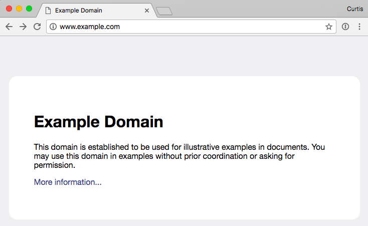
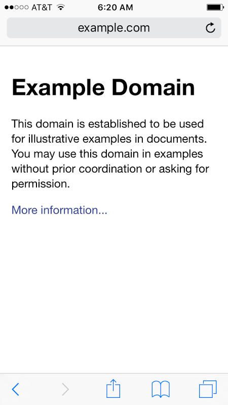
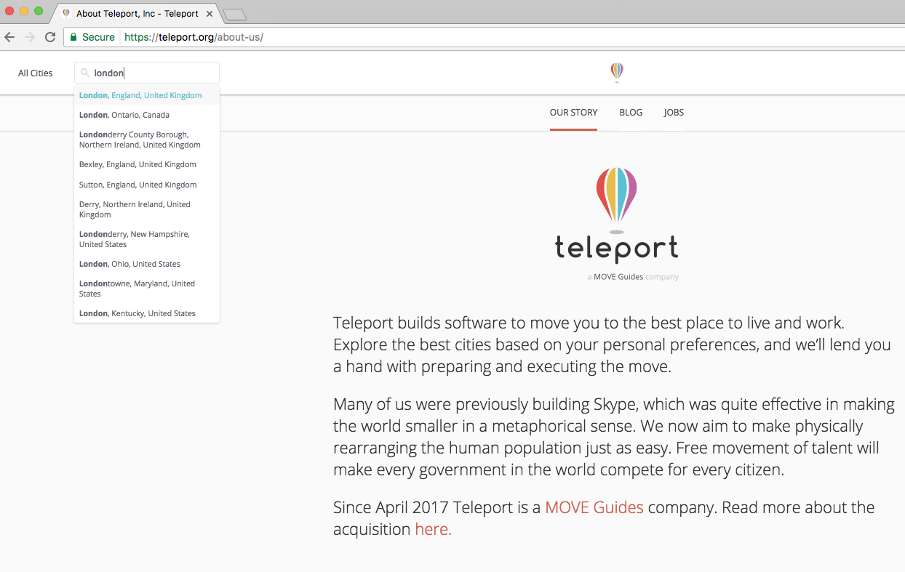
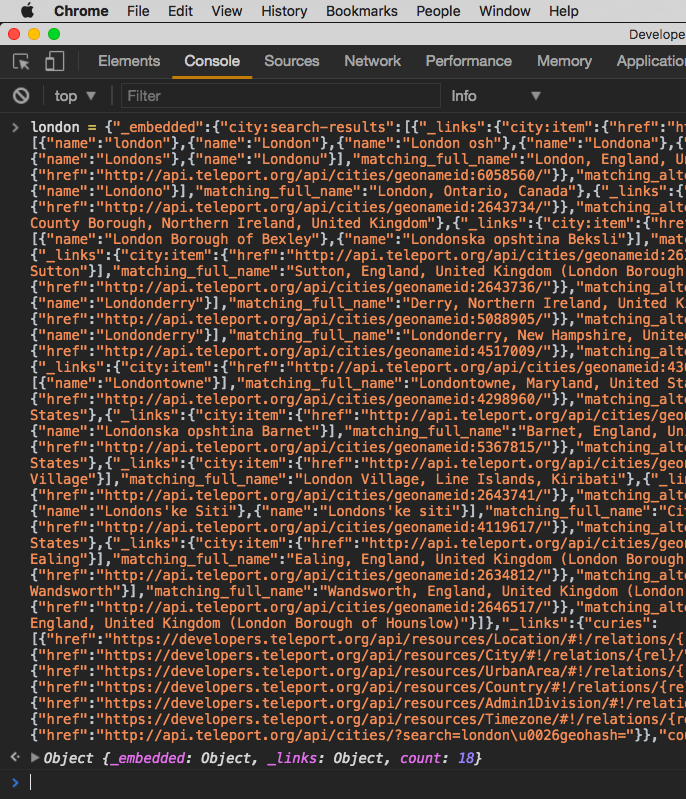
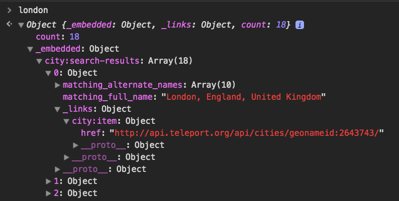
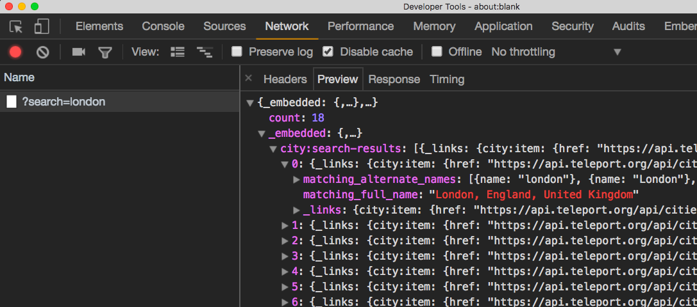

This post will show you:

- Linux/macOS shell commands
- Downloading a web resource with HTTP commands
- The OSI model
- JSON data
- How to make an AJAX request in a Chrome developer console

### Part 1: Downloading a web page, the hard way

| Tools                                               | Tech                                                        |
| :-------------------------------------------------- | :---------------------------------------------------------- |
| [macOS](https://en.wikipedia.org/wiki/MacOS_Sierra) | [Bash](https://en.wikipedia.org/wiki/Bash_%28Unix_shell%29) |
| [iTerm2](https://en.wikipedia.org/wiki/ITerm2)      | [HTTP](https://developer.mozilla.org/en-US/docs/Web/HTTP)   |
| [Telnet](https://en.wikipedia.org/wiki/Telnet)      | [HTML](https://developer.mozilla.org/en-US/docs/Web/HTML)   |
|                                                     | [CSS](https://developer.mozilla.org/en-US/docs/Web/CSS)     |

_(A few months after originally publishing this, Apple removed telnet from macos's default apps)_

There exists a website, [example.com](http://example.com), which is exactly what its name suggests. It happens to be the easiest location on the Internet to show how basic [HTTP](https://en.wikipedia.org/wiki/Hypertext_Transfer_Protocol) requests work, and has a concise and spiffy example of good [HTML](https://en.wikipedia.org/wiki/HTML) and [CSS](https://en.wikipedia.org/wiki/Cascading_Style_Sheets) usage. The site looks like this in a desktop-sized browser:



...and like this on a phone:



The lack of a rounded border and larger grey background on the mobile version is done with a simple stylesheet rule, which we'll touch on very briefly below. It's beyond the scope of this post to teach web development, and besides, a better resource than I could write already exists, the Mozilla Developer Network's excellent series [Getting started with the Web](https://developer.mozilla.org/en-US/docs/Learn_web_development/Getting_started/Your_first_website).

What follows is a shell session log of me downloading the example.com web page using the most primitive of tools: Telnet and manually-entered HTTP commands. I'm using the iTerm 2 terminal emulator on a MacBook using the default Bash shell. If you're not familiar with all those terms, the table above has some Wikipedia links to them, but if you don't want to get sidetracked looking things up now, it's enough to know that I'm using keyboard commands to do the same thing a web browser does.

So here is me, asking to get the resource `/` (the root page) from example.com, that I've connected to on [port](https://en.wikipedia.org/wiki/Port_%28computer_networking%29) 80, the default port for web servers, and the response that the web server gives back:

:::codez
**~ #** _telnet_
**telnet>** _open example.com 80_
Trying 93.184.216.34...
Connected to example.com.
Escape character is '^]'.
_GET / HTTP/1.1_
_Host: example.com_
_Connection: close_

HTTP/1.1 200 OK
Cache-Control: max-age=604800
Content-Type: text/html
Date: Thu, 01 Jun 2017 07:57:30 GMT
Etag: "359670651+gzip+ident"
Expires: Thu, 08 Jun 2017 07:57:30 GMT
Last-Modified: Fri, 09 Aug 2013 23:54:35 GMT
Server: ECS (mdw/1275)
Vary: Accept-Encoding
X-Cache: HIT
Content-Length: 1270
Connection: close

```html
<!doctype html>
<html>
  <head>
    <title>Example Domain</title>

    <meta charset="utf-8" />
    <meta http-equiv="Content-type" content="text/html; charset=utf-8" />
    <meta name="viewport" content="width=device-width, initial-scale=1" />
    <style type="text/css">
      body {
        background-color: #f0f0f2;
        margin: 0;
        padding: 0;
        font-family:
          "Open Sans", "Helvetica Neue", Helvetica, Arial, sans-serif;
      }
      div {
        width: 600px;
        margin: 5em auto;
        padding: 50px;
        background-color: #fff;
        border-radius: 1em;
      }
      a:link,
      a:visited {
        color: #38488f;
        text-decoration: none;
      }
      @media (max-width: 700px) {
        body {
          background-color: #fff;
        }
        div {
          width: auto;
          margin: 0 auto;
          border-radius: 0;
          padding: 1em;
        }
      }
    </style>
  </head>

  <body>
    <div>
      <h1>Example Domain</h1>
      <p>
        This domain is established to be used for illustrative examples in
        documents. You may use this domain in examples without prior
        coordination or asking for permission.
      </p>
      <p>
        <a href="http://www.iana.org/domains/example">More information...</a>
      </p>
    </div>
  </body>
</html>
```

Connection closed by foreign host.
**~ #**
:::

Let's break this down into logical chunks.

:::codez
**~ #** _telnet_
**telnet>** _open example.com 80_
:::

The `~ #` in orange is my system's command prompt. `~` in Unix-speak means your home directory, and `#` is a common symbol to show a user where to start typing their next command. I run the program "telnet", which gives me its own prompt. I tell it to open a connection to the server "example.com" on port 80, the default server port for unencrypted web traffic.

```
Trying 93.184.216.34...
Connected to example.com.
Escape character is '^]'.
```

The telnet program then tells me what IP address it is trying to connect to (it found the address by using a [DNS](https://en.wikipedia.org/wiki/Domain_Name_System) lookup of the site name I gave it), and almost immediately that it had connected, and what to type to get back to a command prompt. In this case, `^]` means to hold down "control" and then press the right bracket key. Until I do that, everything I type gets sent to the example.com server.

:::codez
_GET / HTTP/1.1_
_Host: example.com_
_Connection: close_
:::

This is what I typed after connecting, to request the `/` resource. "HTTP/1.1" is the protocol I said I wanted to use, and I said I intended to request the resource from example.com. It's possible to run more than one web site on a server, so it's important to say who you think you're talking to. The "Connection: close" line means tells the server that I am only going to request this one thing, and that it's safe to close the connection afterwards.

The blank line at the end is important; you can send an arbitrary list of attributes to a web server, identifying cookies for the site, the name of your browser, what type of compression you support, what plugins you have installed, etc. The blank line indicates you don't have anything else to advertise to the server, and it can start sending you a response.

:::codez
HTTP/1.1 200 OK
Cache-Control: max-age=604800
Content-Type: text/html
Date: Thu, 01 Jun 2017 07:57:30 GMT
Etag: "359670651+gzip+ident"
Expires: Thu, 08 Jun 2017 07:57:30 GMT
Last-Modified: Fri, 09 Aug 2013 23:54:35 GMT
Server: ECS (mdw/1275)
Vary: Accept-Encoding
X-Cache: HIT
Content-Length: 1270
Connection: close
:::

This is the header of the HTTP response to my GET request. The top line is the response code, 200, which means that the server found the resource I asked for, and then it proceeds to tell me things about the response I may want to keep track of - what it's [content type](https://en.wikipedia.org/wiki/Media_type) is, when it was created, how long I can expect it to be up to date (a week, in this case), and how many characters long it is.

Once again, the blank line is significant, indicating the end of the header section, and the beginning of the response body - the "file" part. In this case, the "body" is an HTML file representing a small web page with some styling, and a single link to another site. The file itself is also broken down into a header and a body, that a browser would know how to parse. Let's start digging into that.

```html
<!doctype html>
<html>
  <head>
    <title>Example Domain</title>

    <meta charset="utf-8" />
    <meta http-equiv="Content-type" content="text/html; charset=utf-8" />
    <meta name="viewport" content="width=device-width, initial-scale=1" />
    <!-- stylesheet -->
  </head>
  <!-- body -->
</html>
```

The very first line is the doctype declaration. In the past, giving browsers hints about what flavor of HTML content was about to happen would trigger different browser rendering modes. If you poke around in tech forums, you'll occasionally see references to "quirks mode" vs. "standards mode". At this point in the web development space, the HTML standard is fluid, and updated frequently, and the doctype declaration is less significant, but old-timers like me still like to see it, mainly because we're a bunch of cranks.

HTML "tags" are delimited by "angle brackets", meaning less-than and greater-than signs - `<` and `>`. Some tags have a corresponding closing tag. `<html>` has `</html>` at the end of the file, `<head>` has `</head>` at the end of the header section, and anything between them is a child of the header. Other tags are self-closing, like the `<meta>` tags in the header. By convention, self-closing tags end with `/>`, but browsers can still make sense of them if the slash is omitted. In fact, browsers are pretty good about making sense of pages that don't 100% adhere to the standards, which is important, because the HTML spec and browser versions aren't in sync with each other.

The meta tags in this example show two ways of defining the character set, [UTF-8](https://en.wikipedia.org/wiki/UTF-8) being the most common at the moment, as well as a viewport definition, which is a hint to mobile browsers on what size to make the virtual browser window, and how far to zoom in. In this case, we're locking the browser width to the size of the phone, and not zooming.

In this example, I've replaced the style and body sections with comment tags. Starting a tag with `<!--` and ending it with `-->` tells a browser to ignore that part when showing the page. Other programs can key off of HTML comments and perform special functions. The site generator for this blog, [Jekyll](http://jekyllrb.com/), looks for a comment tag `<!--more-->` to delimit where a post's excerpt ends, and can display small parts of each post on the site's main page.

Let's take a closer look at example.com's stylesheet:

```html
<style type="text/css">
  body {
    background-color: #f0f0f2;
    margin: 0;
    padding: 0;
    font-family: "Open Sans", "Helvetica Neue", Helvetica, Arial, sans-serif;
  }
  div {
    width: 600px;
    margin: 5em auto;
    padding: 50px;
    background-color: #fff;
    border-radius: 1em;
  }
  a:link,
  a:visited {
    color: #38488f;
    text-decoration: none;
  }
  @media (max-width: 700px) {
    body {
      background-color: #fff;
    }
    div {
      width: auto;
      margin: 0 auto;
      border-radius: 0;
      padding: 1em;
    }
  }
</style>
```

In a stylesheet, each setting starts with a [selector](https://developer.mozilla.org/en-US/docs/Web/CSS/CSS_selectors), followed by a block of parameters delimited by curly-braces - `{` and `}`. If my setting was `div { display: none; }`, then all the "div" HTML blocks of my page would be hidden.

On example.com, there are two competing settings for the page's main body and it's div tag. The second block of settings is inside of a [media query](https://developer.mozilla.org/en-US/docs/Web/CSS/CSS_media_queries) that fires for any browser whose width is 700 pixels or less. Try it out - head on over to [example.com](http://example.com/), and shrink the page until the left and right borders touch the white box.

Stylesheets are a whole field of study, so I won't get too deep into them right now. If you want a puzzle to unravel outside the scope of this post, figure out why some of the colors above are defined with 6 hex characters, and others with just 3.

The body of the page is a little more straightforward:

```html
<body>
  <div>
    <h1>Example Domain</h1>
    <p>
      This domain is established to be used for illustrative examples in
      documents. You may use this domain in examples without prior coordination
      or asking for permission.
    </p>
    <p><a href="http://www.iana.org/domains/example">More information...</a></p>
  </div>
</body>
```

The body contains a single div tag, whose only purpose is to be a container for the white box with rounded corners. The `<h1>` tag is a heading, implying larger text, and the 1 declaring it's place in a heirarchy from 1 - 6. There has been some struggle in the tech community to re-educate fogies such as myself to think of tags as a document's organization structure, and use stylesheets for layout instructions. In the early days of HTML, tags such as `<font>` and `<center>` were used to control the way a page looked, but that style of web page design is deprecated now in favor of using CSS and various box models. What we have now is pretty good, and a great deal more concise than what we started with in the 90s, but the road to get there was pretty bumpy.

Lastly, under the heading text are a couple of paragraph definitions, one with plain text, the other with an "anchor", or link, to the IANA site, which declares that example.com is reserved, and not up for grabs.

### Part 2: Redirecting to HTTPS

| Tools                                                  | Tech                                                                                                                                        |
| :----------------------------------------------------- | :------------------------------------------------------------------------------------------------------------------------------------------ |
| [Dig](https://en.wikipedia.org/wiki/Dig_%28command%29) | [TLS](https://developer.mozilla.org/en-US/docs/Web/Security/Transport_Layer_Security)                                                       |
| [OpenSSL](https://en.wikipedia.org/wiki/OpenSSL)       | [OSI model](https://en.wikipedia.org/wiki/OSI_model)                                                                                        |
|                                                        | [X509 certificates](https://web.archive.org/web/20210610092146/https://developer.mozilla.org/en-US/docs/Mozilla/Security/x509_Certificates) |

Connections over the Internet between two machines are pretty abstract. They combine everything from the cord plugged into your router (or the Wifi signal to it), to how bytes are delimited, to how your local network card's address is mapped to an Internet address, to how packets are acknowledged, to how files are reassembled from the parts the sender breaks them into, to how your web browser interprets and displays all the files it receives. These connections and behaviors are defined in scores of protocol definitions and display standards, where each protocol exists on (at least) one layer of the "Open Systems Interconnection" (or OSI) model.

While we were connecting using Telnet to example.com to download it's root page, our [presentation layer](https://en.wikipedia.org/wiki/Presentation_layer) was unencrypted. An attacker who controlled one of the routers between us and the server could, in theory, have recorded the raw content of our session, and pieced together a history of what we did.

Encrypted web traffic happens using HTTPS, which is a combination of an encrypted presentation layer, and plain old HTTP over that connection on the [application layer](https://en.wikipedia.org/wiki/Application_layer). Websites that are HTTPS-only will typically listen for unencrypted connections on port 80, and tell connecting clients where to find the same resource over HTTPS on port 443.

I own two sites that do this very thing, both hosted on the same server at the same IP address. This is me using the "dig" application to look up the IP address for both domains. The "+short" option means to truncate everything in the output except the actual IP address of the server, as referenced by the domain name's [A record](https://en.wikipedia.org/wiki/List_of_DNS_record_types):

:::codez
**~ #** _dig appsbykids.org +short_
138.197.24.38
**~ #** _dig mokg.club +short_
138.197.24.38
**~ #**
:::

The telnet session below shows me connecting to that IP address, and doing a GET request for both site's root page.

:::codez
**~ #** _telnet_
**telnet>** _open 138.197.24.38 80_
Trying 138.197.24.38...
Connected to 138.197.24.38.
Escape character is '^]'.
_GET / HTTP/1.1_
_Host: appsbykids.org_

HTTP/1.1 301 Moved Permanently
Server: nginx/1.10.0 (Ubuntu)
Date: Thu, 01 Jun 2017 11:59:13 GMT
Content-Type: text/html
Content-Length: 194
Connection: keep-alive
Location: https://appsbykids.org/

```html
<html>
  <head>
    <title>301 Moved Permanently</title>
  </head>
  <body bgcolor="white">
    <center><h1>301 Moved Permanently</h1></center>
    <hr />
    <center>nginx/1.10.0 (Ubuntu)</center>
  </body>
</html>
```

_GET / HTTP/1.1_
_Host: mokg.club_

HTTP/1.1 301 Moved Permanently
Server: nginx/1.10.0 (Ubuntu)
Date: Thu, 01 Jun 2017 11:59:30 GMT
Content-Type: text/html
Content-Length: 194
Connection: keep-alive
Location: https://mokg.club/

```html
<html>
  <head>
    <title>301 Moved Permanently</title>
  </head>
  <body bgcolor="white">
    <center><h1>301 Moved Permanently</h1></center>
    <hr />
    <center>nginx/1.10.0 (Ubuntu)</center>
  </body>
</html>
```

_^]_
**telnet>** _close_
Connection closed.
**telnet>** _quit_
**~ #**
:::

In both cases, the HTTP response code was 301 instead of 200, and the "Location" record of the header showed the same resource I was trying to download, but changing the URL type to HTTPS. At this point, a web browser would kick over to secure mode, and try to download the same resource over a TLS connection on port 443.

We can't do that over Telnet, since it doesn't have any encryption widgets built in, but we can use the program OpenSSL to start a TLS session as a client, exchange encryption keys with the server, and give us a prompt to run HTTP commands. That looks like this:

:::codez
**~ #** _openssl s_client -connect appsbykids.org:443_

```
CONNECTED(00000003)
depth=1 /C=US/O=Let's Encrypt/CN=Let's Encrypt Authority X3
verify error:num=20:unable to get local issuer certificate
verify return:0

---

Certificate chain
0 s:/CN=appsbykids.org
i:/C=US/O=Let's Encrypt/CN=Let's Encrypt Authority X3
1 s:/C=US/O=Let's Encrypt/CN=Let's Encrypt Authority X3
i:/O=Digital Signature Trust Co./CN=DST Root CA X3

---

Server certificate
-----BEGIN CERTIFICATE-----
MIIFADCCA+igAwIBAgISA2BV3xRGrMQVBo5zJna/Ow36MA0GCSqGSIb3DQEBCwUA
MEoxCzAJBgNVBAYTAlVTMRYwFAYDVQQKEw1MZXQncyBFbmNyeXB0MSMwIQYDVQQD
ExpMZXQncyBFbmNyeXB0IEF1dGhvcml0eSBYMzAeFw0xNzA1MjIxMTA3MDBaFw0x
NzA4MjAxMTA3MDBaMBkxFzAVBgNVBAMTDmFwcHNieWtpZHMub3JnMIIBIjANBgkq
hkiG9w0BAQEFAAOCAQ8AMIIBCgKCAQEAvwy4dpBNDnqDS3oUavI9vH9eDsPT3pe1
1ZSNxcxKrY8/9j4EjWMEv4wt6+cEqBpwlXqHX1Q/4mkZ73GTdV0H8z4d004rKuTb
zxnK0hJV4mMAD/cS7k0ZeTW0znZJycat56dyGfS1BC3IMT0RKMrMsg4HJM9GvC2D
BzcZ9W3rg4N1IwhLf82YpZn+j1h0BfkNllnIuFF6ZTFSjOyZoNGR8+mP1l59hX0i
NSYiJiy5nn7qbSbHFsvQmkRTTErSAOog1Lpe4HmD6zOuadWNebid9z1TK3p8hL5L
6zVKO3NTrox2xGbmDLW7sUpUkp3WlUyXfKAh1gkDChj8FDqYHzzjTQIDAQABo4IC
DzCCAgswDgYDVR0PAQH/BAQDAgWgMB0GA1UdJQQWMBQGCCsGAQUFBwMBBggrBgEF
BQcDAjAMBgNVHRMBAf8EAjAAMB0GA1UdDgQWBBTUs9hoiUE6dCGOxeik6tzmKthP
JzAfBgNVHSMEGDAWgBSoSmpjBH3duubRObemRWXv86jsoTBwBggrBgEFBQcBAQRk
MGIwLwYIKwYBBQUHMAGGI2h0dHA6Ly9vY3NwLmludC14My5sZXRzZW5jcnlwdC5v
cmcvMC8GCCsGAQUFBzAChiNodHRwOi8vY2VydC5pbnQteDMubGV0c2VuY3J5cHQu
b3JnLzAZBgNVHREEEjAQgg5hcHBzYnlraWRzLm9yZzCB/gYDVR0gBIH2MIHzMAgG
BmeBDAECATCB5gYLKwYBBAGC3xMBAQEwgdYwJgYIKwYBBQUHAgEWGmh0dHA6Ly9j
cHMubGV0c2VuY3J5cHQub3JnMIGrBggrBgEFBQcCAjCBngyBm1RoaXMgQ2VydGlm
aWNhdGUgbWF5IG9ubHkgYmUgcmVsaWVkIHVwb24gYnkgUmVseWluZyBQYXJ0aWVz
IGFuZCBvbmx5IGluIGFjY29yZGFuY2Ugd2l0aCB0aGUgQ2VydGlmaWNhdGUgUG9s
aWN5IGZvdW5kIGF0IGh0dHBzOi8vbGV0c2VuY3J5cHQub3JnL3JlcG9zaXRvcnkv
MA0GCSqGSIb3DQEBCwUAA4IBAQBmxhBvSweo3AUNonBuEQbGTPkfjANahPj8IsOw
GXL57nnpCGLOn+fJmSHdRKViEv8mc8G2ncN+ijV4V7/cCG4YwkHv+rx7bBfDp0lK
GygdiAu4y8cp0yLo0HkLyFmZgXFpyOgNijltX27e8+YS/OD3Oj1ba2DmfSXQPr3B
m+eY5ZyPzCntad/1H+Pna3lfL2zW1n52iUSXQ385ki48Wf245EiDhF3fljcfR9Y/
zvcMaMSezHbpW/0JyE0q4c50PS5nKTfP/R9L8lTbFI0dpcq4J7CXKeD3scY+ZcOM
T9hTeHF+GCW+i+X4mtmOBcrfTTfXq9dneIF29KYUilcRq0YA
-----END CERTIFICATE-----
subject=/CN=appsbykids.org
issuer=/C=US/O=Let's Encrypt/CN=Let's Encrypt Authority X3

---

## No client certificate CA names sent

## SSL handshake has read 3416 bytes and written 456 bytes

New, TLSv1/SSLv3, Cipher is DHE-RSA-AES128-SHA
Server public key is 2048 bit
Secure Renegotiation IS supported
Compression: NONE
Expansion: NONE
SSL-Session:
Protocol : TLSv1
Cipher : DHE-RSA-AES128-SHA
Session-ID: 7112A72B95EF591C9FAFE1BA6D91AAB1C7E453612EFBD7E5FBEF733B57509B12
Session-ID-ctx:
Master-Key: B88A46FCD524C9C2BBC644B86D6281FE7F2960099CCEF13609B2179098AD53B288B615DD22DAA32E42EAB9CBF970D259
Key-Arg : None
Start Time: 1495554095
Timeout : 300 (sec)
Verify return code: 0 (ok)

---
```

_GET /files/final.ino HTTP/1.1_
_Host: appsbykids.org_

HTTP/1.1 200 OK
Server: nginx/1.10.0 (Ubuntu)
Date: Tue, 23 May 2017 15:42:11 GMT
Content-Type: application/octet-stream
Content-Length: 885
Last-Modified: Mon, 09 Jan 2017 18:25:42 GMT
Connection: keep-alive
ETag: "5873d5a6-375"
Strict-Transport-Security: max-age=15768000
Accept-Ranges: bytes

```c
const int MAXPINS = 11;
const int tPins[] = {0, 1, 3, 4, 15, 16, 17, 18, 19, 22, 23};
const int notes[] = {60, 62, 64, 65, 67, 69, 71, 72};

int pinFlags[MAXPINS];

void setup() {
// put your setup code here, to run once:
  Serial.begin(115200);
  delay(1000);

  for( int i = 0; i < MAXPINS; i++ ){
    int pin = tPins[i];
    Serial.print("Pin ");
    Serial.print(pin);
    Serial.print(" intial value: ");
    Serial.println(touchRead(pin));
  }
}

void loop() {
  for (int i = 0; i < MAXPINS; i++) {
    if (touchRead(tPins[i]) > 1000) {
      if (!pinFlags[i]) {
        usbMIDI.sendNoteOn(notes[i], 99, 1);
        pinFlags[i] = true;
        Serial.print("Detected :");
        Serial.println(tPins[i]);
      }
    } else {
      pinFlags[i] = false;
      usbMIDI.sendNoteOff(notes[i], 0, 1);
    }
  }

  while (usbMIDI.read()) {
  // ignore incoming messages
  }
}
```

DONE
**~ #**
:::

OpenSSL did some auto-negotiation, finding the best encryption type to use with the server, and displayed back to me some information about the certificate chain, and server's certificate. The certificate is in X.509 format, which encodes the issuer, how long the cert is valid, the encryption algorithm used, and the [public key](https://en.wikipedia.org/wiki/Public-key_cryptography) that I should use to encrypt data. The server keeps the private key, which it uses to decrypt what I've encrypted. This type of encryption is called Assymetrical, or just "public key", and is, like CSS, its own field of study, way outside the scope this post. I wrote a [Blogger post](http://cautery.blogspot.com/2012/06/rsa-encryption-and-other-sun-tzu.html) some years back on the math behind RSA, a popular variant of public key encryption, if you want to dive a little deeper.

After the key exchange, the rest of the OpenSSL session behaves just like the Telnet sessions above, which I then used to download the source code to an Arduino program.

### Part 3: An actual API call

| Tech                                                                                                     | Tool                                                  |
| :------------------------------------------------------------------------------------------------------- | :---------------------------------------------------- |
| [API](https://en.wikipedia.org/wiki/Application_programming_interface)                                   | [Chrome](https://en.wikipedia.org/wiki/Google_Chrome) |
| [Javascript](https://developer.mozilla.org/en-US/docs/Web/JavaScript)                                    |
| [AJAX](https://developer.mozilla.org/en-US/docs/Learn_web_development/Core/Scripting/Network_requests)   |
| [JSON](https://en.wikipedia.org/wiki/JSON)                                                               |
| [Regular Expressions](https://developer.mozilla.org/en-US/docs/Web/JavaScript/Guide/Regular_expressions) |

"API" is a nebulous term that programmers use to mean a few different things. The name the acronym stands for, Application Programming Interface, doesn't really clear things up.

At it's core, an API is a list of commands that something can call. Web browsers provide some features, like AudioBuffer, or SpeechRecognitionResult, that can be accessed from the Javascript programming language directly. The browser talks to your operating system with system commands to allocate memory, draw windows on the screen, and request access to an Internet connection. Web sites sometimes provide answers to questions - what's my account balance? how many messages are in my inbox? - without rendering an entire HTML page, but instead returning just a chunk of data that the browser does something with. All of these are examples of making API calls.

The site teleport.org (defunct as of late 2023), which provides data on cities intended to help people decide where to move, has a search box where you can type in a city name, and get a list of matching names to choose from. Here I am using that to search for London:



The most likely candidate, London England, is on the top, and then a handful of other Londons show up in different states of the US. Teleport provides a public API that can be called with a city name, which returns a block of JSON data that represents what's in the above list. Their API documentation is available here (was https://developers.teleport.org/api/), and here is an example calling to it from Telnet:

:::codez
**~ #** _telnet api.teleport.org 80_
Trying 52.84.76.101...
Connected to d3v9dtao340sz1.cloudfront.net.
Escape character is '^]'.
_GET /api/cities/?search=london HTTP/1.1_
_Host: api.teleport.org_

HTTP/1.1 200 OK
Content-Type: application/json; charset=utf-8
Transfer-Encoding: chunked
Connection: keep-alive
Access-Control-Max-Age: 600
Cache-Control: public, max-age=300
Server: nginx
X-Apiproxy-Cache-Status: MISS
Date: Fri, 02 Jun 2017 20:24:43 GMT
Via: 1.1 google, 1.1 19270b9ebeb1c54b61c028475c86d6dd.cloudfront.net (CloudFront)
Vary: Origin,Accept-Encoding
X-Cache: Miss from cloudfront
X-Amz-Cf-Id: CpJ7DY8v3Ks27jNEQJ5HSeBb_2XR4xjAbWw6aHNPB4GUlZnDdlKE1Q==

1480

```json
{
  "_embedded": {
    "city:search-results": [
      {
        "_links": {
          "city:item": {
            "href": "http://api.teleport.org/api/cities/geonameid:2643743/"
          }
        },
        "matching_alternate_names": [
          { "name": "london" },
          { "name": "London" },
          { "name": "London osh" },
          { "name": "Londona" },
          { "name": "Londonas" },
          { "name": "Londoni" },
          { "name": "londoni" },
          { "name": "Londono" },
          { "name": "Londons" },
          { "name": "Londonu" }
        ],
        "matching_full_name": "London, England, United Kingdom"
      },
      {
        "_links": {
          "city:item": {
            "href": "http://api.teleport.org/api/cities/geonameid:6058560/"
          }
        },
        "matching_alternate_names": [
          { "name": "London" },
          { "name": "Londonas" },
          { "name": "londoni" },
          { "name": "Londono" }
        ],
        "matching_full_name": "London, Ontario, Canada"
      },
      {
        "_links": {
          "city:item": {
            "href": "http://api.teleport.org/api/cities/geonameid:2643734/"
          }
        },
        "matching_alternate_names": [{ "name": "Londonderry County Borough" }],
        "matching_full_name": "Londonderry County Borough, Northern Ireland, United Kingdom"
      },
      {
        "_links": {
          "city:item": {
            "href": "http://api.teleport.org/api/cities/geonameid:2655775/"
          }
        },
        "matching_alternate_names": [
          { "name": "London Borough of Bexley" },
          { "name": "Londonska opshtina Beksli" }
        ],
        "matching_full_name": "Bexley, England, United Kingdom (London Borough of Bexley)"
      },
      {
        "_links": {
          "city:item": {
            "href": "http://api.teleport.org/api/cities/geonameid:2636503/"
          }
        },
        "matching_alternate_names": [{ "name": "London Borough of Sutton" }],
        "matching_full_name": "Sutton, England, United Kingdom (London Borough of Sutton)"
      },
      {
        "_links": {
          "city:item": {
            "href": "http://api.teleport.org/api/cities/geonameid:2643736/"
          }
        },
        "matching_alternate_names": [
          { "name": "Londonderis" },
          { "name": "Londonderry" }
        ],
        "matching_full_name": "Derry, Northern Ireland, United Kingdom (Londonderis)"
      },
      {
        "_links": {
          "city:item": {
            "href": "http://api.teleport.org/api/cities/geonameid:5088905/"
          }
        },
        "matching_alternate_names": [
          { "name": "Londondehrri" },
          { "name": "Londonderi" },
          { "name": "Londonderri" },
          { "name": "Londonderry" }
        ],
        "matching_full_name": "Londonderry, New Hampshire, United States"
      },
      {
        "_links": {
          "city:item": {
            "href": "http://api.teleport.org/api/cities/geonameid:4517009/"
          }
        },
        "matching_alternate_names": [{ "name": "London" }],
        "matching_full_name": "London, Ohio, United States"
      },
      {
        "_links": {
          "city:item": {
            "href": "http://api.teleport.org/api/cities/geonameid:4361094/"
          }
        },
        "matching_alternate_names": [{ "name": "Londontowne" }],
        "matching_full_name": "Londontowne, Maryland, United States"
      },
      {
        "_links": {
          "city:item": {
            "href": "http://api.teleport.org/api/cities/geonameid:4298960/"
          }
        },
        "matching_alternate_names": [{ "name": "London" }],
        "matching_full_name": "London, Kentucky, United States"
      },
      {
        "_links": {
          "city:item": {
            "href": "http://api.teleport.org/api/cities/geonameid:2656295/"
          }
        },
        "matching_alternate_names": [
          { "name": "London Borough of Barnet" },
          { "name": "Londonska opshtina Barnet" }
        ],
        "matching_full_name": "Barnet, England, United Kingdom (London Borough of Barnet)"
      },
      {
        "_links": {
          "city:item": {
            "href": "http://api.teleport.org/api/cities/geonameid:5367815/"
          }
        },
        "matching_alternate_names": [{ "name": "London" }],
        "matching_full_name": "London, California, United States"
      },
      {
        "_links": {
          "city:item": {
            "href": "http://api.teleport.org/api/cities/geonameid:4030939/"
          }
        },
        "matching_alternate_names": [
          { "name": "London" },
          { "name": "London Village" }
        ],
        "matching_full_name": "London Village, Line Islands, Kiribati"
      },
      {
        "_links": {
          "city:item": {
            "href": "http://api.teleport.org/api/cities/geonameid:2643741/"
          }
        },
        "matching_alternate_names": [
          { "name": "London" },
          { "name": "Londonas Sitija" },
          { "name": "Londono Sitis" },
          { "name": "Londons'ke Siti" },
          { "name": "Londons'ke siti" }
        ],
        "matching_full_name": "City of London, England, United Kingdom (London)"
      },
      {
        "_links": {
          "city:item": {
            "href": "http://api.teleport.org/api/cities/geonameid:4119617/"
          }
        },
        "matching_alternate_names": [{ "name": "London" }],
        "matching_full_name": "London, Arkansas, United States"
      },
      {
        "_links": {
          "city:item": {
            "href": "http://api.teleport.org/api/cities/geonameid:2650567/"
          }
        },
        "matching_alternate_names": [{ "name": "London Borough of Ealing" }],
        "matching_full_name": "Ealing, England, United Kingdom (London Borough of Ealing)"
      },
      {
        "_links": {
          "city:item": {
            "href": "http://api.teleport.org/api/cities/geonameid:2634812/"
          }
        },
        "matching_alternate_names": [
          { "name": "London Borough of Wandsworth" }
        ],
        "matching_full_name": "Wandsworth, England, United Kingdom (London Borough of Wandsworth)"
      },
      {
        "_links": {
          "city:item": {
            "href": "http://api.teleport.org/api/cities/geonameid:2646517/"
          }
        },
        "matching_alternate_names": [{ "name": "London Borough of Hounslow" }],
        "matching_full_name": "Hounslow, England, United Kingdom (London Borough of Hounslow)"
      }
    ]
  },
  "_links": {
    "curies": [
      {
        "href": "https://developers.teleport.org/api/resources/Location/#!/relations/{rel}/",
        "name": "location",
        "templated": true
      },
      {
        "href": "https://developers.teleport.org/api/resources/City/#!/relations/{rel}/",
        "name": "city",
        "templated": true
      },
      {
        "href": "https://developers.teleport.org/api/resources/UrbanArea/#!/relations/{rel}/",
        "name": "ua",
        "templated": true
      },
      {
        "href": "https://developers.teleport.org/api/resources/Country/#!/relations/{rel}/",
        "name": "country",
        "templated": true
      },
      {
        "href": "https://developers.teleport.org/api/resources/Admin1Division/#!/relations/{rel}/",
        "name": "a1",
        "templated": true
      },
      {
        "href": "https://developers.teleport.org/api/resources/Timezone/#!/relations/{rel}/",
        "name": "tz",
        "templated": true
      }
    ],
    "self": {
      "href": "http://api.teleport.org/api/cities/?search=london\u0026geohash="
    }
  },
  "count": 18
}
```

0
:::

There are a couple of interesting things to note here. First, the `Transfer-Encoding: chunked` header means that instead of saying up front what the resource's byte count will be, the server will send you a chunk at a time, saying what the size of just that chunk is, and keeping the connection open while there is still more data coming. This is useful for things like streaming video, where there isn't a static file, and also for APIs that return results collected from a database, where the byte count isn't known immediately after the request is made.

The "1480" before the block is actually a hexadecimal number indicating the size of the chunk. The "0" at the very end means the next chunk is 0 bytes, which means there won't be more data coming.

Alright, now it's time to crack open a browser and stop futzing with Telnet. I use the Chrome browser, which has a nice developer tools area that includes a console for entering Javascript commands. To access it, press command-option-j if you're on a Mac, or control-shift-j for Windows or Linux (I think... I also think if you're on Linux you're pretty familiar with developer tools). Here's an example of me entering a small command, and its return value:

```javascript
parseInt("1480", 16);
5248;
```

In this case, I'm converting the "1480" from above from hex to base 10, showing the length of the giant data block that teleport returned. The block is in a format called JSON, which stands for Javascript Object Notation. It's a string that would be valid Javascript if we pasted it into the Chrome console window. In fact, let's do just that. I'll preface it with "london =" so we assign the block to a variable we can look at.



Clicking the triangles beside object field names will cause Chrome's console to expand one additional layer of an object to be examined visually. Repeating this lets you "drill down" through the object to see how it is organized:



In a real web application, I don't want users to have to copy and paste to create an object, or to open a console and start clicking on things. I want it to be able to make an API call, understand the return object's layout, and do something meaningful with that data. Enter AJAX.

AJAX literally stands for "Asynchronous Javascript And XML", even though it is more common to receive JSON data than XML. Javascript has an object type called an XMLHttpRequest designed to make HTTP requests without changing the page the browser is on. The return data is available to Javascript to use on the existing page instead. Here is a small bit of Javascript that you can enter into the console to fetch the same data we did above:

```javascript
x = new XMLHttpRequest();
x.open("get", "https://api.teleport.org/api/cities/?search=london");
x.send();
```

After typing those commands into the Javascript console, Chrome's Network tab shows the API call was made, and gives you an interface similar to what we saw when we pasted the same JSON data into the console above:



### Epilogue

When I wrote this in 2017, Teleport was in the process of being purchased by Topia, who later took down the teleport.org site, and then removed its DNS records, something I've never seen before, but nslookup in my experience doesn't lie:

:::codez
**~ #** _nslookup teleport.org_
Server: 192.168.1.1
Address: 192.168.1.1#53

\*\* server can't find teleport.org: SERVFAIL

**~ #**
:::

That makes it pretty hard to test some of what I've written here, and the AJAX API has long been superseded by `fetch`, but I'm leaving this blog entry up anyway because I'm very fond of it. I originally intended it to be part of a "How to write software" series. I backburnered that in favor of working directly with kids. I started coding clubs at schools my kids attended, and we did stuff a lot more fun than basic web programming, like working with Adafruit and Teensy dev boards, making pixel art and designing levels for video games, and writing a choose your own adventure story.

I don't think I'll ever come back to the series as I originally conceived of it, but that's okay. Somewhere in an alternate universe there's an OED-sized treatise of backend app coding that other Curtis is making millions off of. I'm happy for him, but I'm pretty sure I had more fun.

Curtis - May 27, 2025
