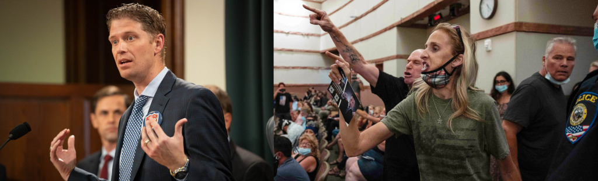

# Schools and angry conservatives

:::hero

:::

> There never was an age of conformity quite like this one, or a camaraderie quite like the Liberals’. Drop a little itching powder in Jimmy Wechsler’s bath and before he has scratched himself for the third time, Arthur Schlesinger will have denounced you in a dozen books and speeches, Archibald MacLeish will have written ten heroic cantos about our age of terror, Harper’s will have published them, and everyone in sight will have been nominated for a Freedom Award. - William F. Buckley

Buckley's anti-liberal rhetoric is magnificent, a breath of fresh air compared to today's GOP angry word salad of Russia hoax, abortion on demand, radical liberal, boys in the girls' bathroom, critical race theory, stop the steal, etc. I long to live in a time where people formed good arguments instead of just shouting and public fistfights. But... that's not the America we live in right now.

On November 7, The Atlantic published [an article](https://www.theatlantic.com/ideas/archive/2021/11/conservative-backlash-progress/620607/) covering in detail the counter-revolutionary mindset of conservatives throughout America's history. Each time some bit of progress is made by women or minorities, it is met with angry backlash by conservatives, with predictions of the coming armageddon and Jacobin rule. The pattern that pro-Trump antivaxxers follow now is the same one followed by Birchers in the 1950s and anti-reconstructionists in the late 19th century. It is always the same, predictable pattern of, as Buckley would say, standing athwart history and shouting "Stop!" at any hint of progress.

The article closes with some commentary on the January 6 capitol riot, and a sobering quote by Bush speech writer David Frum: If conservatives become convinced that they cannot win democratically, they will not abandon conservatism, they will reject democracy. Some of them already have, evinced by human feces smeared on the walls of congress, the plot to kidnap a sitting state governor, and contradictory protests outside of vote-counting venues - "Where are the votes?!" in Phoenix, and "Stop the count!" in Detroit.

Over the last couple of months, a strange interplay of school boards and Texas lawmakers has taken place, the absurdity of which reminds me of the Robert Altman film Nashville. It started in late September, with a letter to the president.

"America’s public schools and its education leaders are under an immediate threat" began a [September 29 letter](/images/nsba-letter.pdf) from National School Board Association CEO Chip Slaven to Joe Biden. "(The NSBA) respectfully asks for federal law enforcement and other assistance to deal with the growing number of threats of violence and acts of intimidation occurring across the nation."

The letter goes on to reference acts of violence and intimidation committed against school board members, teachers, and students around a pair of hot button issues: wearing masks at school to limit the spread of coronavirus, and the false assertion that Critical Race Theory is being taught behind parents' backs.

On page two, Chip took his complaint a step further, saying: "As these acts of malice, violence, and threats against public school officials have increased, the classification of these heinous actions could be the equivalent to a form of domestic terrorism and hate crimes."

After calling out these people for being the dangerous loons that they are, he continued to insert his foot further into his mouth by calling for help from the Department of Justice, the DOE, Homeland Security, and the FBI, under the Patriot Act's provisions against domestic terrorism, the Gun-Free School Zones Act, the Hate Crimes Prevention Act, and a couple of other rights acts. Needless to say, there was a bit of a reaction to this by state SBAs, who would rather not be subject to the feds going scorched-earth on them.

On October 22, after some internal discussion, the NSBA board of directors issued a [press release](https://web.archive.org/web/20211102013459/https://www.osba.org/News-Center/News_releases/20211022NSBA.aspx) apologizing for the letter, indicating they weren't consulted, and were going to implement some internal communication improvements. This lukewarm response coming three weeks too late was met with outrage, and the state boards of Louisiana, Missouri, South Carolina, Ohio, Pennsylvania, Montana, and New Hampshire have all withdrawn membership from the NSBA, which will cost them hundreds of thousands of dollars in dues annually.

Meanwhile, Texas state congressman Matt Krause had been busy writing scary letters to people, trying to get noticed for his bid to be the new Texas Attorney General. A little background...

A few months prior, on June 15, Greg Abbott signed into law Texas representative Steve Toth's [House Bill 3979](https://capitol.texas.gov/BillLookup/History.aspx?LegSess=87R&Bill=HB3979), an untitled bill captioned "Relating to the social studies curriculum in public schools." At its core, the bill is an unfunded mandate calling for schools to develop and implement a civics program, expected to collectively cost the state roughly $14,625,000. Notably, representative Toth's initial fiscal note stated that no significant fiscal implication was anticipated.

The first draft of the bill was straightforward. Develop a civics program that covers the founding documents of the US, Federalist Papers and all that. The rest was mainly an admonition against private funding for social studies courses, not requiring students to be activists for credit, and not forcing teachers to teach currently controversial politics. The kicker, which if you've watched the news recently you've no doubt heard discussed, was not requiring teachers to say anything like white people today are responsible for chattel slavery and lynchings by their ancestors, that meritocracy is better for people born white and male, or that white men are inherently racist and sexist.

The amendments to the bill showed some interesting political back and forth. It included some progressive additions into the civics course to be developed, including the history of white supremacy in the US, the writings of Thomas Jefferson's "concubine" slave Sally Hemings, George Washington's slave Ona Judge, Frederick Douglass's anti-slavery newspaper The North Star, the Indian Removal Act, the Chicano Movement, NFA co-founder Dolores Huerta, and several others in the same vein. The most interesting addition to me is the inclusion of the text that schools can't make any rules that:

> would result in the punishment of a student for discussing, or have a chilling effect on student discussion of, the concepts described by Subsection (h-3)(4)

...where (h-3)(4) is all the "don't call whitey oppressive" language. So while you can't compel a teacher to cover the material, you can't forbid students from discussing it, nor threaten them about talking about it. There were conservative additions in the amendments, including directly calling out the 1619 Project as something teachers can't be compelled to talk about.

Toth then tied a bow on it in a [press release](https://web.archive.org/web/20210616023842/https://house.texas.gov/news/press-releases/?id=7462) (from archive.org—it looks like the Texas House hasn't had a press release since late 2022, and they've removed the entire news section from the website) declaring that the bill would "protect students from Critical Race Theory". Neither the term, nor the concept, appear anywhere in the bill.

Despite the law only covering course material, several schools ignored Timothy Snyder's warning to [resist authoritarianism by refusing to obey in advance](https://lithub.com/resist-authoritarianism-by-refusing-to-obey-in-advance/), and started removing books. One Southlake school classroom took things a step further and [cordoned off](https://www.nbcnews.com/news/us-news/southlake-texas-anti-racist-book-school-library-rcna2734) bookshelves with caution tape.

Signing onto the bill as a co-author late in the game, the day after it passed in the Texas senate and weeks after passing in the Texas House, was 93rd district representative Matt Krause. Matt comes from a devout Baptist family, with a pastor father and a mother who taught in a Baptist school. That would be unimportant, but for the fact that he [openly admits](https://www.youtube.com/watch?v=GlQ1sxesr_k) letting his faith drive his legislation. In a world where Republicans are experimenting with religious extremism, such as Michael Flynn saying we ought to have a [state religion](https://thehill.com/homenews/media/581443-michael-flynn-says-of-the-us-we-have-to-have-one-religion/), it's important to weigh whether someone's religious convictions are going to hurt people, especially those of other religions.

He follows the currently in-fashion GOP ideoelogy, by co-authoring a handful of predictably contentious bills on the topics of social media bans, abortion, trans athletes, election integrity, covid, and financial penalties when Democrats hide to prevent a quorum, referring to the latter humorously as an unexcused absence. On the surface he seems like a bit of a lightweight that thinking people would just roll their eyes at, saying things like "Biden isn't Obama's third term, but Carter's second", "it's all about safety, whether it' boys in the girls' room, or girls in the boys' room", calling in to AM Christian radio shows, and retweeting Ted Cruz. However, he has designs on becoming the Texas attorney general in 2022, so he's started to make a little more noise to get press coverage.

He has been in the news recently for his [October 25 letter](https://static.texastribune.org/media/files/965725d7f01b8a25ca44b6fde2f5519b/krauseletter.pdf) to several schools with a list of around [850 books](https://static.texastribune.org/media/files/94fee7ff93eff9609f141433e41f8ae1/krausebooklist.pdf), that might "make students feel discomfort, guilt, anguish or any other form of psychological distress", borrowing language from HB3979, asking which books the schools owned, and how much they paid for them. The books mainly covered issues such as abortion, race relations, sexuality, and LGBT issues. Both of those links are to the Texas Tribune website, which originally covered the story [here](https://www.texastribune.org/2021/10/26/texas-school-books-race-sexuality/).

Schools' reactions to that have been varied. Some bowed to parent complaints and removed books, others referred him to their card catalog websites, and some ignored the request entirely.

Which books, exactly? Book Riot has a [great write-up](https://bookriot.com/texas-book-ban-list/) on the list, with charts, errata, and notable books. I created [a spreadsheet](https://docs.google.com/spreadsheets/d/1E0XWqhFp_N_EytQmMx8J82FTrQUlgvTx4e2xaonPmJ0/edit?usp=sharing) of the books, with WorldCat links to the first 277 of them, in case you want to reserve them at your local library. (It's quite a chore, but I may return to the spreadsheet and finish finding links for the rest of them. Maybe.)

Prior to this, on October 7, Matt sent a letter to Joy Baskin, director of legal services at the Texas Association of school boards, and posted [her reply](https://x.com/MattKrauseTX/status/1453064669149736974) to Twitter. From that we can infer he asked about how much money was sent to NASB, and whether or not free speech was respected in Texas local school board meetings.

What about those school board meetings? The outrage is funded. An [NPR article](https://www.npr.org/2021/10/26/1049078199/a-look-at-the-groups-supporting-school-board-protesters-nationwide) by Anya Kamenetz calls out some of the groups involved, and their harrowing tactics, like showing up at school board members' homes pretending to be process servers. Here are a few of them:

- [Woke Schooling: A Toolkit For Concerned Parents](https://manhattan.institute/article/woke-schooling-a-toolkit-for-concerned-parents)
- [Combating Critical Race Theory in Your Community](https://citizensrenewingamerica.com/issues/combatting-critical-race-theory-in-your-community/)
- [Parents Defending Education](https://defendinged.org/)
- [Turning Point USA](https://web.archive.org/web/20210128032505/https://www.tpusa.com/activism), who blatantly advertises their "activism grants" (or... used to, this link is an archive.org capture from 2021. Nowadays this redirects to https://www.tpusastudents.com/college/, with less talk of grants, but with activism "kits")

The fights at school board meetings aren't happening organically. The protesters aren't local parents showing up to speak their minds, they are coached, and they travel, as [this article](https://spectrumlocalnews.com/tx/south-texas-el-paso/politics/2021/07/21/conservative-groups-are-training-activists-to-swarm-school-board-meetings-) points out. As Chip Slaven said shortly before coming under fire, this is exactly domestic terrorism.

What next, then? How do we go on when extremist organizations are allowed to exist in the United States, funding and training people to shout at school board members and send death threats to local election officials? If people resign those positions out of fear or stress, and are replaced with science deniers, convinced that the 2020 election was fraudulent and believing themselves true patriots in the upcoming civil war, how do we keep from slipping into authoritarianism?

I don't know. At the risk of sounding naive, I'm going to stay the course, keep showing up, keep voting, and speak kindly to people who disagree with me. I'll continue to advocate for my trans son, and do my part to become a better feminist and anti-racist. One of my two kids under 12 got her first covid shot yesterday, and by the end of the year both of them will be fully vaccinated, so they will not be one of the 10,000 kids who will die from covid before this pandemic is over. I'm going to do my part, unashamed and unafraid, and trust my fellow right-thinkers to do likewise.
