---
og:
  title: "Local LLMs"
  type: "article"
  image: "https://autery.net/images/llm/preview.png"
  url: "https://autery.net/blog/llm"
  description: "Experimenting with Ollama and Open WebUI on a Macbook"
  author: "Curtis Autery"
  publish_date: "2025-05-20"
hasMath: false
---

# Local LLMs

Findings of an AI luddite spinning up on running LLMs on a Macbook for the first time

## Why?

When ChatGPT launched in late 2022, and shortly thereafter entered the software writers' zeitgeist, I thought it was pretty neat. It could follow an output template, answer basic questions, and write some pretty awful code. It became part of the conversation in tech news, with C-suite influencer executives who had never heard of LLMs a month before proudly declaring that it would soon displace most tech workers. Shortly after, AI talk was all the rage in the blogosphere and tech podcasts, and eventually it made its way onto the 6 O'clock news and into daily LinkedIn conversations.

Yet every time I attempted to use it to write some code at work for me, be it with Copilot autocomplete, or describing to ChatGPT what I wanted, the generated code was more trouble than it was worth. So I stopped using it, and went back to my pre-2022 software writing habits. I did not know it then, but there were some things I could have done to improve my experience, as all my prompts had been 0-shot, where I provided no guardrails or examples. And there were some magic prompting phrases that would have helped, like "let's take this step by step." More on that later.

There are two "why"s that made me take a second look at LLMs a couple years later (and boy had the average model improved over that time). The first was the response to a new type of scam/fraud RVshare users were being subjected to. I take seriously my duty not to blab company confidential secrets to the open internet, so I'll just say we were bombarded with a sophisticated social engineering attack that was so new that there were not extant tools to mitigate it. So some clever engineers on my team wrote one.

The engineers on my team who had kept an ear to the ground on the AI world created a tool to analyze messages and make decisions based on how fraudulent they looked to an LLM. The impact this had can't be overstated.

The second was the fact that most of the new job postings on the monthly Hacker News "Who's Hiring?" thread for April and May were related to AI in some way. An example is the first place I applied to in April, Fathom. They have an AI tool that joins your Zoom and Google Meet calls and creates a summary. You can then query an AI about the call's transcript or summary. Did anyone mention payment integrations? Yes, Joe talked about integrating with Stripe at minute 23.

So... I got to work.

## Getting Started Glossary

- Model - The file or set of files that is the result of training an AI. Internally they can be recurrent neural nets, transformers based on attention mechanisms (see [Attention is All You Need](https://arxiv.org/abs/1706.03762) by Vaswani, et al), or in the case of the LLM world, language models. Gemma, Llama, and Qwen are all models.

- LLM - Large Language Model. Like a language model, but, you know... large. Large like trained on all of Wikipedia large.

- Engine - The tool that executes an LLM. There are a few similar terms - local runner, inference engine, deployment platform, offline AI. Ollama and LM Studio are engines.

- GGUF - One of several file formats for models. GGUF's load quickly, which makes testing the performance of multiple models a little easier.

- Hugging Face - An AI ecosystem. It includes a hub of pre-trained models, tools for fine-tuning models, training datasets, and a Heroku-like infrastructure for rapid prototyping. And probably lots of other stuff I haven't bumped into yet.

- Ollama - An engine for running models locally, and a model hub. You can use Ollama's own models, or download from Hugging Face directly, add a Modelfile for it, and import it into Ollama.

- MoE - Mixture of Experts. Here's [a paper](https://paperswithcode.com/paper/llama-3-meets-moe-efficient-upcycling) that discusses using MoE models to reduce compute requirements (power consumption) that comes from scaling up LLMs. From what I understand, the basic idea is rather than have one god-tier model that knows all things, a model could instead be split into specialized experts, and the "work" being requested could be broken down into domains. Agile vs. Waterfall is probably a bad analogy, but that's what MoE reminds me of. Whatever a better analogy might be, MoE is part of the reason why there are good models that can run locally on a Macbook Air.

- RAG - Retrieval Augmented Generation. Some models and frontends support "tool calling", where the model has the option to invoke a tool to get more information before generating a response to the user. The tool then fetches something from the internet (usually) which the model doesn't have access to. It allows a model to, say, get the current weather in Chicago, but keep it from launching nukes and searching for Sarah Connor.

This is by no means a comprehensive list of terms used in the modern AI world, rather it's just a few odds and ends I needed to sort out before I made much progress.

## First steps

After installing Ollama, talking to your first model is as simple as opening a terminal and typing `ollama run <model>`.

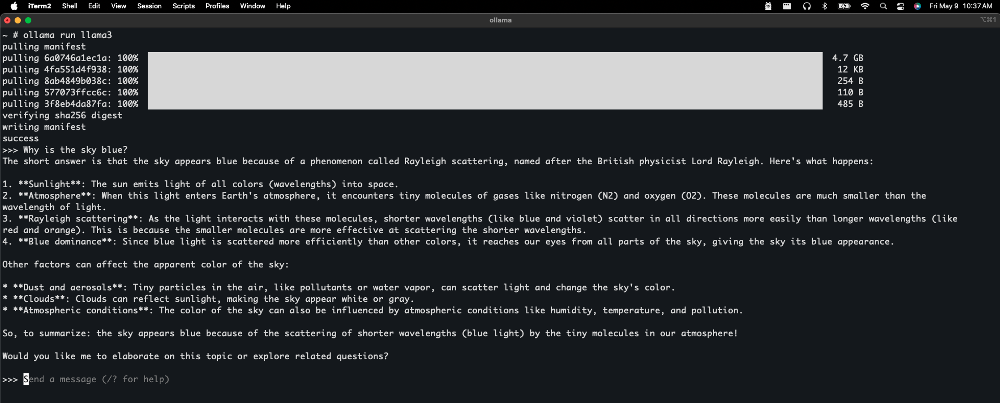

Since the model hadn't been downloaded yet, the first step is to download several files - The model itself (the 4.7 gig one), a license agreement, an Ollama chat template (based on Go's templating engine, with weirdness like `{{ if .System }}<|start_header_id|>system<|end_header_id|>`), a params file, and a manifest.

After that, you'll get a `>>>` prompt in the terminal, and you're talking to the model. It will answer questions, and keep a running context. Outside of this direct interface, Ollama is stateless. Tools making API calls to Ollama need to provide the context including the entire conversation so far.

Here I'm asking it a basic science question, and the model is generating a markdown response. While the response is generating, my GPU is maxed out.

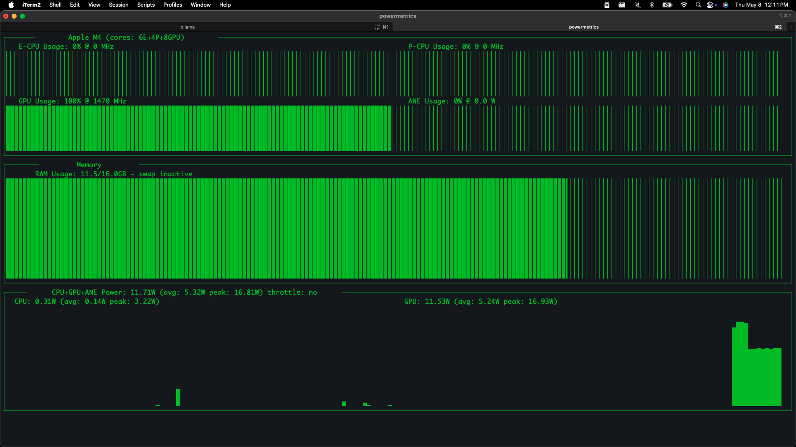

This is a tool called [asitop](https://github.com/tlkh/asitop) that shows the status of CPUs, GPUs, and the ANE, or "Apple Neural Engine", which is part of Apple silicon chips. The ANE is a neural processing unit, like Google's "Tensor Processing Unit" that works with its Tensorflow product. The basic idea is that GPUs are great at parallel operations, which LLMs need, but they were designed for graphics and fast math operations, not specifically for AI applications.

It's possible to convert models to use the ANE, and use Core ML to run them on it, and maybe that's worth investigating sometime down the road.

## Calling Ollama's API

Starting Ollama with `ollama serve` will put it in server mode, listening by default on localhost:11434. You can interact with it with tools like the `curl` command line program, or with a REST client like Postman or Bruno. Here's a sample call from Bruno that just lists all the installed models.

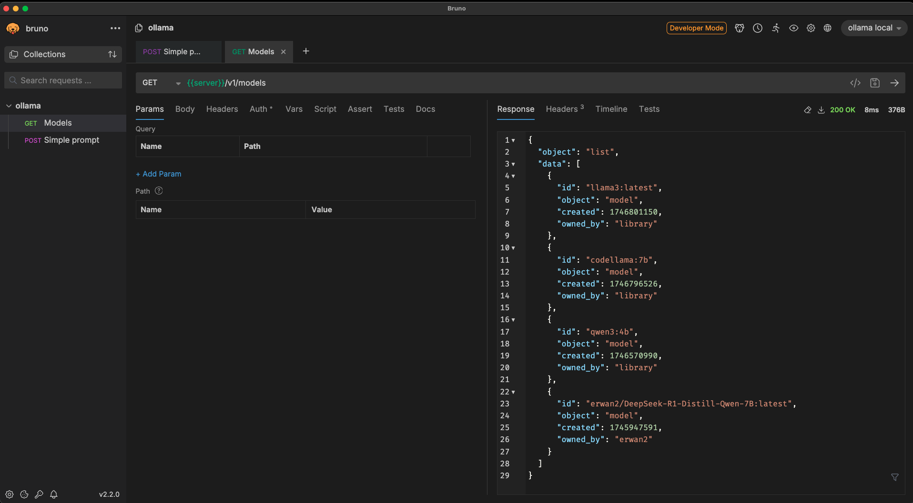

The path I'm posting to, `/v1/models`, is following the [OpenAI API standard](https://platform.openai.com/docs/api-reference/introduction), which Ollama supports.

But let's see what happens when I use Bruno to ask the model a question:

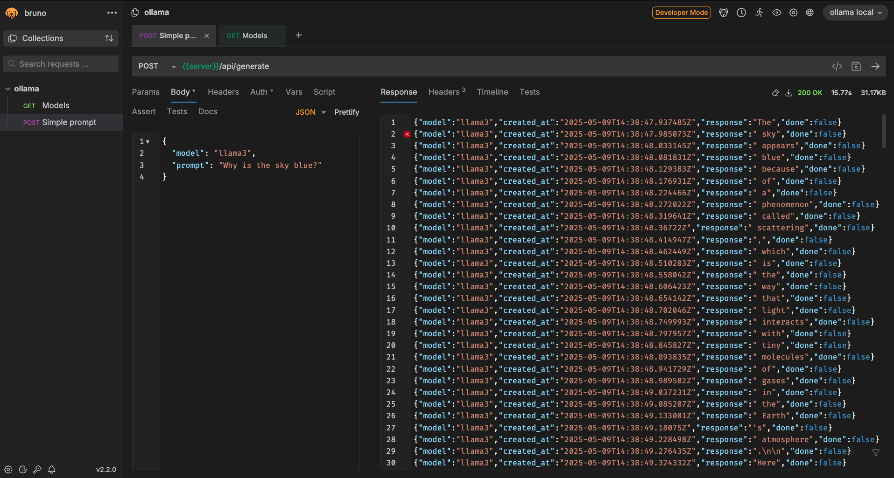

The path I use here, `/api/generate`, is for single questions without a chat history context, using [Ollama's interal API standard](https://github.com/ollama/ollama/blob/main/docs/api.md). The obviously odd thing about the response is that it's in multiple lines of JSON, one token per line. This is using a streaming protocol called [server-sent events](https://developer.mozilla.org/en-US/docs/Web/API/Server-sent_events/Using_server-sent_events), sort of like WebSockets, but only one way.

Tools that interact with Ollama this way need to be able to turn that into something human readable, possibly outputting each token as it comes across the stream. Here is me doing that with some command line mojo, using curl and jq's "join" switch to make short work of it:

```
llm # curl -X POST http://localhost:11434/api/generate -d '{
  "model": "llama3",
  "prompt":"Why is the sky blue?"
 }' > sky-blue-response.json
  % Total    % Received % Xferd  Average Speed   Time    Time     Time  Current
                                 Dload  Upload   Total   Spent    Left  Speed
100 37081    0 37022  100    59   1966      3  0:00:19  0:00:18  0:00:01  2345
llm # head -3 sky-blue-response.json
{"model":"llama3","created_at":"2025-05-09T14:46:30.873537Z","response":"The","done":false}
{"model":"llama3","created_at":"2025-05-09T14:46:30.921277Z","response":" sky","done":false}
{"model":"llama3","created_at":"2025-05-09T14:46:30.967993Z","response":" appears","done":false}
llm # cat sky-blue-response.json | jq '.response' | head -3
"The"
" sky"
" appears"
llm # cat sky-blue-response.json | jq -j '.response'
The sky appears blue because of a phenomenon called Rayleigh scattering, which is the scattering of light by small particles or molecules in the atmosphere. The color we see in the sky is actually a combination of two factors: the color of the sun and the way that light interacts with the tiny molecules of gases in the Earth's atmosphere.

Here's what happens:

1. The sun emits white light, which contains all the colors of the visible spectrum (red, orange, yellow, green, blue, indigo, and violet).
2. When this light travels through the Earth's atmosphere, it encounters tiny molecules of gases like nitrogen (N2) and oxygen (O2). These molecules are much smaller than the wavelength of light.
3. The shorter, blue wavelengths of light are scattered more efficiently by these small molecules than the longer, red wavelengths. This is because the small molecules are more effective at scattering shorter wavelengths.
4. As a result, the blue light is distributed throughout the atmosphere, giving the sky its blue appearance.

This effect is more pronounced during the daytime when the sun is overhead, and the amount of scattered light is greatest. The color of the sky can also be affected by other factors like:

* Atmospheric conditions: Dust, pollution, and water vapor in the air can scatter light in different ways, changing the apparent color of the sky.
* Time of day: During sunrise and sunset, the sun's rays have to travel through more of the Earth's atmosphere, which scatters shorter wavelengths even more, making the sky appear more red or orange.
* Altitude: The color of the sky can change at higher elevations due to changes in atmospheric conditions.

So, to summarize, the sky appears blue because of the scattering of sunlight by tiny molecules in the Earth's atmosphere, with the blue wavelength being scattered more efficiently than other colors.%
llm #
```

## Using Open WebUI to talk to Ollama

The [Open WebUI](https://docs.openwebui.com/) frontend looks similar to ChatGPT. It supports Ollama or any runner that follows the OpenAI API standard, and it supports RAG tool calling. Under the hood it's python, so I `pip install`-ed it, but the getting started doc steers users towards the docker image.

To get up and running, I started Ollama in debug mode, so I could see API calls in the log...

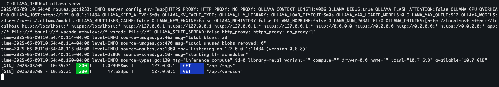

Starting Open WebUI for the first time was similar to the initial `ollama run`, several files were downloaded first. On subsequent startups, the "Fetching 30 files" message still displays.

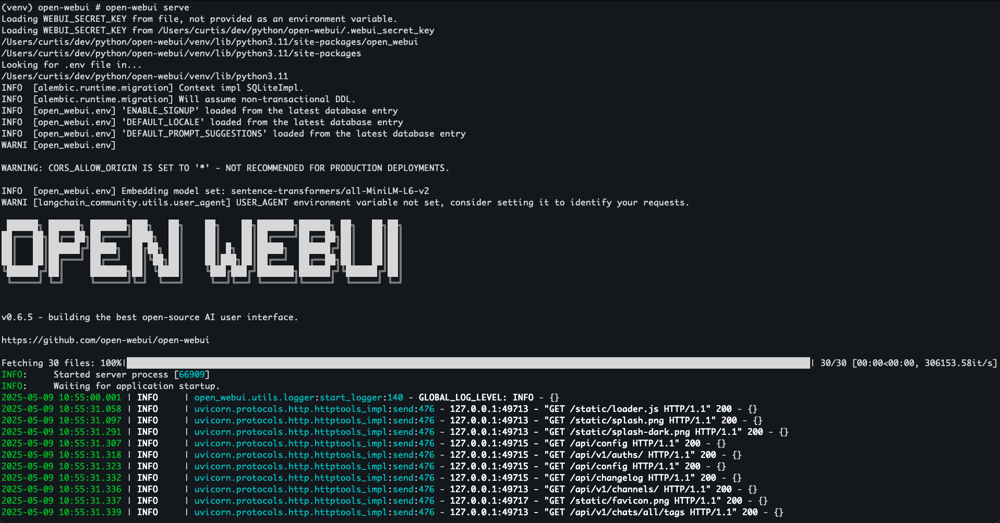

At this point, the UI is ready for a browser connection, defaulting to localhost:8080, and in turn Open WebUI fetches the model list from Ollama, and displays this dapper page:

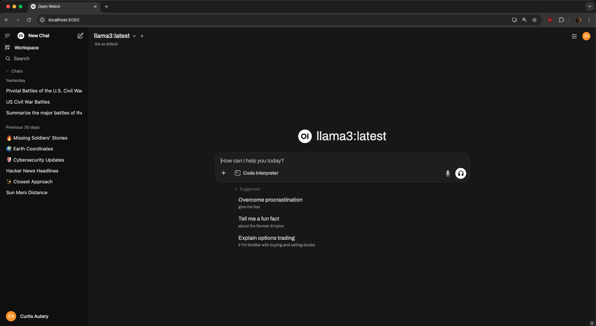

And now we're ready to ask some questions. Open WebUI manages the chat history, showing server-sent tokens to the user as they are received, and asking Ollama for a brief description of the chat and an emoji for it, and some high level tags like "technology" that cover the theme of the conversation. Honestly it's a very nice experience.

The UI shows a random set of sample questions as a mini-tutorial for new users. One of them is a basic web development question, giving the UI a chance to show off.

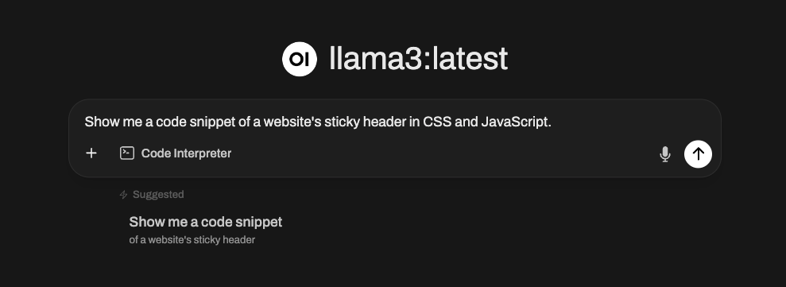

After asking the question, the Ollama log gets some additional posts to `/api/chat`, asking the model for a description and some tags like I mentioned above.

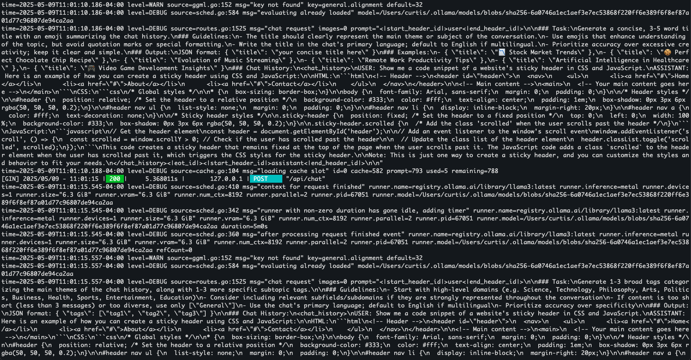

We'll come back to that in a minute. What the UI does at this point is even more surprising than the side conversation it's having with Ollama on the DL. Since we're asking a web development question, and we're in a web browser, Open WebUI can actually render what's being discussed, in this case a page with a sticky nav header.

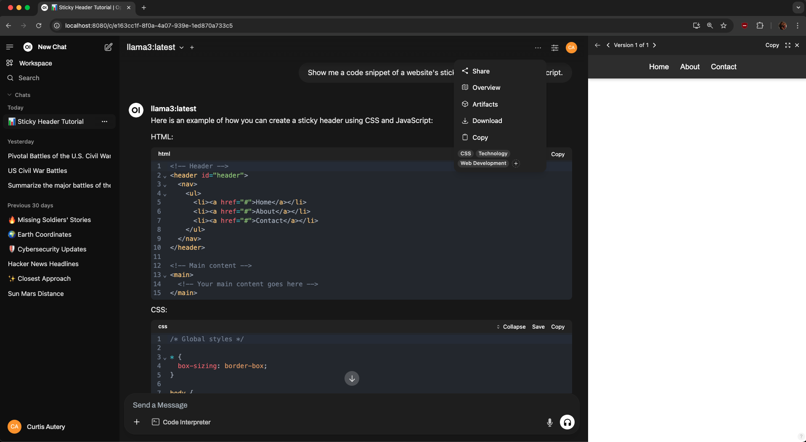

So how do we see more about this side conversation that showed up in the logs? Why by throwing [ngrok](https://ngrok.com/) at it! Ngrok's offerings have grown since I first started using it, but the [Developer Preview](https://ngrok.com/use-cases/developer-preview) is what I need now. Ngrok creates a temporary subdomain off of `ngrok-free.app`, redirects traffic there to the user's local machine, and provides a nice UI to see requests and responses, in this case using pretty-printed JSON.

Here I invoke it with a simple `ngrok http 11434` to see all traffic going to Ollama, and get the following status screen:

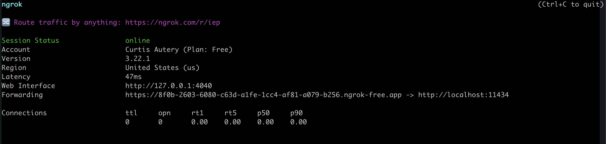

However, Ollama is listening on 127.0.0.1, or localhost. I'll either need to tell Open WebUI to send localhost as the http `Host:` header so that Ollama doesn't balk, or tell Ollama to listen on 0.0.0.0, where it will accept all host headers. I chose the latter, and restarted Ollama with:

    OLLAMA_HOST=0.0.0.0:11434 ollama serve

We also have to tell Open WebUI that the Ollama base URL is the ngrok subdomain:

    OLLAMA_API_BASE_URL=https://8f0b-2603-6080-c63d-a1fe-1cc4-af81-a079-b256.ngrok-free.app open-webui serve

Now after asking a new question:

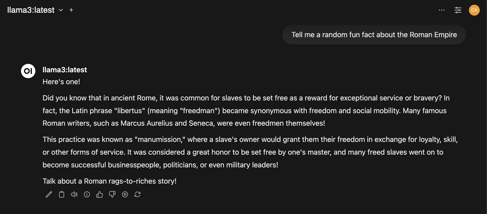

...I can visit the ngrok UI and get details on all the traffic going to Ollama. Here's the actual question:

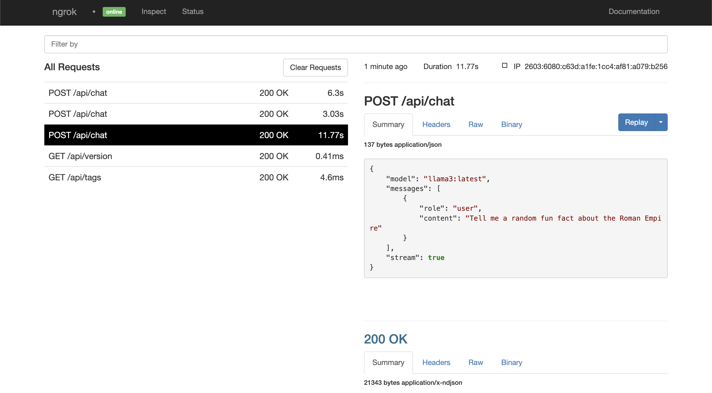

But you can see there are some additional posts to `/api/chat`. Let's look at one of them, and the Ollama reply.

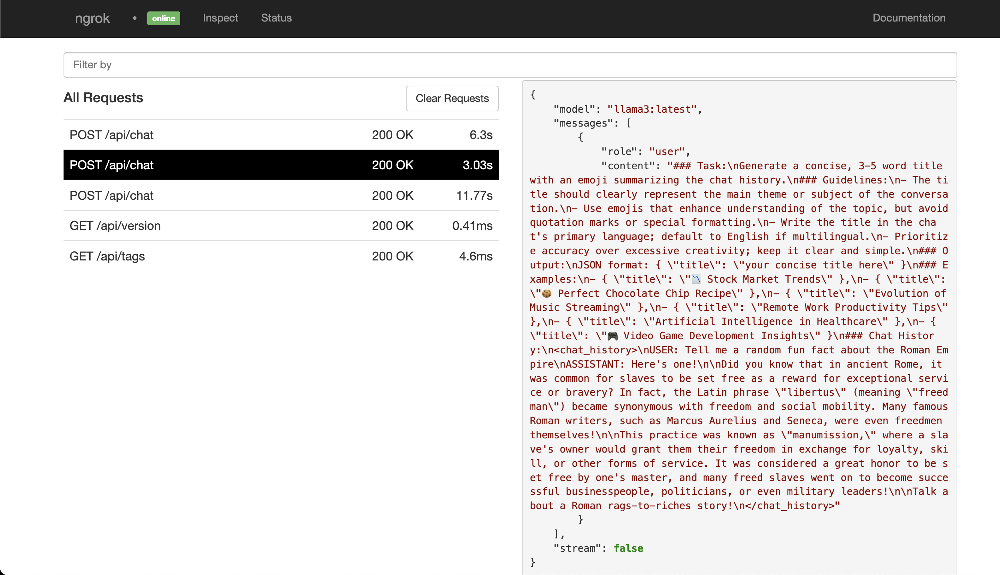

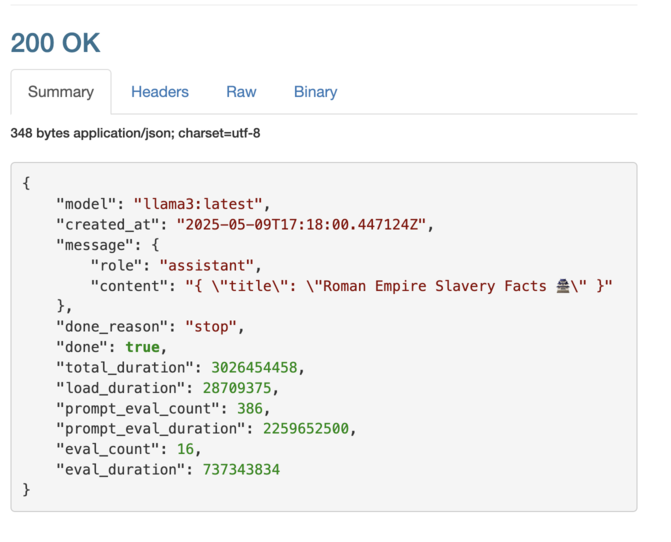

Let's pull out just the "content" part of the prompt and look at it closer.

```
### Task:
Generate a concise, 3-5 word title with an emoji summarizing the chat history.
### Guidelines:
- The title should clearly represent the main theme or subject of the conversation.
- Use emojis that enhance understanding of the topic, but avoid quotation marks or special formatting.
- Write the title in the chat's primary language; default to English if multilingual.
- Prioritize accuracy over excessive creativity; keep it clear and simple.
### Output:
JSON format: { "title": "your concise title here" }
### Examples:
- { "title": "📉 Stock Market Trends" },
- { "title": "🍪 Perfect Chocolate Chip Recipe" },
- { "title": "Evolution of Music Streaming" },
- { "title": "Remote Work Productivity Tips" },
- { "title": "Artificial Intelligence in Healthcare" },
- { "title": "🎮 Video Game Development Insights" }
### Chat History:
<chat_history>
USER: Tell me a random fun fact about the Roman Empire
ASSISTANT: Here's one!

Did you know that in ancient Rome, it was common for slaves to be set free as a reward for exceptional service or bravery? In fact, the Latin phrase "libertus" (meaning "freedman") became synonymous with freedom and social mobility. Many famous Roman writers, such as Marcus Aurelius and Seneca, were even freedmen themselves!

This practice was known as "manumission," where a slave's owner would grant them their freedom in exchange for loyalty, skill, or other forms of service. It was considered a great honor to be set free by one's master, and many freed slaves went on to become successful businesspeople, politicians, or even military leaders!

Talk about a Roman rags-to-riches story!
</chat_history>
```

This is a good example of a prompt, using tools that a new ChatGPT user may not know are available. This is an "obvious in hindsight" idea. LLMs process natural language, and prompts like this are like instructions on a test, which would be right in an LLM's wheelhouse. Providing guidelines and examples are powerful tools to help a model generate a better response. Terms like "Zero shot" or "Five shot" reference the number of examples given in a prompt.

Techniques like this are discussed in Lee Boonstra's [Prompt Engineering whitepaper](https://www.kaggle.com/whitepaper-prompt-engineering), which is a good read for anyone who wants to make more effective use of LLMs.

Since this is a side conversation and not part of the natural flow of the user-assistant interaction, the "chat history" was included directly in the prompt, bordered by an XML tag. This is what a normal user-assistant chat history looks like after multiple interactions:

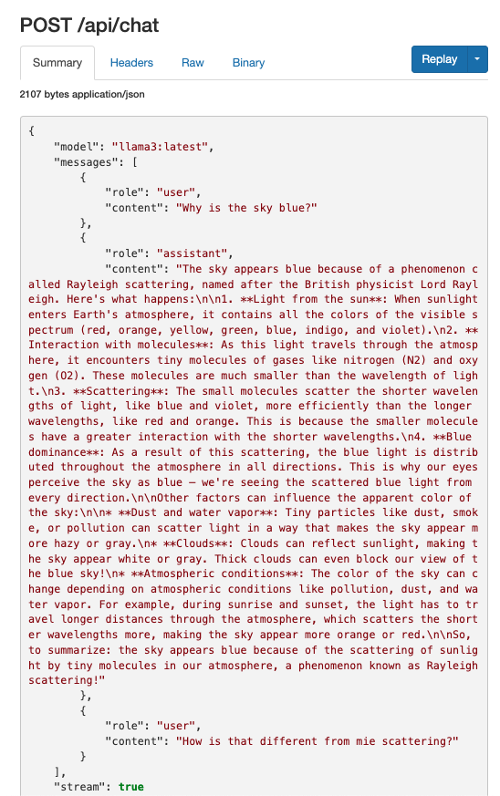

## Asking better coding questions

A lot of the LLM ecosystem is built on python. What I found in my early days of trying Copilot and ChatGPT is that models could generate valid ruby methods, but that they didn't have a "feel" for idiomatic ruby. They would write methods like this:

```
def do_thing(n)
  if @cached[n]
    return @cached[n]
  else
    @cached[n] = (0..n-1).map { |i| calc(i) }
    return @cached[n]
  end
end
```

...instead of something a native rubyist would write, like this:

```
def do_thing(n)
  @cached[n] ||= (0...n).map &method(:calc)
end
```

To me, this has a number of readability improvements, and takes less mental overhead to parse. I had a number of arguments with various models trying to get them to output code in a style I liked. During my foray into using local LLMs, I experimented with using prompts more like the ones mentioned in the Google whitepaper and the Open WebUI request for a title.

A basic "is this thing usable" test for LLMs that I use is to have it write code to generate and cache the fibonacci sequence. My first pass at a formatted prompt with an example was this:

    Write a ruby class that generates the fibonacci sequence. Include getter methods for the nth element, and the first n elements.

    Return just the code.

    ##Style guide##

    * Prefer instance methods over class methods
    * Prefer the conditional assignment operator (`||=`) over if/ternary logic
    * Prefer `x...n` ranges to `x..(n-1)`
    * Omit unneeded return statements
    * Memoize results

    ##Example##

    ```ruby
    class Doubler
      def initialize
        # Cache instance variable for memoization
        @doubles = { 1 => 2, 2 => 4 }
      end

      def double(n)
        # Return cached value, or set cached value and return it
        @doubles[n] ||= n * 2
      end
    end
    ```

The results? The Llama model that meta.ai uses hit it out of the park...

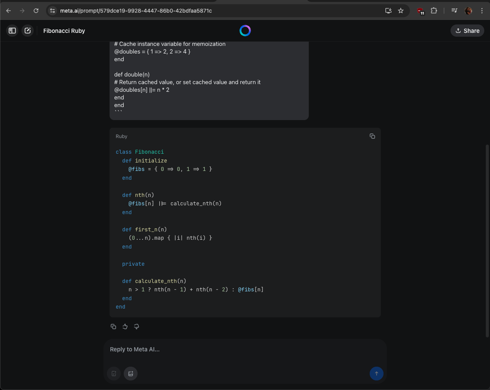

...and the code ran correctly:

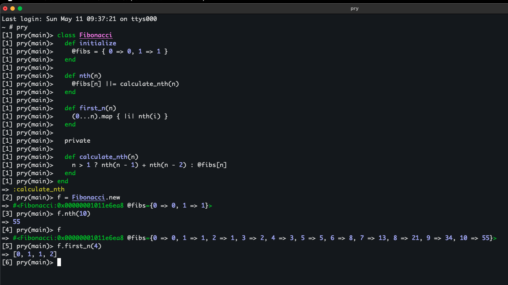

However, local models struggled with the problem. The worst performer was `codellama:7b-instruct`, which utterly failed to write usable code after multiple attempts. Among other problems, it got caught in a loop once, generating the same code and explanation repeatedly until I control-C'ed, and in another attempt it snuck some literal python code into the response.

Here is the best attempt:

    ~ # ollama run codellama:7b-instruct
    >>> Write a ruby class that generates the fibonacci sequence. Include getter methods for the nth element, and the first n elements.
    ...
    ... Return just the code.
    ...
    ... ##Style guide##
    ...
    ... * Prefer instance methods over class methods
    ... * Prefer the conditional assignment operator (`||=`) over if/ternary logic
    ... * Prefer `x...n` ranges to `x..(n-1)`
    ... * Omit unneeded return statements
    ... * Memoize results
    ...
    ... ##Example##
    ...
    ... ```ruby
    ... class Doubler
    ...   def initialize
    ...     # Cache instance variable for memoization
    ...     @doubles = { 1 => 2, 2 => 4 }
    ...   end
    ...
    ...   def double(n)
    ...     # Return cached value, or set cached value and return it
    ...     @doubles[n] ||= n * 2
    ...   end
    ... end
    ... ```
    ```ruby
    class Fibonacci
      def initialize
        # Cache instance variables for memoization
        @fib_seq = [0, 1]
        @first_n_elements = nil
        @nth_element = nil
      end

      def get_first_n_elements(n)
        return @first_n_elements if @first_n_elements && n <= @fib_seq.length

        (1..n-1).each do |i|
          @fib_seq.push(@fib_seq[i] + @fib_seq[i-1])
        end

        @first_n_elements = @fib_seq.take(n)
      end

      def get_nth_element(n)
        return @nth_element if @nth_element && n == @fib_seq.length

        (1..n-1).each do |i|
          @fib_seq.push(@fib_seq[i] + @fib_seq[i-1])
        end

        @nth_element = @fib_seq[n]
      end
    end
    ```
    Note that the `get_first_n_elements` method caches the first `n` elements of the Fibonacci sequence, while the `get_nth_element` method caches the `n`-th     element. This is done to avoid
    recomputing the same values multiple times.

    Also note that the class uses instance variables to store the cached values, and memoization is used to avoid recomputing the same values multiple times.

    >>> Rewrite this without using the `@first_n_elements` and `@nth_element` instance variables. Remember to only return the code.
    ```ruby
    class Fibonacci
      def initialize
        # Cache instance variables for memoization
        @fib_seq = [0, 1]
      end

      def get_first_n_elements(n)
        return @fib_seq.take(n) if n <= @fib_seq.length

        (1..n-1).each do |i|
          @fib_seq.push(@fib_seq[i] + @fib_seq[i-1])
        end
      end

      def get_nth_element(n)
        return @fib_seq[n] if n <= @fib_seq.length

        (1..n-1).each do |i|
          @fib_seq.push(@fib_seq[i] + @fib_seq[i-1])
        end
      end
    end
    ```
    Note that the `get_first_n_elements` method now returns the first `n` elements of the Fibonacci sequence, while the `get_nth_element` method now returns     the `n`-th element. This is done
    to avoid recomputing the same values multiple times.

    >>>

In both cases, it ignored my request to only return code (I probably needed to move that into the system prompt), and wrote code that generated an invalid sequence.

```
~ # pry
[1] pry(main)> class Fibonacci
[1] pry(main)>   def initialize
[1] pry(main)>     # Cache instance variables for memoization
[1] pry(main)>     @fib_seq = [0, 1]
[1] pry(main)>   end
[1] pry(main)>
[1] pry(main)>   def get_first_n_elements(n)
[1] pry(main)>     return @fib_seq.take(n) if n <= @fib_seq.length
[1] pry(main)>
[1] pry(main)>     (1..n-1).each do |i|
[1] pry(main)>       @fib_seq.push(@fib_seq[i] + @fib_seq[i-1])
[1] pry(main)>     end
[1] pry(main)>   end
[1] pry(main)>
[1] pry(main)>   def get_nth_element(n)
[1] pry(main)>     return @fib_seq[n] if n <= @fib_seq.length
[1] pry(main)>
[1] pry(main)>     (1..n-1).each do |i|
[1] pry(main)>       @fib_seq.push(@fib_seq[i] + @fib_seq[i-1])
[1] pry(main)>     end
[1] pry(main)>   end
[1] pry(main)> end
=> :get_nth_element
[2] pry(main)> f = Fibonacci.new
=> #<Fibonacci:0x000000011f9ee948 @fib_seq=[0, 1]>
[3] pry(main)> f.get_nth_element(5)
=> 1..4
[4] pry(main)> f
=> #<Fibonacci:0x000000011f9ee948 @fib_seq=[0, 1, 1, 2, 3, 5]>
[5] pry(main)> f.get_first_n_elements(5)
=> [0, 1, 1, 2, 3]
[6] pry(main)> f.get_first_n_elements(15)
=> 1..14
[7] pry(main)> f
=> #<Fibonacci:0x000000011f9ee948 @fib_seq=[0, 1, 1, 2, 3, 5, 1, 2, 3, 5, 8, 6, 3, 5, 8, 13, 14, 9, 8, 13]>
[8] pry(main)>

~ #

```

Of note, if `get_nth_element` has to add new values to the sequence, it returns a naked range (the `1..4` at the third pry command) instead of an element, and both getter methods keep starting over and appending to the cache variable, generating unpredictable results.

The best performer was `qwen3:4b`. Qwen is a model that by default generates a "think" block, showing its chain of thought.

    ~ # ollama run qwen3:4b
    >>> Write a ruby class that generates the fibonacci sequence. Include getter methods for the nth element, and the first n elements.
    ...
    ... Return just the code.
    (truncated)
    ...   def double(n)
    ...     # Return cached value, or set cached value and return it
    ...     @doubles[n] ||= n * 2
    ...   end
    ... end
    ... ```
    <think>
    Okay, I need to write a Ruby class that generates the Fibonacci sequence. The user wants getter methods for the nth element and the first n elements.     Also, there's a style guide to
    follow. Let me think about how to approach this.

    First, the Fibonacci sequence starts with 0 and 1, and each subsequent number is the sum of the previous two. So, for the nth element, maybe I should have     an instance variable that
    stores the sequence, but since it's a class, maybe it's better to compute it on the fly with memoization.

    Wait, the style guide says to prefer instance methods over class methods. So the class will have an initialize method, and then instance methods for     getting the nth element and the
    first n elements.

    Memoization is important here. So, perhaps I can store the Fibonacci numbers in a hash, where the keys are the indices, and the values are the numbers.     That way, when I calculate a
    number, I can store it so that future calls are faster.

    Let me think about the initialize method. Maybe I should initialize a hash to hold the Fibonacci numbers. The base cases are 0 and 1. Wait, but Fibonacci     sequence can be defined with 0
    as the first element. Let me check: the 0th element is 0, 1st is 1, 2nd is 1, 3rd is 2, etc. Or sometimes it's considered starting with 1, 1, 2... So
    (~150 lines truncated)
    So the code is as written above. Let me check again the style guide points:

    - Prefer instance methods over class methods: the class has an initialize method, and instance methods nth_element and first_n_elements. So that's correct.

    - Prefer ||= over if/ternary: the code uses ||=, and the code inside the begin...end is not using if/ternary, but the code is using a begin...end block.     But in the code, the begin...end
    is used to handle the case where n is 0 or 1. But the code is written with the ||= operator. So that's acceptable.

    - Ranges: (0...n) is used, which is correct.

    - No unneeded return statements: the code returns the values via the methods.

    - Memoization: the @fib hash is used to store the computed values. So that's correct.

    So the code should be correct. Now, the user wants the code to be written as per the example. The example has the initialize method with an instance     variable, and the method uses ||=.

    So the code should be correct.
    </think>

    ```ruby
    class Fibonacci
      def initialize
        @fib = { 0 => 0, 1 => 1 }
      end

      def nth_element(n)
        @fib[n] ||= begin
          @fib[n-1] + @fib[n-2]
        end
      end

      def first_n_elements(n)
        (0...n).map { |i| nth_element(i) }
      end
    end
    ```

Other than a minor style point (the unneeded begin block), I have no complaints about the code, only needing to wait for a 7k think block to generate before the final code started to appear.

In both cases, the Code Llama model and Qwen, I could have improved things by simplifying the requirements, and providing a better example. I was using the Doubler class as a style guide, but it wasn't generating a sequence based on prior values, so the entire example was at best a distraction, linting rules that could be replaced by just piping the output to `rubocop -A`.

What I needed was a better example that more closely matched the problem. Here's what I came up with:

    ~ # ollama run llama3
    >>> Write a ruby class that generates the fibonacci sequence.
    ...
    ... ## Guidelines
    ...
    ... * Include getter methods for the nth element, and the first n elements.
    ... * Memoize results as they are calculated
    ...
    ... ## Example
    ...
    ... ```ruby
    ... class Doubler
    ...   def initialize
    ...     @doubles = { 1 => 2, 2 => 4 }
    ...   end
    ...
    ...   def nth(n)
    ...     @doubles[n] ||= calculate_double(n)
    ...   end
    ...
    ...   def first_n(n)
    ...     (1..n).map &method(:nth)
    ...   end
    ...
    ...   private
    ...
    ...   def calculate_double(n)
    ...     nth(n - 1) + 2
    ...   end
    ... end
    ... ```
    Here is a Ruby class that generates the Fibonacci sequence:
    ```ruby
    class FibSequence
      attr_reader :fib_cache

      def initialize
        @fib_cache = { 0 => 0, 1 => 1 }
      end

      def nth(n)
        @fib_cache[n] ||= calculate_fibonacci(n)
      end

      def first_n(n)
        (0..n-1).map &method(:nth)
      end

      private

      def calculate_fibonacci(n)
        if n <= 1
          n
        else
          nth(n-1) + nth(n-2)
        end
      end
    end
    ```
    Here's a brief explanation of the code:

    * The class has an instance variable `@fib_cache` that serves as a cache for previously calculated Fibonacci numbers. We use this to memoize results, so     we don't have to recalculate the
    same values multiple times.
    * The `nth` method returns the nth Fibonacci number. If the value is already cached, it returns the cached result; otherwise, it calculates the value     using the recursive formula and
    stores it in the cache for future reference.
    * The `first_n` method returns an array of the first `n` Fibonacci numbers.

    You can use this class like so:
    ```ruby
    fib = FibSequence.new
    puts fib.nth(5) # prints 3
    puts fib.first_n(10).inspect # prints [0, 1, 1, 2, 3, 5, 8, 13, 21, 34]
    ```
    I hope this helps! Let me know if you have any questions.

    >>> Send a message (/? for help)

Much better. I took out the style guide, and changed the example to function more like the Fibonacci calculator would. It could be argued that this was too much hand-holding, and I don't disagree. For this case I would have been better just writing the Fibonacci class itself, rather than get 90% of the way there with the Doubler class example. Either way... lesson learned. Provide examples that model the important aspects of the prompt, and don't fret about syntax sugar.

## Writing a tool

Open WebUI supports tool calling (RAG). There are a variety of community-written tools that you can import, or you can [develop your own](https://docs.openwebui.com/features/plugin/tools/development/). Tools are python scripts that Open WebUI executes. They provide an interface description, which gets passed to the model. The model can then reply with which tool, if any, it wants to use to answer the user's question, and what parameters to pass to it.

I scaffolded up a proof of concept tool to query the Project Gutenberg database by means of an API at [gutendex.com](https://gutendex.com/). It's very simple, just choosing one of two query params ("search" or "topic"), and doing an HTTP GET. Here's what I came up with:

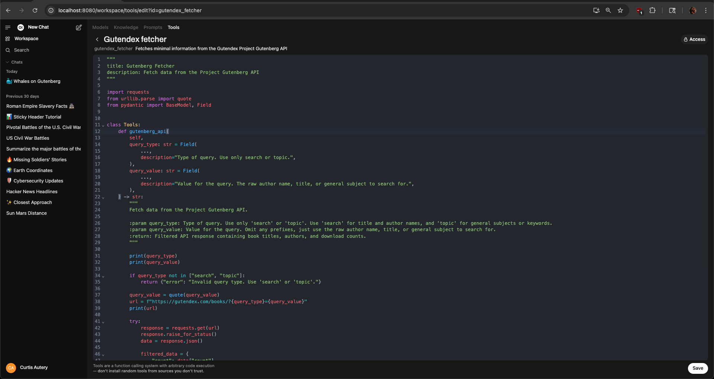

Once you import a community tool, or save one of your own, it becomes available in the UI.

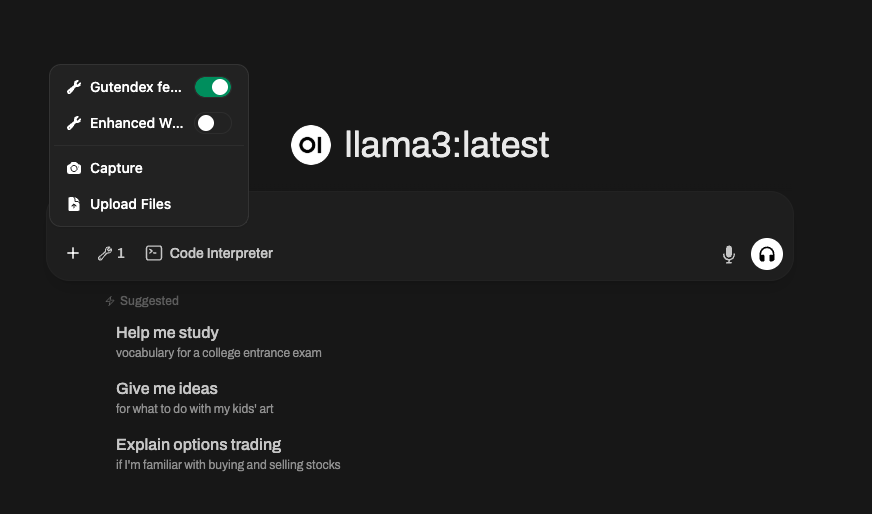

After enabling the tool, Open WebUI will advertise it to Ollama in subsequent messages. Here it is in use, from the UI's point of view:

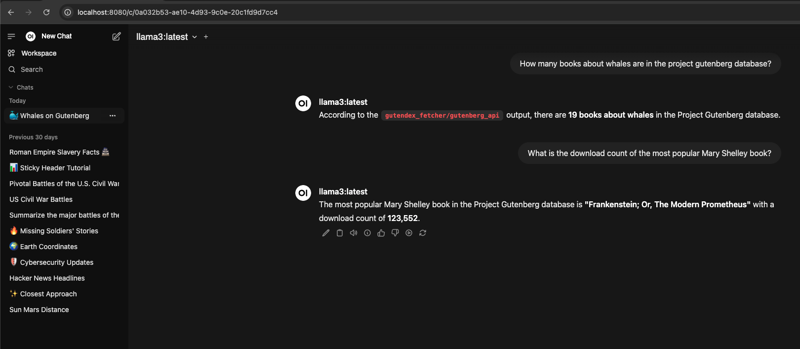

I added in some debug statements to show the query params, the final URL, and the filtered JSON response:

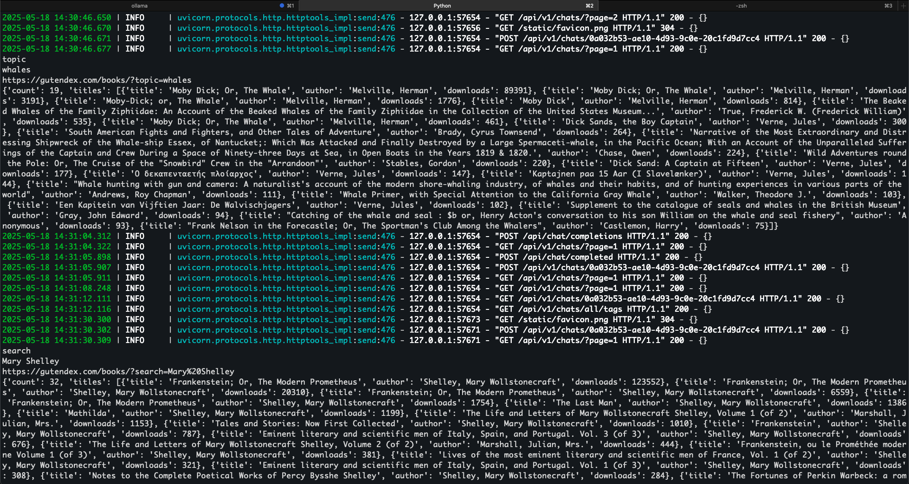

Under the hood, what do queries that include tools look like? I fired up our trusty friend ngrok, turned on the Gutenberg tool, and then asked about H.G. Wells. Here's the initial post from Open WebUI to Ollama:

    {
        "model": "llama3:latest",
        "messages": [
            {
                "role": "system",
                "content": "Available Tools: [{\"name\": \"gutenberg_api\", \"description\": \"\\n        Fetch data from the Project Gutenberg API.\\n\\n        \", \"parameters\": {\"properties\": {\"query_type\": {\"description\": \"Type of query. Use only 'search' or 'topic'. Use 'search' for title and author names, and 'topic' for general subjects or keywords.\", \"type\": \"string\"}, \"query_value\": {\"description\": \"Value for the query. Omit any prefixes, just use the raw author name, title, or general subject to search for.\", \"type\": \"string\"}}, \"type\": \"object\"}}]\n\nYour task is to choose and return the correct tool(s) from the list of available tools based on the query. Follow these guidelines:\n\n- Return only the JSON object, without any additional text or explanation.\n\n- If no tools match the query, return an empty array: \n   {\n     \"tool_calls\": []\n   }\n\n- If one or more tools match the query, construct a JSON response containing a \"tool_calls\" array with objects that include:\n   - \"name\": The tool's name.\n   - \"parameters\": A dictionary of required parameters and their corresponding values.\n\nThe format for the JSON response is strictly:\n{\n  \"tool_calls\": [\n    {\"name\": \"toolName1\", \"parameters\": {\"key1\": \"value1\"}},\n    {\"name\": \"toolName2\", \"parameters\": {\"key2\": \"value2\"}}\n  ]\n}"
            },
            {
                "role": "user",
                "content": "Query: History:\nUSER: \"\"\"How many Gutenberg entries are there for H.G. Wells?\"\"\"\nQuery: How many Gutenberg entries are there for H.G. Wells?"
            }
        ],
        "stream": false
    }

The UI adds a system prompt that declares what tools are available, and how to use them. Here's a pretty print of the system prompt:

    Available Tools: [{"name": "gutenberg_api", "description": "\n        Fetch data from the Project Gutenberg API.\n\n        ", "parameters": {"properties": {"query_type": {"description": "Type of query. Use only 'search' or 'topic'. Use 'search' for title and author names, and 'topic' for general subjects or keywords.", "type": "string"}, "query_value": {"description": "Value for the query. Omit any prefixes, just use the raw author name, title, or general subject to search for.", "type": "string"}}, "type": "object"}}]

    Your task is to choose and return the correct tool(s) from the list of available tools based on the query. Follow these guidelines:

    - Return only the JSON object, without any additional text or explanation.

    - If no tools match the query, return an empty array:
       {
         "tool_calls": []
       }

    - If one or more tools match the query, construct a JSON response containing a "tool_calls" array with objects that include:
       - "name": The tool's name.
       - "parameters": A dictionary of required parameters and their corresponding values.

    The format for the JSON response is strictly:
    {
      "tool_calls": [
        {"name": "toolName1", "parameters": {"key1": "value1"}},
        {"name": "toolName2", "parameters": {"key2": "value2"}}
      ]
    }

...and here's a pretty-print of the Available Tools object:

    [{
        "name": "gutenberg_api",
        "description": "\n        Fetch data from the Project Gutenberg API.\n\n        ",
        "parameters":
        {
            "properties":
            {
                "query_type":
                {
                    "description": "Type of query. Use only 'search' or 'topic'. Use 'search' for title and author names, and 'topic' for general subjects or keywords.",
                    "type": "string"
                },
                "query_value":
                {
                    "description": "Value for the query. Omit any prefixes, just use the raw author name, title, or general subject to search for.",
                    "type": "string"
                }
            },
            "type": "object"
        }
    }]

This is very similar to the "write a concise title" side conversation from earlier, except giving Ollama the instructions as a system prompt, overriding any default behavior, talk like a pirate mods, etc. Here's Ollama's response:

    {
        "model": "llama3:latest",
        "created_at": "2025-05-20T14:21:33.9222Z",
        "message": {
            "role": "assistant",
            "content": "{\n    \"tool_calls\": [\n        {\n            \"name\": \"gutenberg_api\",\n            \"parameters\": {\"query_type\": \"search\", \"query_value\": \"H.G. Wells\"}\n        }\n    ]\n}"
        },
        "done_reason": "stop",
        "done": true,
        "total_duration": 10320286417,
        "load_duration": 3704954167,
        "prompt_eval_count": 354,
        "prompt_eval_duration": 4471744708,
        "eval_count": 45,
        "eval_duration": 2139375834
    }

It said that yes, I'd like to use the Gutenberg tool to answer a Gutenberg question, with the query terms "search" and "H.G. Wells". At this point, the UI executes the `gutenberg_api` method with those params. It makes an HTTP call to gutendex.com, filters the results, and passes them back to Ollama as a new message:

    {
        "model": "llama3:latest",
        "messages": [
            {
                "role": "user",
                "content": "How many Gutenberg entries are there for H.G. Wells?\n\nTool `gutendex_fetcher/gutenberg_api` Output: {\n  \"count\": 1,\n  \"titles\": [\n    {\n      \"title\": \"The World of H.G. Wells\",\n      \"author\": \"Brooks, Van Wyck\",\n      \"downloads\": 161\n    }\n  ]\n}"
            }
        ],
        "stream": true
    }

Oops. Unfortunately the query itself went sideways, probably because all the HG Wells books are listed with the author "Wells, H. G. (Herbert George)", a gentle reminder that integration with a third-party API is hard.

Lastly, Ollama responds with a streaming one-line-per-token response, which when joined together says:

    According to the output from `gutendex_fetcher/gutenberg_api`, there is only 1 Gutenberg entry for H.G. Wells. Specifically, it's a book about him titled "The World of H.G. Wells" by Van Wyck Brooks.

After these experiments, I'm more tuned into the LLM world than I was before. Unsurprisingly, a lot of ChatGTP-adjacent content is showing up in my Reddit feed now, which shows that there's quite a lot of activity in getting models shrunk down enough to use locally (e.g., [Devstral-Small](https://www.reddit.com/r/LocalLLaMA/comments/1kryybf/mistralaidevstralsmall2505_hugging_face/) that you can use with OpenHands with commands like "Go clone this repo, and fix all the broken tests", and watch the agent go to town).

But we still have a long way to go. Even the larger LLMs like Meta.ai are still giving untrustworthy answers while expending ice cap-melting levels of energy. But every day we seem to get closer to something reliable. Right now we're somewhere between GLaDOS and Friend Computer, but we're getting there.
