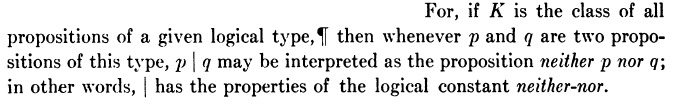
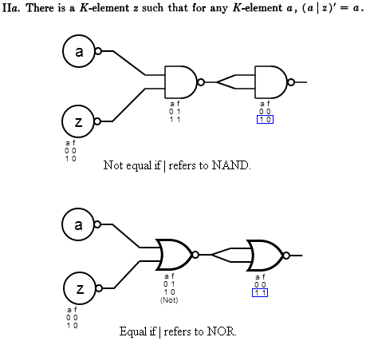
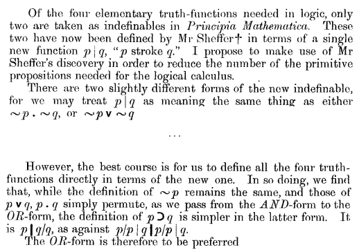
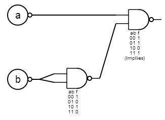
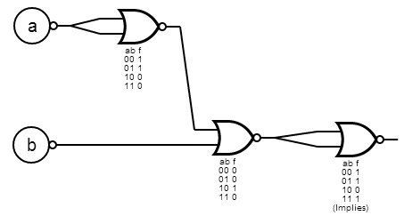
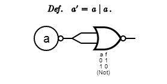

# Why Sheffer's Stroke is NAND instead of NOR

As a young boy, diving into mathematics was a great release for me. I often manipulated numbers in my head, independently discovered cross-multiplication, and found the gradeschool introduction to logic fascinating. Logic, of course, one needs to understand intuitively in order to be an effective coder.

Famous science personalities were my heroes. From Newton himself playing with equations of planetary motion in his giant Principia tome, to Gödel showing with marvelous simplicity that all mathematical investigation will be (hopelessly?) incomplete, to Hoffstadter's work on artificial intelligence (and from whom I first heard the word "meme"), to Feynman picking locks at Los Alamos for kicks and investigating what he found interesting with little regard to its future practical value.

These were the giants to be revered, the Atlases holding the world on their shoulders. If only we could all be like them, forgoing our petty disagreements, cults of personality, and clanishness... or so I thought. Later when I realized that the science and maths world contained all of these things, it was quite disillusioning. Yes, even the greats stepped on each other's work, stole each other's credit, and disagreed on basic notation and phraseology of important concepts, particularly as a new field was being developed.

"Sheffer's Stroke" is an example of this kind of thing. Denoted by `|` (or "pipe" as we techies call it), in modern notation it refers to the logical NAND function. `a|b` is true in all cases where `a` and `b` are not both true. However, Henry Sheffer explicitly refers to his proposed function as "neither-nor", false in all cases where `a` and `b` are not both false. In his 1913 paper ["A set of five independent postulates for Boolean algebras, with application to logical constants"](https://www.ams.org/journals/tran/1913-014-04/S0002-9947-1913-1500960-1/S0002-9947-1913-1500960-1.pdf), he has this to say:

Logic gate diagrams of either NAND or NOR can be used to express most of the definitions in Sheffer's paper by virtue of [De Morgan duality](https://en.wikipedia.org/wiki/De_Morgan%27s_laws). Most, but not all. Specifically, proof IIa:

Here _z_ refers to 0, or false, where _u_ (unity/unary) is 1, or true. If z refers to 0, then IIa only works for NOR.

Jean Nicod, however, found a reason for preferring NAND. In his 1917 paper, ["A Reduction in the Number of Primitive Propositions of Logic"](https://en.wikisource.org/wiki/A_Reduction_in_the_number_of_the_Primitive_Propositions_of_Logic), the following paragraphs which suggested an alternate function should be assigned to the stroke:

This takes a little decoding. Let's start with the symbols:

    ~  NOT
    • AND
    ∨ OR
    ⊃ Implies (modern notation is an arrow, →)
    /|| The proposed new function, in order of operation if they are chained together

So there are two options for | proposed by Nicod. The first:

    ~p • ~q = (NOT p) AND (NOT q) := pq f
                                     00 1
                                     01 0
                                     10 0
                                     11 0

This is the NOR function, what Nicod confusingly calls the "AND-form". The second option:

    ~p ∨ ~p = (NOT p) OR (NOT q) := pq f
                                    00 1
                                    01 1
                                    10 1
                                    11 0

This is the NAND function, what Nicod calls the "OR-form". The "Implies" function takes a little explaining if you know logic mainly from coding. It has this truth table:

    pq ⊃
    00 1
    01 1
    10 0
    11 1

It is false only if the first input (the cause) is true, but the second input (the effect) is false. Let's assert this proposition: if I punch you in the nose, your nose will bleed. Punching will be _p_, bleeding will be _q_. Only if _p_ is true (I punch you), and _q_ is false (you don't bleed) will my assertion be false. If I haven't hit you, your nose may or may not be bleeding for other reasons, so this doesn't disprove the assertion. If you don't care for the whole causality discussion, this function can also be thought of as "_p_ is less than or equal to _q_".

Now, if we take Nicod's last statement, that expressing ⊃ is p|q/q for NAND, and p/p|q**|**p/p| q for NOR, and turn those into logic gate diagrams, we see that the two functions are more similar than the notation would suggest:

Basically the NOR form just needs to reverse its outputs by using the first rule put forth by Sheffer:

However, the world adopted Nicod's view that Sheffer's definition should be changed, making it very confusing if you're a 40 year old software developer who didn't major in mathematics trying to wade through these papers for the first time. This isn't necessarily a bad thing. The NOR function didn't disappear from logic, and Sheffer's contribution is still of monumental importance, as chaining NAND or NOR gates in semiconductors to build more complex logical operations is exactly what makes them work. It's how math is performed, it's how RAM is stored. It's everything.

Point being, scientists step on each others toes and take liberties with their works in a very human fashion, further cementing my views that close examination of any hero will show things that are disappointing, and that the study of maths, like the study of computer science, is as much the study of history and notation as anything else.
