# Four ways to construct a pentagon

[This page](https://autery.net/compass) contains animations of the compass and straightedge pentagon construction techniques I describe below, along with the first six propositions in Euclid's Elements.

Over the last few weeks I've been spending what free time I have obsessing over the odd mathematics of Argand diagrams, complex roots, and how they relate to constructing regular polygons with a compass and straightedge. I found, among other things, that I had forgotten quite a bit from my trig and geometry classes from 25 years ago.

The spark for this obsession was when I stumbled on the Wikipedia article [Compass and straightedge construction](https://en.wikipedia.org/wiki/Straightedge_and_compass_construction)s, a topic I thoroughly enjoyed in my freshman Geometry class back in high school. The article mentions the discovery by Guass that a regular heptadecagon (a 17-sided polygon) was constructable because the cosine of $\frac{2\pi}{17}$ was equal to some arcane madness that had several nested square roots of 17 in it. On further digging, it mentions his proof of this had to do with finding the complex roots for $x^{17} = 1$, raising e to the $\frac{2\pi i}{17}$, and liberal application of Euler's formula $e^{ix} = \cos x + i \sin x$, all of which either seemed unrelated to drawing circles and lines, or just went right over my head.

After returning to the article and reading other texts about the topic, I started to see how it all connected together, but not enough to be able to explain it to anyone, and then miraculously, it all clicked after watching [this video](https://www.youtube.com/watch?v=N0Y8ia57C24) on Khan Academy, which explains how to find complex roots. (Thanks, Sal, you da man.)

There are two sides to this: the crazy math which concerns itself with complex roots and whatnot, which deals mainly with proving that a shape is or is not constructable, and the much simpler math that deals with finding where on a circle to find the next vertex of a shape. The simpler math, while easier to understand to laymen like myself, turns out to be pretty interesting on its own.

### 0: Basic concepts

Let's start with a triangle.

No, let's start with $\pi$ (pi), the ratio of a circle's circumference to it's diameter. If you've read this far, I imagine you've heard of it, as well as the basic formula $C = 2\pi r$. The circumference of a circle is equal to 2 times $\pi$ times the circle's radius.

If the circle's radius is 1 (a "unit circle"), your current distance around the circle can be described as a fraction of $2\pi$, the total circumference. If you are a third of the way around, you are at $\frac{2\pi}{3}$ from your starting point. To describe an equilateral triangle on the circle, you start at any point on the circle's edge, then add a second point one third the way around, at $\frac{2\pi}{3}$, then add a third point another $\frac{2\pi}{3}$ around, then connect the dots:

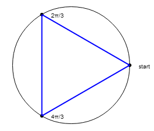

So far so good, but how does knowing you have to go $\frac{2\pi}{3}$ around help you? With our good friend the cosine, of course! If you took a trigonometry course in school, you may have heard of the acronym SOH-CAH-TOA (it's explanation, unfortunately, commonly comes with a story that mocks native Americans - old chief Sohcahtoa, uncle to the lost brave Fallen Rocks, etc.). The acronym tells us that the Cosine is equal to the Adjacent side divided by the Hypotenuse. Cosine, Adjacent, Hypotenuse - the "CAH" of SOH-CAH-TOA. What does all that mean?

This is in reference to right-triangles. With our example above, we can draw a right triangle from the point we're trying to find to the diameter line of the circle:

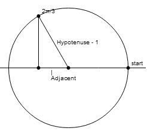

This is a unit circle, so it has a radius of one. The cosine of our $\frac{2\pi}{3}$ angle will be the length of the line segment marked "adjacent", divided by the hypotenuse. Since the hypotenuse in this case is also the circle's radius, we're just dividing by one, so the cosine tells us how far to move from the center along the diameter line to get "under" the point at $\frac{2\pi}{3}$.

The cosine of $\frac{2\pi}{3}$ radians (120 degrees if your calculator doesn't understand radians), is -.5, or half the distance from the circle's center to the left side of the diameter line. This is where the numbers turn into drawing instructions. One of the basic constructs with a compass and straightedge is dividing something in two, in this case the line segment between the circle's center and the left edge:

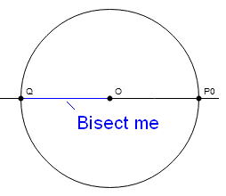

Start with the circle in the picture above, then draw a circle with Q as the center, out to radius QO, and the circle/circle intersection points bisect the line segment QO, putting us -.5 from center on the diameter line, or immediately under the $\frac{2\pi}{3}$ point.

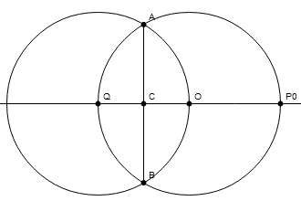

Now to find the second point of the triangle, we need a line perpendicular to QO, which will intersect the original circle at $\frac{2\pi}{3}$... what's that? Yes, in fact, we already have one of those. Additionally, the point it intersected was already established by the circle/circle intersection. Additionally...er, the bottom intersection point was at $\frac{4\pi}{3}$ (whose cosine is also -.5, but whose sine is negative). So after we draw circle QO, we can mark off the second and third points of the inscribed triangle, and connect them:

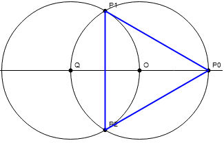

Fairly simple. For any regular polygon you want to inscribe in a circle, you pick a point on the circle's edge, and then find the point at $\frac{2\pi}{n}$, where n is the number of sides. Once you find one leg of the shape, you can either repeat the procedure starting at the new point, or just draw a new circle centered on one point with a radius out to the other, and the circle-circle intersection shows where the next point is.:

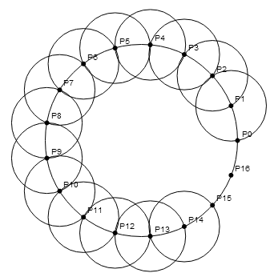

Alternatively, find $\frac{f2\pi}{n}$, where n is the number of sides, and f is co-prime to n. "Say what?" Basically, instead of finding the next point, you can find some other point, so long as skipping that many points and repeating will eventually fill in all the dots.

### 1: Euclid's method

There are other methods to find a point than by using cosines. With pentagons, the cosine math gets a little trickier. Since there are five points, the distance along the circumference between each will be $\frac{2\pi}{5}$. If you ask a calculator for the cosine of $\frac{2\pi}{5}$ radians (or 72 degrees), you get an irrational number that starts with 0.309016994. This turns out to be $\frac{\sqrt{5} - 1}{4}$, but let's assume we don't know that yet. Point being, no method of finding that point with compass and straightedge jumps out at you.

In Euclid's Elements, the construction method was different: Inscribe an isosceles triangle on a circle, making the angles on the base double the one on top. Bisect the bigger angles, and then you should have 5 equal angles extending to 5 points equidistant from each other. Creating the triangle involves mechanically finding the golden ratio, $\frac{\sqrt{5} + 1}{2}$, commonly denoted by the Greek letter phi ($\phi$). The link below titled "Pentagon, Euclid's method" shows an animation of that, but here's the gist of it:

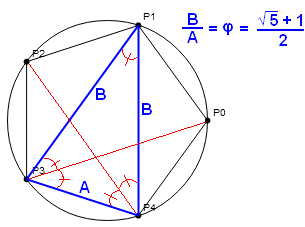

The type of triangle required for this is a "golden triangle", meaning the ratio between the long sides and short side is the golden ratio. That knowledge, combined with Ptolemy's little gem, can tell us everything we need to know about a pentagon, including ways to construct it beyond Euclid's.

### 2: Phi method (or "The Kite")

Ptolemy's theorem, if you've never heard of it, is the bad-ass sequel to the Pythagorean theorem... the "Godfather 2" to Pythagoras' "The Godfather". Unfortunately, it never made its way into popular parlance, which I attribute to its difficulty in being expressed succinctly in English. It goes, roughly, thusly:

If you inscribe a 4 sided polygon on a circle, the product of the lengths of the diagonals is the same as the sum of the products of each pair of opposite sides. For example, if you have a quadrilateral ABCD inscribed on a circle:

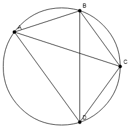

...then $AC \times BD = (AB \times CD) + (BC \times AD)$. Why this relationship works isn't intuitive (to me), especially since it doesn't rely on right angles. In the case of pentagons, it's surprisingly useful. To start, remember the golden triangle that can be drawn with three of the pentagon's points. The long sides (B from above) amount to connecting pentagon vertex points that are two apart on the circle's edge, where the short side (A) connects points that are adjacent. The ratio between them, B/A is equal to φ, the golden ratio.

Now with that in mind, draw a line from one of the pentagon's points, through the circle's center, and connect it with the opposite end of the circle, making a diameter line. Then draw a kite:

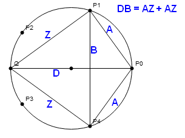

Note that point Q, the end of the diameter line, is not a point on the pentagon. The lines A and B in the drawing above have the same lengths as A and B from the golden triangle. We don't know what their individual lengths are... yet. The diameter line is D, which we know is length 2 since this is a unit circle. The two Z lines are, for now, complete unknows. Now let's apply Ptolemy's theorem and a little algebra:

:::codez
$DB = AZ + AZ$, or, $DB = 2AZ$. Divide both sides by 2A to solve for Z.
$Z = \frac{DB}{2A}$
We know the diameter, D, is 2, so:
$Z = \frac{2B}{2A}$ which reduces to $Z = \frac{B}{A}$
Lastly, we know from Euclid that $\frac{B}{A}$ is the golden ratio, so:
$Z = \phi = \frac{\sqrt{5} + 1}{2}$
:::

This gives us our second method of constructing a pentagon with compass and straightedge, namely finding a point phi away from the opposite end of P0. We do this by finding the $\frac{\sqrt{5}}{2}$ part and the $\frac{1}{2}$ part separately using nothing more than bisecting lines and drawing circles with known points. The link "Pentagon, Phi method" below shows an animation of that, but the method is simply drawing a circle with a $\frac{1}{2}$ radius inside the unit circle, with a diameter from the unit circle's center to it's edge:

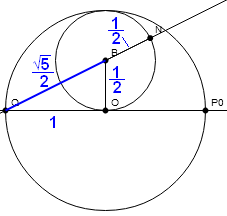

The triangle QBO is a right triangle with base 1, height $\frac{1}{2}$, and hypotenuse $\sqrt{1^2 + (\frac{1}{2})^2} = \sqrt{1 + \frac{1}{4}} = \sqrt{\frac{5}{4}} = \frac{\sqrt{5}}{2}$. So from Q to B we need only $\frac{1}{2}$ more to be at the radius φ... which also happens to be the radius of the inner circle.

So we just extend line QB, and the point where it intersects the inner circle, N, is φ away from Q. All that's left is to draw a semicircle from center Q to radius N, which will cross the unit circle at P1 and P4:

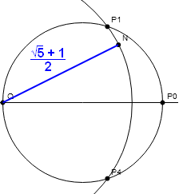

### Intermission: Exact value of 0.309016994...

With some further applied trig and algebra, we can find the exact value of $\cos \frac{2\pi}{5}$. Let's return to the kite:

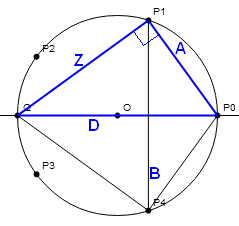

According to Thales' theorem if two points on a circle lie on opposite ends of a diameter line, connecting them to any other point on the circle forms a right angle. In the kite diagram above, triangle ZAD is a right triangle. D and Z are known values, so A is $\sqrt{D^2 - Z^2}$, or $\sqrt{4 - \phi^2}$, which reduces to the very un-sexy $\sqrt{\frac{5 - \sqrt{5}}{2}}$.

Now in the Ptolemy equation, only B is unknown. A little algebra finds its length to be $\sqrt{\frac{5 + \sqrt{5}}{2}}$. If line B intersects the diameter line at J:

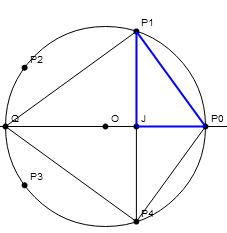

...then we have enough information to solve for the missing length J-P0 in right triangle J-P1-P0: $\frac{5}{4} - \sqrt{\frac{5}{4}}$, leading us, at long last, to the length between O and J, the same as the cosine of $\frac{2\pi}{5}$ : $\frac{\sqrt{5} - 1}{4}$.

### 3: Cosine method (or "Richmond's epiphany")

The 19th century gave us an interesting mathematician who is very overlooked: Herbert William Richmond. His specialty was algebraic geometry. His papers were compact, and contained simplifications of already discovered methods. Two years before his death, he was writing about the failings of algebraic techniques to handle problems of higher than three dimensions, and had this to say about his style:

> "It is true that the scope of these methods is restricted, but there is compensation in the fact that when geometry is successful in solving a problem the solution is almost invariably both simple and beautiful.
>
> The last sentence explains why so many of my published papers are very short. A result already known is obtained in a simple manner.
>
> Admittedly I have spent much time advocating old-fashioned methods which have fallen into undeserved neglect (in my opinion). This does not imply lack of appreciation of modern methods..."

In 1893, Richmond published a two-page paper in "The Quarterly Journal Of Pure And Applied Mathematics" titled "A Construction for a Regular Polygon of Seventeen Sides." The paper expands on Gauss' work on the heptadecagon, showing a practical compass and straightedge construction method. As a footnote, the paper ends with a quick discussion of pentagons:

It may similarly be shewn that, if 2C be the acute angle whose tangent is 2, and α stand for $\frac{2\pi}{5}$, then will
2 cos α = tan C, and 2 cos 2α = - cot C.
Therefore (fig. 7), if OA, OB be two perpendicular radii of a [circle] and J the middle point of OBl then the ordinates drawn circle, through E and F, the points where the bisectors of OJA meet OA, determine on the circle four points which with A form a regular pentagon.

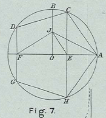

Another way of expressing Richmond's equation is this:

$$
\tan(\arctan(\cos(\frac{2\pi}{5}) \times 2) \times 2) = 2
$$

What it's trying to show is that we're flipping the triangle the other way, with the vertex at 90°, changing from a hypotenuse of 1 to a height of 1, and examining the angle at A instead of the angle at O:

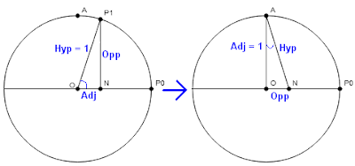

What Richmond found, and it's unclear what sparked his epiphany, is that if you cut the adjacent side in half, and double the angle, you get a tangent of 2. In the case of the unit circle, this puts the apex of the triangle at (0, 1/2), and the base points at O and P0.

Going backwards from the epiphany, if you bisect line OA at B, then bisect the angle at O-B-P0, you intersect O-P0 at $\frac{\sqrt{5} - 1}{4}$. A perpendicular line up from there intersects the unit circle at P1:

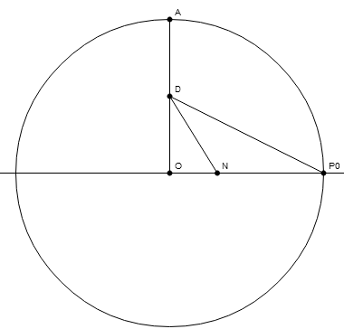

The "Pentagon, Cosine method" link on the animations page shows this in a way that makes more sense.

### 4: Carlyle Circles

In the early 19th century, Thomas Carlyle gave us a gem of a geometric construct - shortly before retiring from teaching mathematics and moving on to political writing including satire, a history of the French Revolution, and advocating against democracy and for moving back to a fuedal society. Takes all types.

Anyway, what he discovered was a way to mechanically find the quadratic roots of equations of the form $x^2 -sx + p$. The method is remarkably simple: draw a circle with a diameter from (0,1) to (s,p), and where the circle crosses the x axis are the roots.

For example, here's Wolfram Alpha's rendition of a Carlyle Circle describing $x^2 - 5x + 6$:

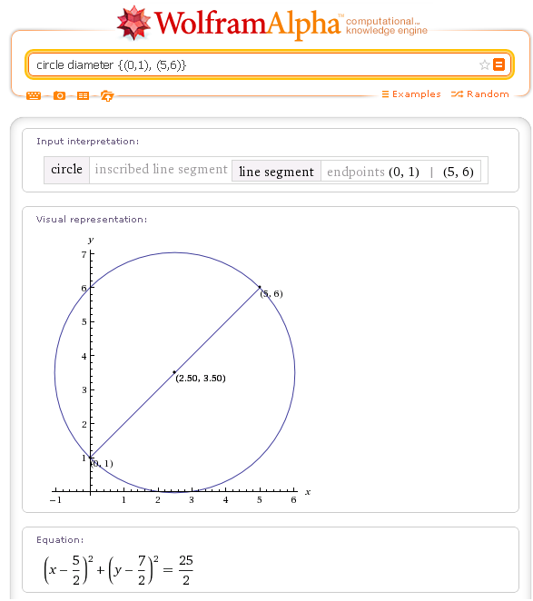

The equation at the bottom is not the quadratic formula we're trying to solve, but rather the circle's equation in the format $(x - h)^2 + (y - k)^2 = r^2$. Visually it appears the circle is crossing 2 and 3, but here's an official declaration from Wolfram of the intersect points:

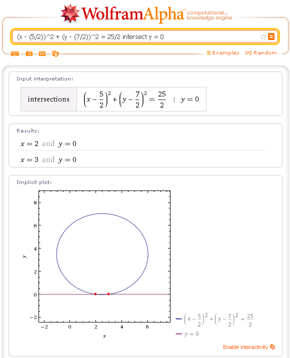

(Unfortunately, I couldn't find the exact syntax on Wolfram's input line to do this in one step, hence the examples all have two screenshots.) As it appeared, 2 and 3, making the root formula $(x - 2)(x - 3)$, which, if you're familiar with this type of thing, is pretty obvious.

For a second example, here is how the Carlyle circle behaves when the roots are the same, solving $x^2 - 6x + 9$:

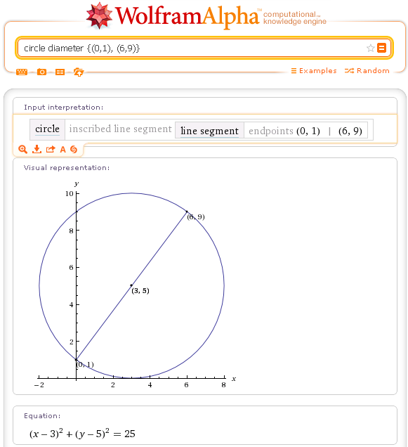
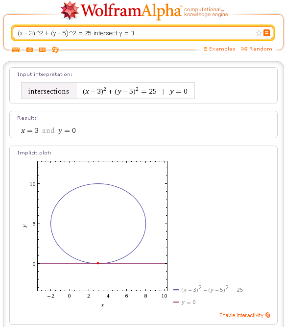

One intersection, the x axis tangent to the circle, making the root formula $(x - 3)^2$

How does any of this help us construct a pentagon? It goes back to the cosines of the individual points. Remember that when we find cosines of points on the edge of a unit circle (actually cosines of the angles at the origin), we end up with the length of the base of the right triangle - positive for points right of the origin, negative for points left of the origin, and 0 for points at exactly 90 and 270 degrees. If you think about this for a minute, you might come to an interesting conclusion:

For a regular polygon, the cosines of the points add up to 0.

As a corollary of that, consider that all of our examples have had a vertex point at (1,0), or on the x axis, at distance 1 from the origin. The cosine of that point is 1. If you add up the cosines of every other point, then, you get -1. Some regular polygons have another property: certain combinations of vertex cosines multiply together to form whole numbers or simple fractions.

Consider the four points of a pentagon other than the starting point at (1,0):

:::codez
Point 1: $\cos(1 \times \frac{2\pi}{5}) =  0.30901699437494742410229341718282$
Point 2: $\cos(2 \times \frac{2\pi}{5}) = -0.80901699437494742410229341718282$
Point 3: $\cos(3 \times \frac{2\pi}{5}) = -0.80901699437494742410229341718282$
Point 4: $\cos(4 \times \frac{2\pi}{5}) =  0.30901699437494742410229341718282$
:::

First, clearly the two positive numbers (points 1 and 4) correspond to points on the right of the origin, where the two negative numbers (points 2 and 3) are left of the origin. It turns out that the positive points are the same x distance from the origin, and the same is true of the negative points.

To verify what I said above, these values all add up to -1 (note after the 3 and 8, the rest of the digits are the same, so you have .3-.8-.8+.3 = -1.0. Now, if you add the negative and positive pairs together, let's call them "n1" and "n2", we get this:

```
n1 = -0.80901699437494742410229341718282 * 2 = -1.618033988749894848204586834364
n2 =  0.30901699437494742410229341718282 * 2 =  0.618033988749894848204586834364
n1 + n2 = -1
```

and here's the punchline:

```
n1 * n2 = -1
```

Now the digits I have for n1 and n2 are estimates, so if you're checking the product with a calculator, you'll get a -0.99999... number just short of -1. The real answer is -1, and I'll spare you the trigonometric exegesis that shows it.

So, if I plug `(-1,-1)` into the Carlyle circle, the two points crossing the x axis should equal n1 and n2, by virtue of `s` being `n1 + n1`, and `p` being `n1 * n2`. Both points are double the x distance from the origin as their respective pentagon vertex points:

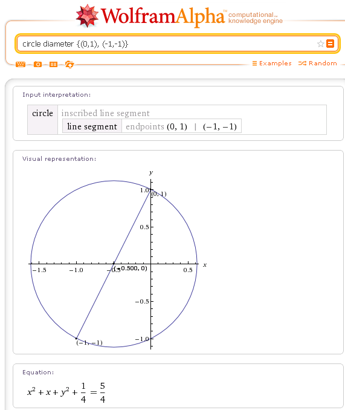

Visually the intersection points look to be at roughly n1 and n2 from above, but here's the exact answer from Wolfram (I've done the obvious simplification of their equation of subtracting $\frac{1}{4}$ from both sides):

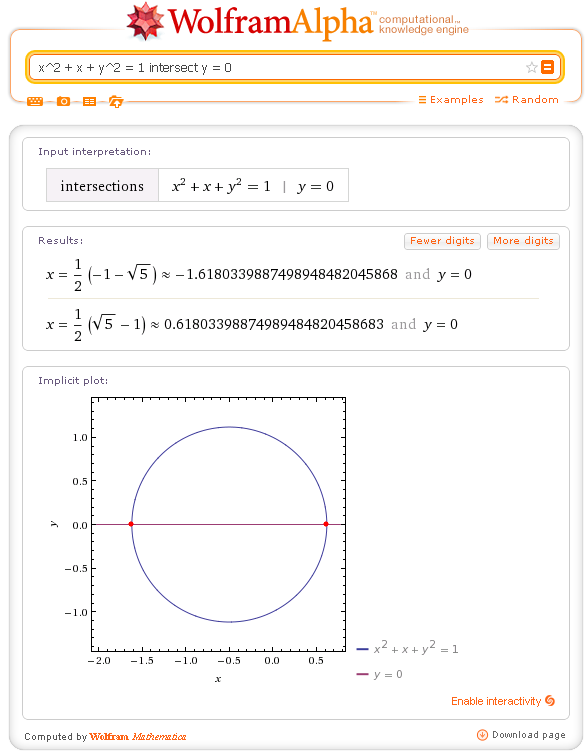

Using compass and straightedge rules, finding point `(0,1)` is trivial. So is finding `(-.5,0)`, the midpoint between `(-1,-1)` and `(0,1)`, to be the circle's center:

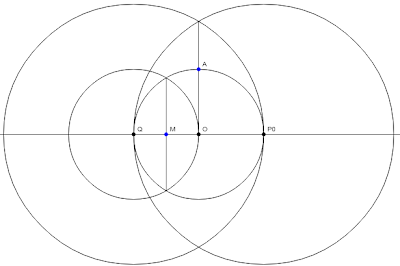

From there a circle from center M to radius A intersects the x axis at our n1 and n2 points:

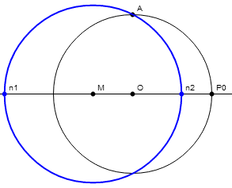

And now what do we do? Lines O-n1 and O-n2 are both twice as long as the x position of their respective vertex points. From here there are two basic approaches. First, you can bisect the lines, then a perpendicular line from the bisection points will cross the unit circle at P2 and P3 on the negative side, and P1 and P4 on the positive side. Alternately, we can draw new unit circles at n1 and n2, and the circle/circle intersections will occur in the same places as the first approach.

If you add the ability of remembering a compass length to the classical rules of compass and straightedge, the unit circle approach is decidedly the simpler one. In the link to my example below titled "Pentagon, Carlyle Circle method", I performed the unit-circle method on one side, but stuck to the classical Greek rules of collapsing a compass when you lift it from the page. To get the unit length over to point n1, I used Book I, Proposition II of Euclid's Elements to copy the length over from line QO.

So, that's about all. There are other methods to create a pentagon which I haven't covered here, such as Ptolemy's, but I think I've covered the topic pretty thoroughly. I hope I have laid this out simply enough for a layman (or a high-school student trying to decide if math is a worthwhile thing to think about) to follow.

Don't forget to check out the construction animations [here](https://autery.net/compass).
