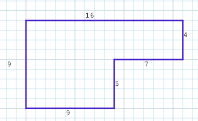
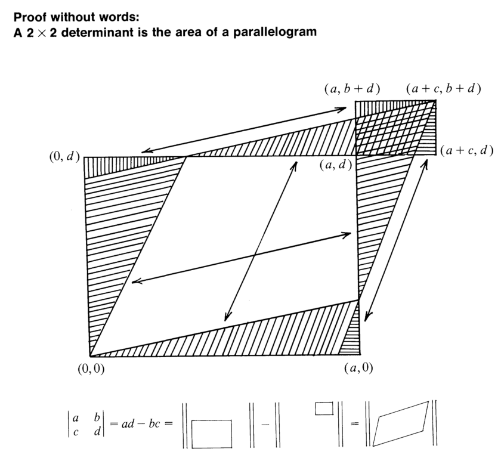
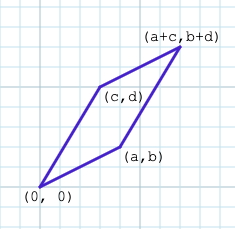
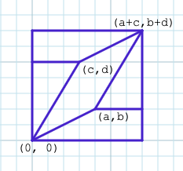
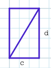
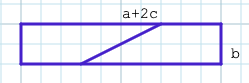
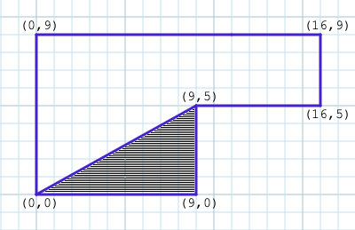
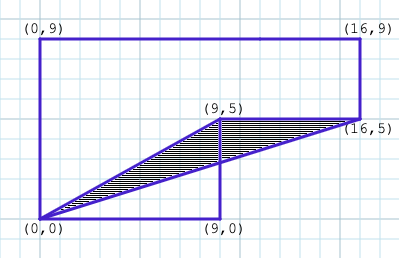
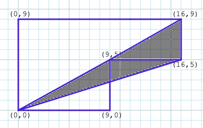
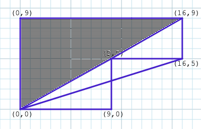

# Outsiders, TDD, and the area of a polygon

In the closing years of the 18th century, Sarah Green, the wife of Nottingham baker George Green, gave birth to a son, also named George, who would shake up the world, but never know.

When George was a young boy, his father noticed he was good with numbers, and so sent him off to an expensive private school. He returned after only one year, for reasons that aren't recorded. His father also owned a mill, and when George was old enough to apprentice there, he fell in love with the mill manager's daughter. Later they married, and together raised a family of seven children. In total, George would work at his father's mill for 20 years. Surprisingly, this is the background of one of the most influential mathematicians of all time.

As an adult, George was wealthy enough to join a local "subscription library", a club for gentlemen, under the encouragement of his property-owning cousin who was a member. George was not a typical club member since he worked with his hands, but his reputation as an amateur mathematician was enough to cross class lines.

After five years in the club, he self-published a paper titled ["An Essay on the Application of Mathematical Analysis to the Theories of Electricity and Magnetism"](https://books.googleusercontent.com/books/content?req=AKW5QaccFzhbIRMRmQYVRvasOfY4KAudbXdW_C_Nd99ayqwW3fu1LQ-Npj_3Lnw_bUWixwq7x5oID-W-y21q6n45zw-FVJH_RQnIT43x7aSuq55A_51SZBnyUxiCkE41aIYYFBpgf9lU0mZo-gQk008zc64gtMsVBF9Zcldb3g1vmBq7twl4dpOaCR5368PO7fgyaNx42Zn7VthSANyrvbjeMVS3LTDPAhVkLvvKHhMribhUnZI3oL8WDqbA4vyXnSPsIb8DYQWsR08XsJED4BxVOZ4qg1e8BGQCXrjN2MzT__f7KMu8_yU), which contains 90 pages of tables of observations, equations, and lengthy explanations on his experiments with electricity. In the paper, he does two very remarkable things. First, he invents the theory of potential, which is now used in everything from Riemannian geometry, to Markov chains, to Fourier transforms.

Second, he extended the fundamental theorem of calculus by building on the "area under a curve" formulae, coming up with a method to calculate the area of a closed curve given only the functions that describe its border. After Green's death, the significance of this became known to the scientific community, and now Green's Theorem is one of the four fundamental theorems of vector calculus.

Later in life, Green joined a Cambridge school as an undergraduate, and wrote a handful of papers on wave theory and hydrodynamics. In his late 40s, he grew ill, and returned home, succumbing to his illness shy of his 48th birthday. His work inspired the "Cambridge school" of natural philosophers that became legends - James Clerk Maxwell (of Maxwell's Demon fame), Lord Kelvin, and George Stokes (polarization and optics), just to name a few. Each of his mathematical successors is deserving of all the accolades they received in life, but they all built on the insights of a man almost lost to history, buried in an unassuming family plot in the church across from his mill.

George's story resonates with me in a deeply personal way. In my life of writing software, I have done nothing nearly as extraordinary as change how calculus is taught worldwide, but I have been the guy who was the outlier in a room full of gentlemen, and I understand the joy in exploring hard topics because they're interesting, not because they are part of your formal training.

What sparked all this interest in a mathematician I hadn't heard of before? It all started with an interesting coding challenge.

## The Challenge

The challenge was this: Given directions to draw an L-shaped room, calculate its area. The input was an array of vectors, each vector being a direction and a length, as if driving around the circumference of a room. Here is a sample input:

```
["(N,9)", "(E,16)", "(S, 4)", "(W,7)", "(S,5)", "(W,9)"]
```

It describes an L-shaped room that looks like this:



Visually inspecting the shape, it's easy for a human to understand that this is a 16x9 rectangle with a 7x5 rectangle cut out of it, making the room area 144 - 35 = 109 square units. When first faced with the puzzle, my spur of the moment solution attempt was to note which vector directions repeated, and which didn't. Two of the vector directions don't repeat, so their values are the base rectangle, and the rectangle to be subtracted is described by the first direction to repeat's second value, and the second direction to repeat's first value. Yes... that's quite a hacky approach to the problem. Maybe that works in all L-room cases and maybe it doesn't, but it is definitely not a general solution that works with other room shapes.

I was unsatisfied with my approach, so the next day I googled "polygon area given corner coordinates" or something like that, and quickly found the [Shoelace Formula](https://en.wikipedia.org/wiki/Shoelace_formula), which solves this for any arbitrary, non-intersecting polygon. It was a rabbit hole that led me to George, several calculus textbooks, and descriptive videos by math professors.

I dove in, and along the way also went back to the basics with using [test-driven development](https://en.wikipedia.org/wiki/Test-driven_development) (TDD) to quickly create some simple projects, starting at "bundle init", and writing a failing spec. The math research and coding practice combined to be the software writing equivalent of Rocky falling to Clubber Lang, then deciding to listen to some bad 80s rock at the gym while he gets himself back into fighting shape. In the end I got myself excited about numbers and coding again, and it was all time well spent.

## The Shoelace Formula

The shoelace formula makes finding the area of polygons straightforward and elegant, but it's not immediately obvious why it works. Collect all the coordinates going counter-clockwise around the perimeter, and include the first point again at the end. Assume point Pn has coordinates (xn, yn), e.g., point P1 has coords (x1, y1). The formula for finding the polygon's area is then:

$\frac{1}{2} ( (x1y2 - x2y1) + (x2y3 - x3y2) ... + (xny1 - x1yn) )$

To understand why this works, let's take a step back...

Given any two points that produce a triangle with the origin, moving counterclockwise with respect to the origin, let's call the points (a, b) and (c, d), the area of the parallelogram (0, 0), (a, b), (a+c, b+d), (c, d) can be calculated by ad - bc. The best visual for understanding why that formula works is probably Solomon Golomb's famous "proof without words":



We can deduce the same formula algebraically with a little elbow grease. To find the area of the parallelogram below...



We can draw a bounding box around it, and divide the area outside the parallelogram into congruent shapes we can build rectangles with:






The rectangles will have the areas `cd` and `b(a+2c)`. So, the area of the parallelogram is the area of the bounding box `(a+c)(b+d)`, minus the rectangles:

```
area = (a+c)(b+d) - cd - b(a+2c)
     = ab + ad + bc + cd - cd - (ab + 2bc)
     = ab + ad + bc + cd - cd - ab - 2bc
     = ab + ad + bc - ab - 2bc
     = ad + bc - 2bc
     = ad - bc
```

Dividing that in half gives us the area of triangle (0, 0), (a, b), (c, d).

Breaking any arbitrary polygon (so long as none of the lines cross) up into triangles with respect to origin, can be used to calculate the shape's total area with this method. Take our original L-shaped room. If we assume the bottom left corner sits on origin, then that saves us a pair of calculations. Going counter-clockwise around the shape, form a triangle from the first pair of points to origin:



I'll keep a running total of parallelogram areas, and divide everything in half at the end. Using the shoelace method, our first area is
<br>$(9 \times 5) - (9 \times 0)$ or 45, representing double the shaded area.

The next triangle is where things get weird:



Our "sweep" has just moved clockwise, so it should produce a negative area. It looks to be subtracting part of the triangle we just considered, and some random wedge outside the shape. Let's pretend that's not as insane as it sounds, and continue. The formula gives us $(9 \times 5) - (16 \times 5)$,
<br>or $45 - 80$, or $^{-}35$. This makes our running total

$45 - 35 = 10$

The next triangle shows that we're still on the right track:



We've added back in both of the shapes subtracted in the previous step, along with the small triangle in the upper-right. Using the formula, we have $(16 \times 9) - (16 \times 5)$, or $144 - 80$, or $64$. Our running total is now

$45 - 35 + 64 = 74$

This brings us to the last triangle we have to consider:



The formula gives us $(16 \times 9) - (9 \times 0)$, or 144, making our final running total

$45 - 35 + 64 + 144 = 218$

Dividing that in half gives us the area we calculated initially, 109.

If this still isn't intuitive, the most approachable explanation I've found for why this works is in [this Mathologer video](https://www.youtube.com/watch?v=0KjG8Pg6LGk) from Burkard Polster, math professor at Monash University.

Going the other direction, [this video](https://www.youtube.com/watch?v=Bh0pSVByxbo) by Wichita State University's Justin Ryan shows how to turn Green's theorem into the shoelace formula.

Lots of fun. I emplore you to dig in. I also highly recommend [Calculus: early transcendentals](https://www.whitman.edu/mathematics/calculus_online/) from Whitman College as a calculus refresher, if that's your jam.

## Coding up a solution

Starting with a fresh ruby project, I'm going to TDD my original code challenge, and end up with a small program that parses the array of vectors input, tokenizes it, turns it into coordinates, and applies the shoelace formula.

This work is being done from a [shell](https://tidbits.com/2019/12/08/resources-for-adapting-to-zsh-in-catalina/) on a pre-M1 [Macbook](https://en.wikipedia.org/wiki/MacBook_Pro), using [ruby 2.7](https://rubyreferences.github.io/rubychanges/2.7.html), with some standard gems, namely [rspec](https://rspec.info/), [bundler](https://bundler.io/), and [pry](http://pry.github.io/), with [vim](https://stackoverflow.blog/2017/05/23/stack-overflow-helping-one-million-developers-exit-vim/) as an editor. To begin, let's make a folder for the project (which I'll just call "area"), use bundler to initialize a Gemfile, add rspec to it so we can test as we go, and bind gems to the project:

:::codez
**curtis@Curtis-Autery-MBPro dev %** _mkdir area && cd area_
**curtis@Curtis-Autery-MBPro area %** _bundle init_
Writing new Gemfile to /Users/curtis/dev/area/Gemfile
**curtis@Curtis-Autery-MBPro area %** _echo 'gem "rspec"' >> Gemfile_
**curtis@Curtis-Autery-MBPro area %** _bundle_
Fetching gem metadata from https://rubygems.org/...
Resolving dependencies...
Using bundler 2.1.4
Using diff-lcs 1.4.4
Using rspec-support 3.10.3
Using rspec-core 3.10.1
Using rspec-expectations 3.10.1
Using rspec-mocks 3.10.2
Using rspec 3.10.0
Bundle complete! 1 Gemfile dependency, 7 gems now installed.
Use `bundle info [gemname]` to see where a bundled gem is installed.
**curtis@Curtis-Autery-MBPro area %**
:::

Our sample input:

```
["(N,9)", "(E,16)", "(S, 4)", "(W,7)", "(S,5)", "(W,9)"]
```

...is in a format called [JSON](https://en.wikipedia.org/wiki/JSON), which is ubiquitous in modern sotware writing. I'm going to put my sample input into a file, then open a pry [REPL](https://en.wikipedia.org/wiki/Read%E2%80%93eval%E2%80%93print_loop) (TODO: improve that Wikipedia page), then read the file into a JSON parser.

:::codez
**curtis@Curtis-Autery-MBPro area %** _echo '["(N,9)", "(E,16)", "(S, 4)", "(W,7)", "(S,5)", "(W,9)"]' > input.txt_
**curtis@Curtis-Autery-MBPro area %** _pry_

```pry
[1] pry(main)> input = File.read('input.txt')
=> "[\"(N,9)\", \"(E,16)\", \"(S, 4)\", \"(W,7)\", \"(S,5)\", \"(W,9)\"]\n"
[2] pry(main)> require 'json'
=> true
[3] pry(main)> parsed = JSON.parse(input)
=> ["(N,9)", "(E,16)", "(S, 4)", "(W,7)", "(S,5)", "(W,9)"]
[4] pry(main)> parsed[2]
=> "(S, 4)"
```

:::

At this point `parsed` is a ruby array that I can iterate over, but each element needs more processing to turn that into a vector with a direction string and a distance integer. If this were part of a larger project, or if we needed to account for possible errors in the input, I'd continue down this route and write some cumbersome parsing code. Fortunately, the challenge declared that you could assume both correct input data (with the caveat that sometimes there's a pesky space in a vector), and that the described shape would always be a complete polygon. With that in mind, we can afford to be a little more bold and ditch JSON parsing altogether, and just look for word tokens.

```pry
[5] pry(main)> tokens = input.scan /\w+/
=> ["N", "9", "E", "16", "S", "4", "W", "7", "S", "5", "W", "9"]
```

The `\w+` is a [regular expression](https://developer.mozilla.org/en-US/docs/Web/JavaScript/Guide/Regular_expressions) that asks for one or more "word" characters. The definition of a word character changes over time and between programming languages, but it is generally letters, numbers, and the underscore. The ruby `scan` method runs a regular expression repeatedly on a string, and collects all the matches into an array.

This gets us most of the way to turning our input file into something usable. The last things we need to do are collect the tokens in pairs (ruby has good combinatorics methods to help with things like this), and to turn the distance strings into ruby numbers.

```pry
[6] pry(main)> tokens.each_slice(2).map { |dir, len| [dir, len.to_i] }
=> [["N", 9], ["E", 16], ["S", 4], ["W", 7], ["S", 5], ["W", 9]]
```

And that's about all we need our pry REPL for. We know how we're going to read in the file and turn it into usable chunks. The rest of what we need to is turn an array of vectors into an array of coordinates, and to run the shoelace formula over those coordinates to return the polygon's area. All of that can be easily written with TDD: Write a test for something you want the program to do, make sure the test fails, then write app code to make the test succeed.

It took me a very long time in my software writing career before I understood the value of that process. I've been required to write passing tests for all my code for the last four years, but for most of that time I used it just to check core pieces of app code that I'd already written. TDD, on the other hand, lets you document the system you want to write, and makes you think about the problem you want to solve in smaller pieces that can be tested independently.

The two basic items we want to test are turning vectors into coordinates, and calculating an area. Starting with the first, let's create a class called `coord_maker`, and a corresponding spec:

:::codez
**curtis@Curtis-Autery-MBPro area %** _touch coord_maker.rb coord_maker_spec.rb_
**curtis@Curtis-Autery-MBPro area %** _ls_
Gemfile Gemfile.lock coord_maker.rb coord_maker_spec.rb input.txt
:::

In coord_maker_spec.rb I'll start by simply importing the nonexistent CoordMaker class and calling RSpec.describe to instantiate it:

```ruby
# coord_maker_spec.rb

require 'rspec'
require_relative 'coord_maker'

RSpec.describe CoordMaker do
end
```

Running the spec shows the expected error that the class doesn't exit:

:::codez
**curtis@Curtis-Autery-MBPro area %** _rspec coord_maker_spec.rb_

```
An error occurred while loading ./coord_maker_spec.rb.
Failure/Error:
RSpec.describe CoordMaker do
end

NameError:
uninitialized constant CoordMaker

# ./coord_maker_spec.rb:4:in `<top (required)>'

No examples found.

Finished in 0.00002 seconds (files took 0.11449 seconds to load)
0 examples, 0 failures, 1 error occurred outside of examples
```

:::

...which stubbing out the class will correct:

```ruby
# coord_maker.rb
class CoordMaker

end
```

Re-running the spec gives....

:::codez
**curtis@Curtis-Autery-MBPro area %** _rspec coord_maker_spec.rb_
No examples found.

Finished in 0.00021 seconds (files took 0.11907 seconds to load)
0 examples, 0 failures
:::

From here I'll show just the code deltas and errors, and at the end I'll link to a GitHub repo for this project. In the project, each commit happens after a new spec passes.

We want a CoordMaker instance to initialize with a list of vectors and turn them into coordinates. The simplest example of that would be taking a single vector, let's say `["N", 4]`, and returning origin and `(0, 4)`. In coord_maker_spec, let's check for that.

```ruby
RSpec.describe CoordMaker do
  subject { CoordMaker.new(vectors) }

  context 'with a single vector' do
    let(:vectors) { [['N', 4]] }

    it 'returns (0,0) and (0,4)' do
      expect(subject.coords).to contain_exactly([0, 0], [0, 4])
    end
  end
end
```

Which gives...

```
1) CoordMaker with a single vector returns (0,0) and (0,4)
   Failure/Error: subject { CoordMaker.new(vectors) }

   ArgumentError:
     wrong number of arguments (given 1, expected 0)
```

This drives us to add an initializer to our class to accept a variable, and to return the expected array.

```ruby
class CoordMaker
  attr_reader :coords

  def initialize(vectors)
    @coords = [[0, 0], [0, 4]]
  end
end
```

Which gives...

:::codez
**curtis@Curtis-Autery-MBPro area %** _rspec coord_maker_spec.rb_
.

Finished in 0.00432 seconds (files took 0.08343 seconds to load)
1 example, 0 failures
:::

Believe me, I hear you. My app code isn't calculating a damned thing, and giving it any other vectors will return the wrong results. I get it, and I used to balk at that, too. What we're checking now isn't that the coords are calculated, but that it returns an array of arrays, that the spec can parse them, and that the spec and class agree on variable/method names. Doing this step checks for stupid typos and misunderstanding variable types.

At this point, it would be fine to rewrite the app code to calculate coordinates and run the spec again, but the normal pattern is to write a new spec with different inputs first.

```ruby
context 'with a square' do
  let(:vectors) { [['N', 4], ['E', 4], ['S', 4], ['W', 4]] }

  it 'coords describe a square and return to origin' do
    expect(subject.coords).to contain_exactly([0, 0], [0, 4], [4, 4], [4, 0], [0, 0])
  end
end
```

Which gives...

:::codez
**curtis@Curtis-Autery-MBPro area %** _rspec coord_maker_spec.rb_
.F

```
Failures:

  1) CoordMaker with a square coords describe a square and return to origin
     Failure/Error: expect(subject.coords).to contain_exactly([0, 0], [0, 4], [4, 4], [4, 0], [0, 0])

       expected collection contained:  [[0, 0], [0, 0], [0, 4], [4, 0], [4, 4]]
       actual collection contained:    [[0, 0], [0, 4]]
       the missing elements were:      [[0, 0], [4, 0], [4, 4]]
     # ./coord_maker_spec.rb:19:in `block (3 levels) in <top (required)>'

Finished in 0.02385 seconds (files took 0.08586 seconds to load)
2 examples, 1 failure
```

:::

Now let's write some code to calculate coordinates, and we have two waiting examples to make sure we're doing it right.

```ruby
def initialize(vectors)
  x = 0
  y = 0
  @coords = [[x, y]]

  vectors.each do |direction, distance|
    case direction
    when 'N'
      y += distance
    when 'S'
      y -= distance
    when 'E'
      x += distance
    when 'W'
      x -= distance
    end

    coords.push([x, y])
  end
end
```

Which gives...

```
..

Finished in 0.0045 seconds (files took 0.08336 seconds to load)
2 examples, 0 failures
```

We can add additional checks, like vectors with some other distance than 4, or an L-shaped room, but I'm satisfied with what we have since CoordMaker is a unitasker with simple code. Instead, let's move on in the same vein with a Room class and spec. Room takes an array of coordinates, and calculates an integer area (since we can only move in integer steps in the four primary directions, the area will always be a whole number).

:::codez
**curtis@Curtis-Autery-MBPro area %** _touch room.rb room_spec.rb_
**curtis@Curtis-Autery-MBPro area %** _ls_
Gemfile coord_maker.rb input.txt room_spec.rb
Gemfile.lock coord_maker_spec.rb room.rb
**curtis@Curtis-Autery-MBPro area %**
:::

I'll skip the incremental TDD steps (althought they're in the GitHub repo) and jump right to a correct rectangle area calculation using the shoestring formula.

The spec describes a 3x5 rectangle:

```ruby
require 'rspec'
require_relative 'room'

RSpec.describe Room do
  subject { described_class.new(coords) }

  context 'with a rectangle' do
    let(:coords) { [[0, 0], [0, 5], [3, 5], [3, 0], [0, 0]] }

    it 'calculates the correct area' do
      expect(subject.area).to eq(15)
    end
  end
end
```

...and the app code calculates area with the shoelace formula.

```ruby
class Room
  attr_reader :area

  def initialize(coords)
    working = 0

    coords.each_cons(2) do |p1, p2|
      a, b = p1
      c, d = p2

      working += (a * d - b * c)
    end

    @area = working.abs / 2
  end
end
```

Here I'm using another wonderful Ruby combinatorics method, `each_cons`, which instead of splitting the array up in groups, takes them in sets, but only increments the index by 1. For example:

:::codez
**curtis@Curtis-Autery-MBPro area %** _pry_

```pry
[1] pry(main)> (1..5).each_cons(2) { p _1 }
[1, 2]
[2, 3]
[3, 4]
[4, 5]
=> nil
```

:::

Also, since I have no way of knowing which direction the vectors drive around the shape, this returns the absolute value of the area, in case the path was clockwise overall.

Almost done. Let's add another spec to describe the example from the original coding challenge:

```ruby
context 'with an L-shaped room' do
  let(:coords) { [[0, 0], [0, 9], [16, 9], [16, 5], [9, 5], [9, 0], [0, 0]] }

  it 'calculates the correct area' do
    expect(subject.area).to eq(109)
  end
end
```

Which gives...

:::codez
**curtis@Curtis-Autery-MBPro area %** _rspec room_spec.rb_
..

Finished in 0.00405 seconds (files took 0.08648 seconds to load)
2 examples, 0 failures
:::

The last bit, then is the main script that parses the input file, calls our classes, and prints the result. I'll call the file `calculate.rb`, and use the method from our first pry session. Since we have all the heavy lifting app code well-defined and tested, the script is surprisingly simple:

```ruby
require_relative 'coord_maker'
require_relative 'room'

tokens = File.read('input.txt').scan /\w+/
vectors = tokens.each_slice(2).map { |direction, distance| [direction, distance.to_i] }

coord_maker = CoordMaker.new(vectors)
room = Room.new(coord_maker.coords)

puts "Room area: #{room.area}"
```

And running that produces the answer we expect:

:::codez
**curtis@Curtis-Autery-MBPro area %** _ruby calculate.rb_
Room area: 109
:::

If you'd like to see each TDD step as individual commits, a repo is available at https://github.com/ceautery/code_challenge-room_area.
